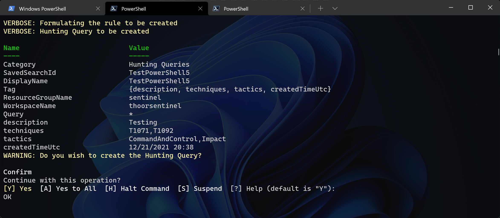
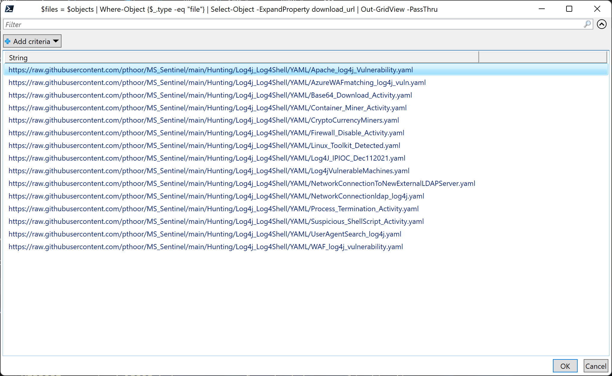
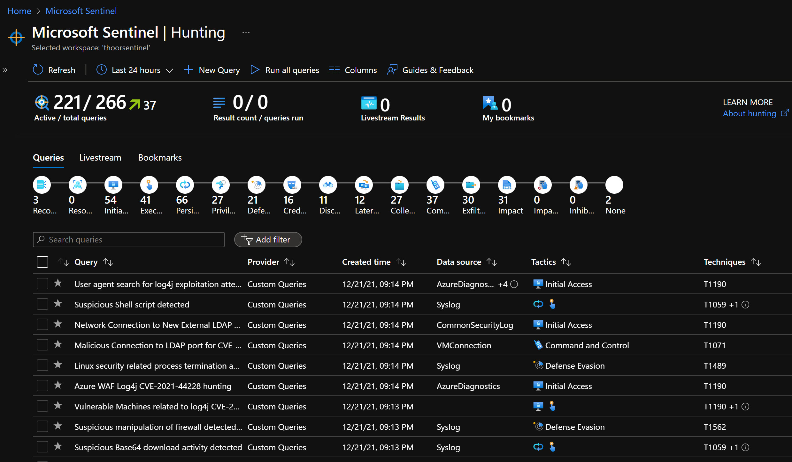

This vulnerability for Log4j have been exploding 💥 around the world and to keep track - that's not so easy. And it's not easy when you have this great community contributing in creating awesome KQL for Microsoft Sentinel and then you need to find the time to import them all into Sentinel.

There's also a limitation for Azure CSP Subscriptions when it comes to the new Solutions part in Sentinel. So I really hope that you can use this script to import the most important queries that you need. 

In this post, we will see if my script can help you to import all of those Hunting Queries. I have made two options for you, to create new hunting query via PowerShell - or import from a GitHub repo, directly from PowerShell.

But first, let see if you have all the pre-reqs installed.

Pre-Reqs:
- [PowerShell 7.2 or higher](https://docs.microsoft.com/en-us/powershell/scripting/install/installing-powershell-on-windows?view=powershell-7.2)
- [Microsoft Az Module](https://www.powershellgallery.com/packages/Az/6.6.0)
- [powershell-yaml](https://www.powershellgallery.com/packages/powershell-yaml/0.4.2)

Now, if you want to create a new hunting query:

```powershell
New-MsSentinelHuntingRule -CreateNewOrImport CreateNew -DisplayName "NameOfYourQuery" -Query "InKqlFormat" -Description "WhatDoTheQueryDo" -Tactics <Choose from list, no ""> -Techniques <Add one or more T-number, no ""> -Category 'Hunting Queries' -SubscriptionId "LookInAzurePortal" -ResourceGroupName "WheresSentinel" -WorkspaceName "LogAnalyticsWorkspaceName" [-Verbose]
```


To import from GitHub, we are using the API URI and in that we can find the download_url, like raw.githubusercontent.com URL. So what I need in the PowerShell one-liner is:

```powershell
New-MsSentinelHuntingRule -CreateNewOrImport Import -GitHubPath "https://api.github.com/repos/pthoor/MS_Sentinel/contents/Hunting/Log4j_Log4Shell/YAML/" -YAMLimportPath "LocalPathToSaveFiles" -SubscriptionId "LookInAzurePortal" -ResourceGroupName "WheresSentinel" -WorkspaceName "LogAnalyticsWorkspaceName" [-Verbose]
```

*For the GitHubPath, adjust it for your needs.*

Now you will be prompted to select the YAML files you want to download and then import via Out-Gridview. 


After a short while, the queries will be uploaded via the cmdlet New-AzOperationalInsightsSavedSearch.


Here's the New-MsSentinelHuntingRule - **available at GitHub** - https://github.com/pthoor/MS_Sentinel/blob/main/New-MsSentinelHuntingRule.ps1 

### New-MsSentinelHuntingRule


```powershell
#requires -module @{ModuleName = 'Az.Accounts'; ModuleVersion = '1.5.2'}
#requires -version 6.2
function New-MsSentinelHuntingRule {
<#
    .SYNOPSIS
    Create Microsoft Sentinel Hunting Rule
    .DESCRIPTION
    Use this function to creates Microsoft Sentinal Hunting rule
    .PARAMETER SubscriptionId
    Enter the subscription ID
    .PARAMETER WorkspaceName
    Enter the Log Analytics Workspace name
    .PARAMETER DisplayName
    Enter the Display Name for the hunting rule
    .PARAMETER Description
    Enter the Description for the hunting rule
    .PARAMETER Tactics
    Enter the Tactics, valid values: 
    "Reconnaissance", "ResourceDevelopment", "InitialAccess", "Execution", "Persistence", "PrivilegeEscalation", "DefenseEvasion", "CredentialAccess", "Discovery", "LateralMovement", "Collection", "CommandAndControl", "Exfiltration", "Impact", "ImpairProcessControl", "InhibitResponseFunction"
    .PARAMETER Query
    Enter the query in KQL format
    .PARAMETER CreateNewOrImport
    Valid values: "CreateNew", "Import".
    If CreateNew, you have to fill in all other parameters.
    If Import, you have to fill in GitHubPath parameter and YAMLimportPath parameter.
    .PARAMETER YAMLimportPath
    Local path to save YAML files downloaded by GitHubPath
    .PARAMETER GitHubPath
    Enter the full GitHub URI (api.github.com) to YAML files for download
    .EXAMPLE
    New-MsSentinelHuntingRule -CreateNewOrImport CreateNew -WorkspaceName "<LogAnalyticsWorkspaceName>" -DisplayName "<DisplayNameOfRule>" -Description "<DescriptionForYourRule>" -Tactics "<AddTactics>","<Tactic2>" -Query 'InKQLFormat'
    In this example you create a new hunting rule by defining the rule properties directly in PowerShell
    .EXAMPLE
    New-MsSentinelHuntingRule -CreateNewOrImport Import -SubscriptionId "<FindIdInAzurePortal>" -ResourceGroupName "WhereYouHaveSentinel" -WorkspaceName "<LogAnalyticsWorkspaceName>" -GitHubPath "<URIToApi>" -YAMLimportPath "<LocalPathToSaveFiles>"
#>

    [CmdletBinding(SupportsShouldProcess, ConfirmImpact = 'High')]
    param (
        [parameter(Mandatory)]
        [ValidateSet("CreateNew", "Import")]
        [String] $CreateNewOrImport,

        [parameter()]
        [string] $GitHubPath,
        
        [ValidateScript({ (Test-Path -Path $_) })]
        [IO.DirectoryInfo] $YAMLimportPath,

        [Parameter(Mandatory,
            ParameterSetName = "Sub")]
        [ValidateNotNullOrEmpty()]
        [string] $SubscriptionId,

        [Parameter(Mandatory)]
        [ValidateNotNullOrEmpty()]
        [string] $ResourceGroupName,

        [Parameter(Mandatory)]
        [ValidateNotNullOrEmpty()]
        [string] $WorkspaceName,

        [Parameter()]
        [string] $DisplayName,

        [Parameter()]
        [ValidateNotNullOrEmpty()]
        [string] $Query,

        [Parameter()]
        [ValidateNotNullOrEmpty()]
        [string] $Description,

        [Parameter()]
        [ValidateNotNullOrEmpty()]
        [ValidateSet("Reconnaissance", "ResourceDevelopment", "InitialAccess", "Execution", "Persistence", "PrivilegeEscalation", "DefenseEvasion", "CredentialAccess", "Discovery", "LateralMovement", "Collection", "CommandAndControl", "Exfiltration", "Impact", "ImpairProcessControl", "InhibitResponseFunction")]
        [string[]] $Tactics,

        [Parameter()]
        [ValidateNotNullOrEmpty()]
        [string[]] $Techniques,

        [Parameter()]
        [ValidateNotNullOrEmpty()]
        [ValidateSet("Hunting Queries")]
        [string] $Category = "Hunting Queries"
    )

    $subIdContext = (Get-AzContext).Subscription.Id 
    if ($subIdContext -ne $subscriptionId) {
        $setSub = Set-AzContext -SubscriptionName $subscriptionId -ErrorAction SilentlyContinue
        if ($null -eq $setSub) {
            Write-Warning "$subscriptionId is not set, please login"
            Login-AzAccount
            Set-AzContext -SubscriptionName $subscriptionId -ErrorAction SilentlyContinue
        }
    }

    # If not installed, import the PowerShell-YAML community module, installed from https://www.powershellgallery.com/packages/powershell-yaml/0.4.2
    $powershellYamlModule = Get-Module -Name "powershell-yaml" -ErrorAction SilentlyContinue
    #if ($powershellYamlModule -eq $null) {
    if ($null -eq $powershellYamlModule) {
        Write-Warning "The PowerShell-YAML module is not found"
            #check for Admin Privleges
            $currentPrincipal = New-Object Security.Principal.WindowsPrincipal([Security.Principal.WindowsIdentity]::GetCurrent())

            if (-not ($currentPrincipal.IsInRole([Security.Principal.WindowsBuiltInRole]::Administrator))) {
                #Not an Admin, install to current user
                Write-Warning -Message "Can not install the PowerShell-YAML module. You are not running as Administrator"
                Write-Warning -Message "Installing the PowerShell-YAML module to current user Scope"
                Install-Module powershell-yaml -Scope CurrentUser -Force
            }
            Else {
                #Admin, install to all users
                Write-Warning -Message "Installing the powershell-yaml module to all users"
                Install-Module -Name powershell-yaml -Force
                Import-Module -Name powershell-yaml -Force
            }
    }
    
    # Import the Az.SecurityInsights module
    Import-Module -Name Az.SecurityInsights

    # Create new or import existing from GitHub

    # Import from GitHub
    if($CreateNewOrImport -eq "Import"){
        try {
            #Ask GitHub API for all of the files in repo and let the user choose
            $wr = Invoke-WebRequest -Uri $GitHubPath
            $objects = $wr.Content | ConvertFrom-Json
            $files = $objects | Where-Object {$_.type -eq "file"} | Select-Object -ExpandProperty download_url | Out-GridView -PassThru
            
            if (-not (Test-Path $YAMLimportPath)) {
                # Destination path does not exist, let's create it
                try {
                    New-Item -Path $YAMLimportPath -ItemType Directory -ErrorAction Stop
                } catch {
                    throw "Could not create path '$YAMLimportPath'!"
                }
            }

            foreach ($file in $files) {
                Write-Verbose "Start downloading files from GitHub Path"
                $fileDestination = Join-Path $YAMLimportPath (Split-Path $file -Leaf)
                $outputFilename = $fileDestination.Replace("%20", " ");
                try {
                    Invoke-WebRequest -Uri "$file" -OutFile "$outputFilename" -ErrorAction Stop -Verbose
                    Write-Verbose "Downloaded '$($file)' to '$outputFilename'";
                } catch {
                    throw "Unable to download '$($file)'";
                }
            }

            $myNewRules = Get-ChildItem $YAMLimportPath -Filter *.yaml
            Write-Verbose "Found $($myNewRules.count) files"
            #Stop if we don't have YAML rules found to import
            if ($null -eq $myNewRules) {
                Write-Warning "Cannot find YAML rules to import, is your path correct?"
                break
            }
            Write-Verbose "Starting foreach loop"
            foreach ($myNewRule in $myNewRules) {
                Write-Verbose "Processing $($myNewRule.Name)"
                $myRuleObject = [pscustomobject](Get-Content $myNewRule.FullName -Raw | ConvertFrom-Yaml)
                $myRuleObject | Add-Member -MemberType NoteProperty -Name DisplayName -Value $myRuleObject.name
                $ruletactics = $myRuleObject.Tactics -join ","
                $ruleTechniques = $myRuleObject.relevantTechniques -join ","
                $ruleQuery = $myRuleObject.Query
                $ruleDescription = $myRuleObject.description

                Write-Verbose "Construct URI for uploading Hunting Query via API"
                $myruleDisplayName = $myRuleObject.DisplayName
                $uri = "https://management.azure.com/subscriptions/$($SubscriptionId)/resourcegroups/$($ResourceGroupName)/providers/Microsoft.OperationalInsights/workspaces/$($WorkspaceName)/savedSearches/$($myruleDisplayName)?api-version=2020-08-01"
                
                $Date = Get-Date -UFormat "%m/%d/%Y %R"
                Write-Verbose "Using date of $($Date)"
                
                $body = @{
                    properties = @{
                            DisplayName = $myruleDisplayName
                            Query = $ruleQuery
                            Description = $ruleDescription
                            Category = 'Hunting Queries'
                            Tags = @(
                                @{
                                    Name = 'description'
                                    Value = $myruleDisplayName
                                },
                                @{
                                    Name = 'techniques'
                                    Value = $ruleTechniques
                                },
                                @{
                                    Name = 'tactics'
                                    Value = $ruletactics
                                },
                                @{
                                    Name = 'createdTimeUtc'
                                    Value = $Date
                                }
                            )
                    }
                }

                try {
                    Write-Verbose "Construct Headers for API Put call and convert Body to JSON"
                    $Headers = @{
                        'Content-Type' = 'application/json'
                        "Authorization" = (Get-AzAccessToken).Type + " " + (Get-AzAccessToken).Token
                    }
                    $result = Invoke-WebRequest -Uri $uri -Method Put -Headers $Headers -Body ($body | ConvertTo-Json -Depth 10 -EnumsAsStrings)
                    $body.Properties | Add-Member -NotePropertyName status -NotePropertyValue $($result.StatusDescription) -Force
                    $return += $body.Properties
    
                    Write-Verbose "Successfully updated hunting rule: $($item.displayName) with status: $($result.StatusDescription)"
                }
                catch {
                    Write-Verbose $_
                    Write-Error "Unable to invoke webrequest for rule $($item.displayName) with error message: $($_.Exception.Message)" -ErrorAction Continue
                }
            }

        }
        catch {
            Write-Warning "Script terminated, please try again."
        }
    }

    # Create new
    if($CreateNewOrImport -eq "CreateNew"){
        try {
            Write-Verbose "Formulating the rule to be created"
            $TacticsJoin = $Tactics -join ","
            $TechniquesJoin = $Techniques -join ","
            $Date = Get-Date -UFormat "%m/%d/%Y %R"        

            $TagsSplatt = @{
                description = $Description
                techniques  = $TechniquesJoin
                tactics     = $TacticsJoin
                createdTimeUtc  = $Date
            }

            $ruleSplatt = @{
                WorkspaceName = $workspaceName
                ResourceGroupName = $ResourceGroupName
                SavedSearchId = $DisplayName
                DisplayName = $DisplayName
                Category = $Category
                Query = $Query
                Tag = $TagsSplatt
            }
            Write-Verbose "Hunting Query to be created"
            Write-Output $ruleSplatt
            Write-Output $TagsSplatt
            Write-Warning "Do you wish to create the Hunting Query?" -WarningAction Inquire

            New-AzOperationalInsightsSavedSearch @ruleSplatt
        }
        catch {
            Write-Warning "Script terminated, please try again."
        }
    }
}
```



Please let me know if the script don't work for you - I know it cannot update existing queries yet.
I see you at the next post!

**Happy hunting!**


