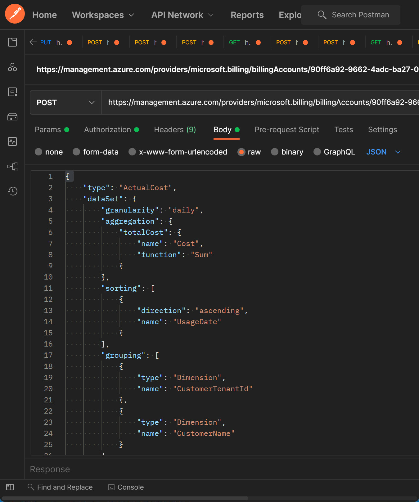
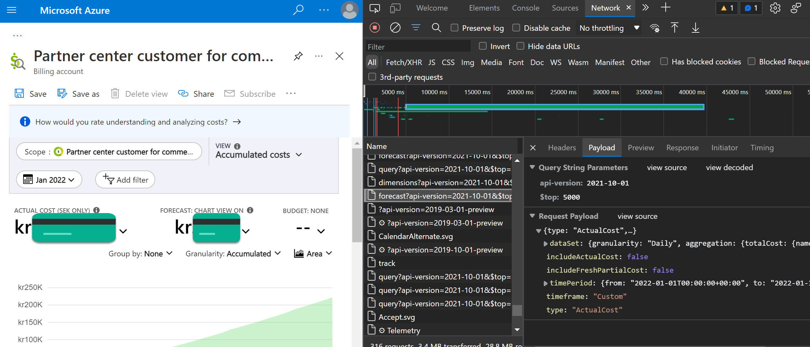

So I have been starting to really like Power BI and what we can do to present data. In my case I want to show how the sales are going with costs, margins, trends and so on. I have been playing with the Cost Management API for some time now, and due to the lack of documentation I have been able to create some cool reports. The one thing I DON'T like is that everyone who wants to look at these amazing reports need to have a Power BI license if the creator doesn't have the Power BI Premium Capacity license - which costs from **$4,995** per month. Do you have some tip on not having the Capacity license and still be able to share some reports to users within the org without paying that huge amount, please share. I'm just a PM wanting to share my insights 😊


If you want to play around with the API, here's how to.
I started to use Postman to see if my request body actual works, since the bad documentation.

## Access Token

First, get your Access Token. I find it simpliest to start PowerShell for this, sign in with Connect-AzAccount and then (Get-AzAccessToken).Token | clip to copy the token directly to your clipboard.

```powershell
Connect-AzAccount
(Get-AzAccessToken).Token | clip
```

## Available scopes

We can talk to the API with some alternatives on scope.
- "/subscriptions/{subscriptionId}/" for subscription scope 
- "/subscriptions/{subscriptionId}/resourceGroups/{resourceGroupName}" for resourceGroup scope
- "/providers/Microsoft.Billing/billingAccounts/{billingAccountId}" for Billing Account scope
- "/providers/Microsoft.Billing/billingAccounts/{billingAccountId}/departments/{departmentId}" for Department scope 
- "/providers/Microsoft.Billing/billingAccounts/{billingAccountId}/enrollmentAccounts/{enrollmentAccountId}" for EnrollmentAccount scope
- "/providers/Microsoft.Management/managementGroups/{managementGroupId} for Management Group scope
- "/providers/Microsoft.Billing/billingAccounts/{billingAccountId}/billingProfiles/{billingProfileId}" for billingProfile scope
- "/providers/Microsoft.Billing/billingAccounts/{billingAccountId}/billingProfiles/{billingProfileId}/invoiceSections/{invoiceSectionId}" for invoiceSection scope
- "/providers/Microsoft.Billing/ billingAccounts/{billingAccountId}/customers/{customerId}' specific for partners

In my example, I want to look at the Billing Account level for my Partner Account to see how the sales are going. 

**Scope syntax**

POST https://management.azure.com/{scope}/providers/Microsoft.CostManagement/query?api-version=2019-11-01

So I'm going to use: "/providers/Microsoft.Billing/billingAccounts/{billingAccountId}"

## Cost Management API

To find your Billing Account ID, go to the **Cost Management + Billing** resource in the Azure Portal and then Properties. 

Full URI will for my case then be:

POST https://management.azure.com/providers/microsoft.billing/billingAccounts/{YourBillingAccountId}/providers/microsoft.costmanagement/query?api-version=2019-11-01

Then my Body will be:
```json
{
    "type": "ActualCost",
    "dataSet": {
        "granularity": "daily",
        "aggregation": {
            "totalCost": {
                "name": "Cost",
                "function": "Sum"
            }
        },
        "sorting": [
            {
                "direction": "ascending",
                "name": "UsageDate"
            }
        ],
        "grouping": [
            {
                "type": "Dimension",
                "name": "CustomerTenantId"
            },
            {
                "type": "Dimension",
                "name": "CustomerName"
            }
        ]
    },
    "timeframe": "MonthToDate"
}
```


*(Don't forget the authorization!)*

## Forecast API
This was more complex, because the documentation was bad with the same example everywhere. So using Developer Tool in my browser I found some interesting things (look at the end of this post and I will guide you on how to find the queries made).

**Method and URL**

POST https://management.azure.com/providers/microsoft.billing/billingAccounts/{YourBillingAccountId}/providers/microsoft.costmanagement/forecast?api-version=2021-10-01

**Authorization**

Bearer "paste in the token"

**Body** 

Raw and in JSON:
```json
{
    "type": "ActualCost",
    "dataSet": {
        "granularity": "Monthly",
        "aggregation": {
            "totalCost": {
                "name": "Cost",
                "function": "Sum"
            }
        },
        "sorting": [
            {
                "direction": "ascending",
                "name": "BillingMonth"
            }
        ],
        "filter": {
            "Dimensions": {
		        "name": "CustomerTenantId",
		        "operator": "In",
		        "values": [
                    "<CustomerTenantId_1>",
                    "<CustomerTenantId_2>"
		        ]
		    }
        }
	},
    "timeframe": "Custom",
    "timePeriod": {
        "from": "2022-01-01T00:00:00+00:00",
        "to": "2022-01-31T23:59:59+00:00"
    },
    "includeActualCost": true,
    "includeFreshPartialCost": false
}
```
When you set "includeActualCost" to True you will get the cost as of today in one row and then the forecast in another row. Then you need to SUM the rows in Power BI to get the approximate number your Azure bill will be for that "timePeriod".

## Power BI
Great! Now I want to make some visualizations and as I wrote in the beginning, Power BI starts to grow on me. I'm no expert in this so if you have some great tip on how to make the authorization in a more automagical way - I'm all ears. But this is what I did to get in the data and to rename columns and such.

**For Actual Cost**

In Power BI Advanced Editor, paste in (and change the Bearer token to your, and the BillingAccountId in the Web.Contents) following code:
```json
let
    Source = let
Source = Web.Contents(
"https://management.azure.com/providers/microsoft.billing/billingAccounts/{YourBillingAccountId}/providers/microsoft.costmanagement/query?api-version=2019-11-01",
[
Headers=[
#"Method"="POST",
#"Content-Type"="application/json",
#"Authorization"="Bearer eyJ0eXAi...."
],
Content=Text.ToBinary("{
    ""type"": ""ActualCost"",
    ""dataSet"": {
        ""granularity"": ""daily"",
        ""aggregation"": {
            ""totalCost"": {
                ""name"": ""Cost"",
                ""function"": ""Sum""
            }
        },
        ""sorting"": [
            {
                ""direction"": ""ascending"",
                ""name"": ""UsageDate""
            }
        ],
        ""grouping"": [
            {
                ""type"": ""Dimension"",
                ""name"": ""CustomerTenantId""
            },
            {
                ""type"": ""Dimension"",
                ""name"": ""CustomerName""
            }
        ]
    },
    ""timeframe"": ""MonthToDate""
}")
]
),
#"JSON" = Json.Document(Source)
in
    #"JSON",
    properties = Source[properties],
    rows = properties[rows],
    #"Converted to Table" = Table.FromList(rows, Splitter.SplitByNothing(), null, null, ExtraValues.Error),
    #"Extracted Values" = Table.TransformColumns(#"Converted to Table", {"Column1", each Text.Combine(List.Transform(_, Text.From), ";"), type text}),
    #"Split Column by Delimiter" = Table.SplitColumn(#"Extracted Values", "Column1", Splitter.SplitTextByDelimiter(";", QuoteStyle.None), {"Column1.1", "Column1.2", "Column1.3", "Column1.4", "Column1.5"}),
    #"Changed Type" = Table.TransformColumnTypes(#"Split Column by Delimiter",{{"Column1.1", type number}, {"Column1.2", type date}, {"Column1.3", type text}, {"Column1.4", type text}, {"Column1.5", type text}}),
    #"Renamed Columns" = Table.RenameColumns(#"Changed Type",{{"Column1.1", "Amount"}, {"Column1.2", "Date"}, {"Column1.3", "TenantId"}, {"Column1.4", "CustomerName"}, {"Column1.5", "Currency"}})
in
    #"Renamed Columns"
```

**Forecast Cost (targeting specific customers with filter)**

```json
let
Source = let
Source = Web.Contents(
"https://management.azure.com/providers/microsoft.billing/billingAccounts/{YourBillingAccountId}/providers/microsoft.costmanagement/forecast?api-version=2021-10-01",
[
Headers=[
#"Method"="POST",
#"Content-Type"="application/json",
#"Authorization"="Bearer eyJ0eXA...."
],
Content=Text.ToBinary("{
    ""type"": ""ActualCost"",
    ""dataSet"": {
        ""granularity"": ""Monthly"",
        ""aggregation"": {
            ""totalCost"": {
                ""name"": ""Cost"",
                ""function"": ""Sum""
            }
        },
        ""sorting"": [
            {
                ""direction"": ""ascending"",
                ""name"": ""BillingMonth""
            }
        ],
        ""filter"": {
            ""Dimensions"": {
		        ""name"": ""CustomerTenantId"",
		        ""operator"": ""In"",
		        ""values"": [
			        ""{CustomerTenantId}"",
                    ""{CustomerTenantId}""
		        ]
		    }
        }
	},
    ""timeframe"": ""Custom"",
    ""timePeriod"": {
        ""from"": ""2022-01-01T00:00:00+00:00"",
        ""to"": ""2022-01-31T23:59:59+00:00""
    },
    ""includeActualCost"": true,
    ""includeFreshPartialCost"": false
}")
]
),
#"JSON" = Json.Document(Source)
in
    #"JSON",
    properties = Source[properties],
    rows = properties[rows],
    #"Converted to Table" = Table.FromList(rows, Splitter.SplitByNothing(), null, null, ExtraValues.Error),
    #"Extracted Values" = Table.TransformColumns(#"Converted to Table", {"Column1", each Text.Combine(List.Transform(_, Text.From), ";"), type text}),
    #"Split Column by Delimiter" = Table.SplitColumn(#"Extracted Values", "Column1", Splitter.SplitTextByDelimiter(";", QuoteStyle.None), {"Column1.1", "Column1.2", "Column1.3", "Column1.4"}),
    #"Changed Type" = Table.TransformColumnTypes(#"Split Column by Delimiter",{{"Column1.1", type number}, {"Column1.2", type datetime}, {"Column1.3", type text}, {"Column1.4", type text}}),
    #"Renamed Columns" = Table.RenameColumns(#"Changed Type",{{"Column1.1", "ForecastAmount"}, {"Column1.2", "ForecastDate"}, {"Column1.3", "ForecastActualAndForecast"}, {"Column1.4", "ForecastCurrency"}})
in
    #"Renamed Columns"
```
Remove the Filter part in the Content if you want to get forecast for all customers. Change the scope if you want forecast on different scope and they all are provided in the beginning of this post.

Find the documentation here: https://docs.microsoft.com/en-us/rest/api/cost-management/query/usage 

Test around with different requests, like change the TimeFrame
- BillingMonthToDate
- Custom (you need to use "from/to" as the examples in this post)
- MonthToDate
- TheLastBillingMonth
- TheLastMonth
- WeekToDate

## PRO TIP
Start the Developer Tool for your web browser, go to Network and you will see all the queries made. And hey look, the current API version is 2021-10-01.

