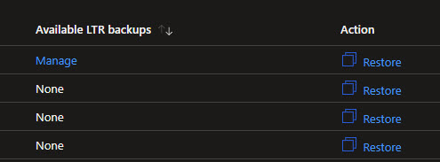
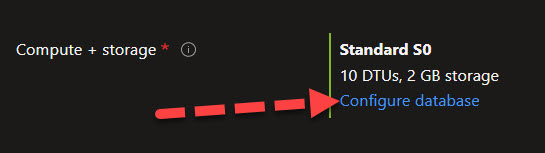
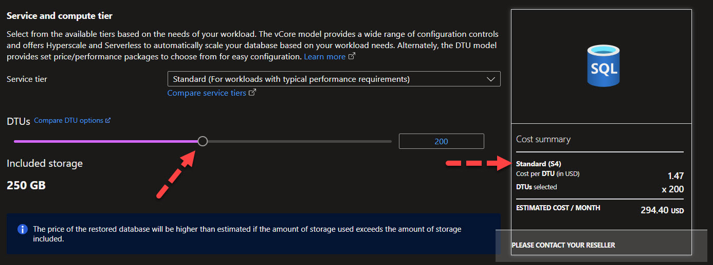
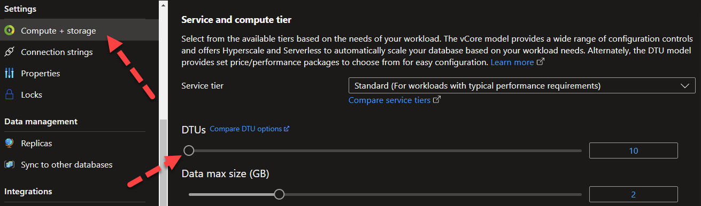
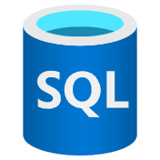

Recently, I had a case where the Long-Term Retention restore of Azure SQL didn't work as expected. It was the same error for both portal as Cloud Shell so we escalated the support case to Microsoft.


```txt
"code": "InternalServerError",
      "message": "An unexpected error occured while processing the request."
```

The error message was indeed not so describtive. And yes, there was some issues in the backend so we needed to wait for Microsoft to check the error.

Today we got an workaround! 👍

1. Double check so you got some backups that are in LTR, go to you Azure SQL Server resource and then Backups



2. When doing the restore, name the new DB and see that you are selecting the right source and backup date. Then configure the database SKU to S4 or higher. The lower SKU does have some issues right now.





3. After a while the restore should be done
4. Resize to the SKU you want in the SQL Database menu





See Microsoft documentation:
[Manage Azure SQL Database long-term backup retention](https://learn.microsoft.com/azure/azure-sql/database/long-term-backup-retention-configure?view=azuresql&tabs=portal&WT.mc_id=AZ-MVP-5004683)