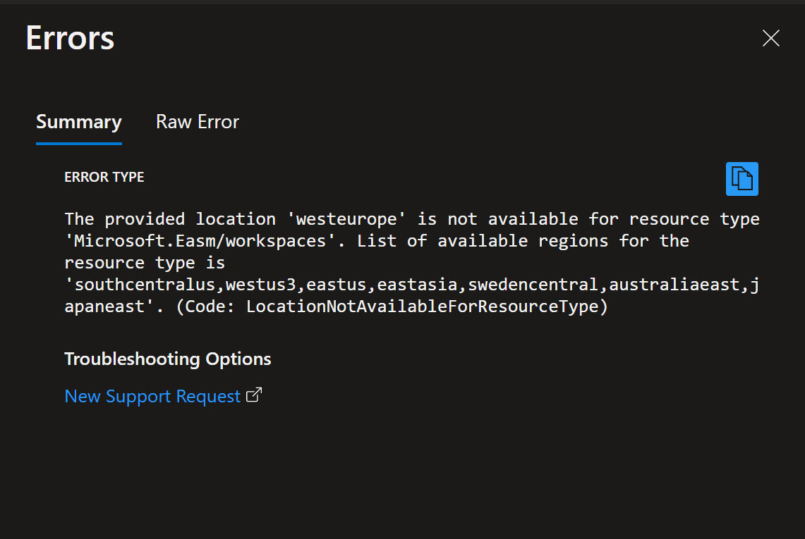
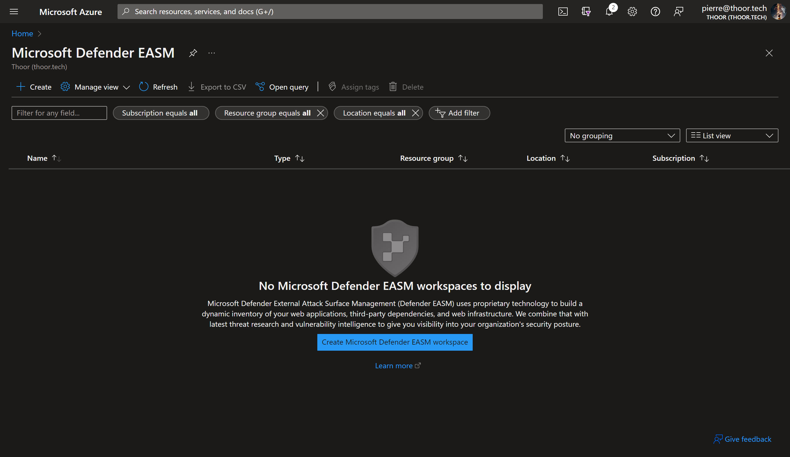
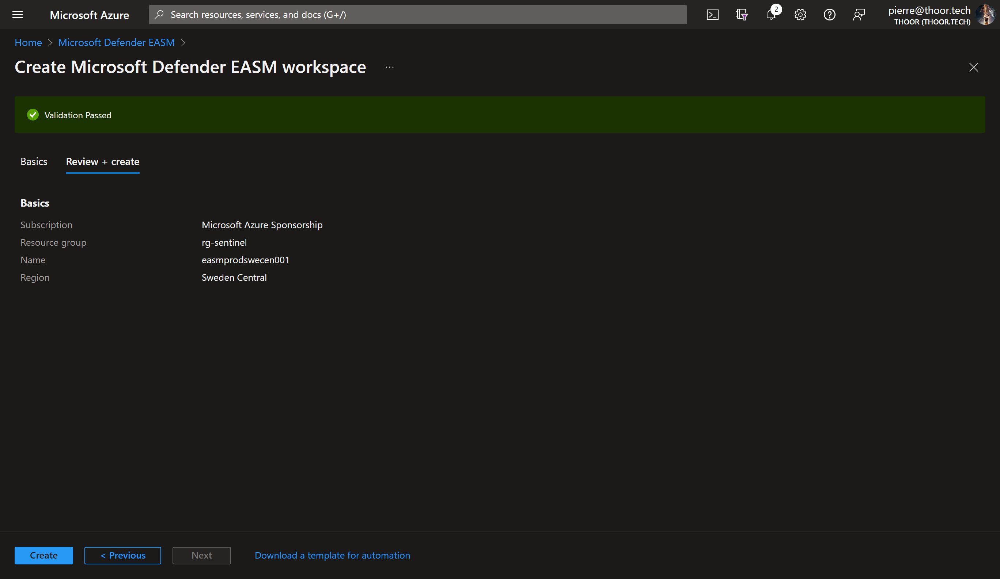
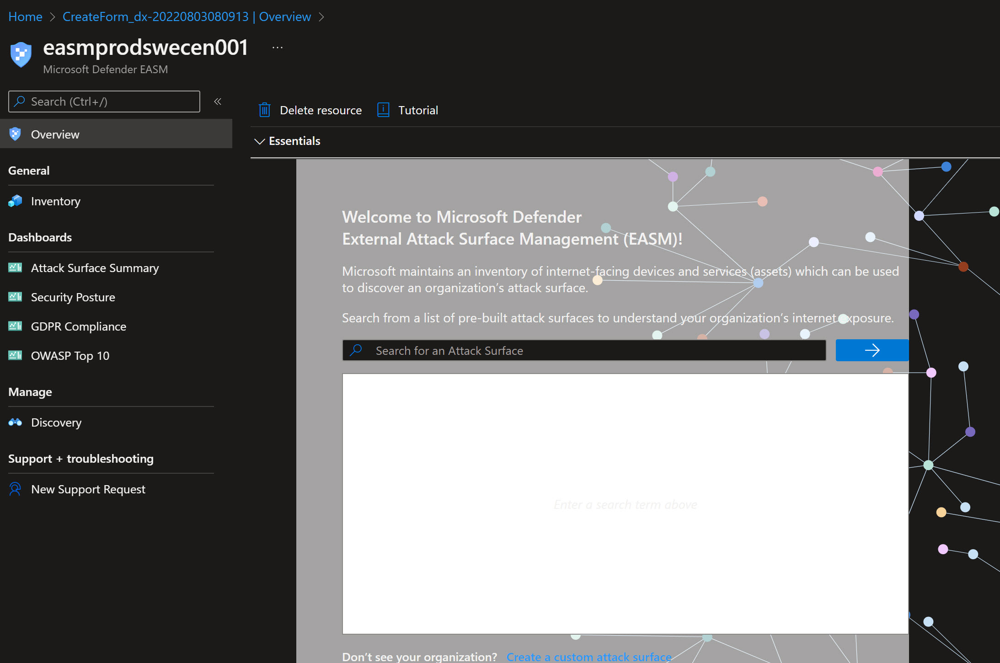
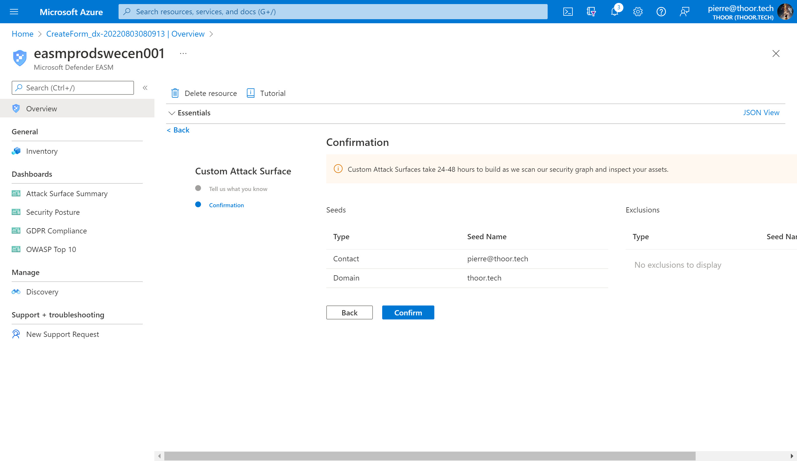
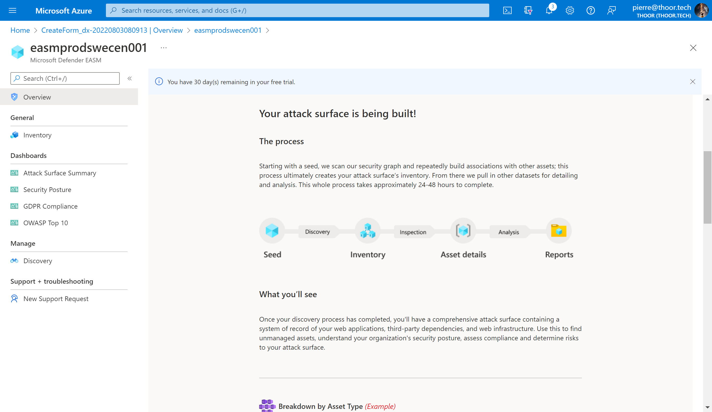

First post of the new tools Microsoft announced a couple of days ago - **Microsoft Defender External Attack Surface Management** and **Microsoft Defender Threat Intelligence**. This is the result of the earlier acquisition of RiskIQ for a year ago.
In this post we will go deeper on the first tool - EASM, to see if we have any potential entry points for attackers.

## What is External Attack Surface Management (EASM)?
Basically it will see unknown and unmanaged resources, outside of the firewall. This could also be for discover our external assets in a multi-cloud environment and the most important thing, identify weaknesses that are exposed so we can mitigate vulnerabilities and in some cases misconfigurations. 



**Microsoft Defender External Attack Surface Management (Defender EASM)** continuously discovers and maps your digital attack surface to provide an external view of your online infrastructure. This visibility enables security and IT teams to identify unknowns, prioritize risk, eliminate threats, and extend vulnerability and exposure control beyond the firewall. Defender EASM leverages Microsoft’s crawling technology to discover assets that are related to your known online infrastructure, and actively scans these assets to discover new connections over time. Attack Surface Insights are generated by leveraging vulnerability and infrastructure data to showcase the key areas of concern for your organization.



## What assets can EASM discover for me?

* Domains
* Hosts
* Pages
* IP Blocks
* IP Addresses
* Autonomous System Numbers (ASNs)
* SSL Certificates
* WHOIS Contacts

Each asset can have five different stages; Approved Inventory, Dependency, Monitor Only, Candidate, Requires Investigation. 

Approved Inventory is the state of assets that will be shown in the EASM workspace and scanned on a daily basis. You can define your own filters of course if you want to show the other stages as well. 

## How can I start using EASM?


Not all Azure Regions are enabled for EASM 


This is a new product from Microsoft and therefore not available in all Azure Regions, yet. The regions that do have the support are:
* Sweden Central
* South Central US
* West US 3
* East US
* East Asia
* Australia East
* Japan East



### Steps to activate EASM
1. In the Azure Portal, search for EASM, and then click on Microsoft Defender EASM



2. Now create a new workspace, I did choose the name convention of:

```cmd
easm<env><region><instance number ###>
Example: easmprodswecen001
```



As you can see, EASM does not as of writing this post, support dark mode in the Azure Portal.



I added a custom Attack Surface with my email and my domain. So lets see after 24-48 hours what EASM can find. You may also search for your own organization direcly in the workspace, with that Microsoft have already identified some assets connected to your organization, if you find your org in the list. It is best practice to start with the pre-built Attack Surface (i.e. searching for your org.) rather than the Custom Attack Surface.





Now let's wait and I will update the post if we will find some good stuff. 

**Happy hunting!**


