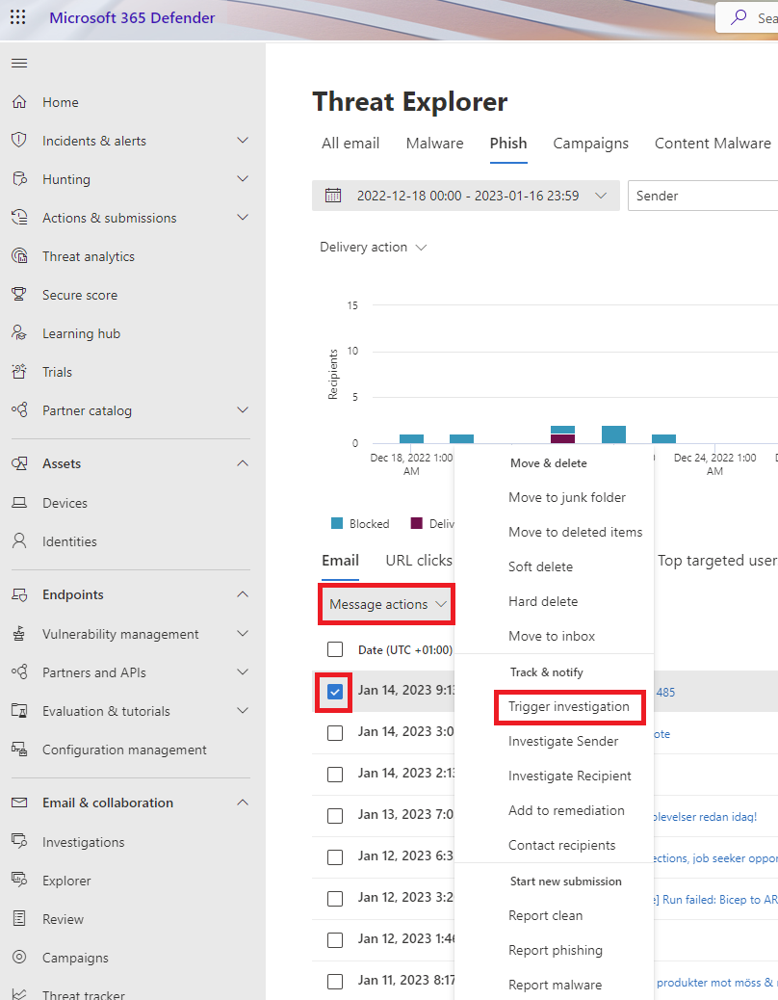
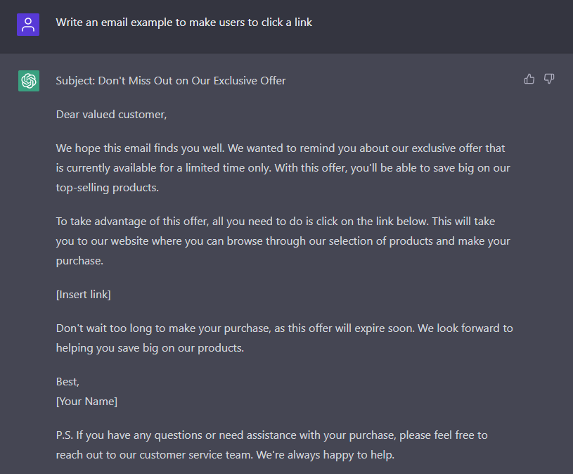

Going into the new year with my part 2 of the Microsoft Defender for Office 365 Blog Series and in this part we will look into the configuration piece of MDO.

As we know by now, Exchange Online Protection or EOP is the first level of protection but as the attacks are more and more sophisticated we do need more levels of protection. I wish all security products could be free but well, reality is different. And some may argue that putting all your security in one basket is not a good idea, but see instead the big ecosystem that Microsoft has built around Microsoft 365 and the Defender products. 

Now to the configuration part of MDO. In the previous post we looked into the different licenses and the different SKU types. In this post we will look into the configuration of MDO.

# Microsoft Defender for Office 365 - Part 2 - Configuring MDO
In the Microsoft 365 Defender portal and under the **Email & collaboration** section we have everything that we can configure for MDO. At the bottom of the **Email & collaboration** section, click on **Policies & rules**.

Now we will look into "Preset security policies", also known as "Templated Policies" and "Custom security policies". The preset security policies are the default security policies that are created when you enable MDO. The custom security policies are the security policies that you create yourself.

## Security levels
There are two preset security policies within MDO, Standard and Strict. The Standard security level is the baseline security protection level and the Strict security level is the highest security level and are more aggresive - good to use on selected users (VIP users or similiar). The Standard security level is the recommended security level for most organizations. The Strict security level is recommended for organizations that want to block more messages and have a higher level of protection.

Yes, there are another security level as well called Built-in protection and are part of paid MDO tenants. The Built-in protection is the default security level for all users in your organization.

### Standard protection

To apply Standard protection just go through the guide, where you will start with Exchange Online Protection settings. Yes you read that right, you will start with Exchange Online Protection settings. This is because the Standard protection is the default security level for all users in your organization. So if you want to change the security level for all users in your organization, you will need to change the security level in Exchange Online Protection.

Recommended is to apply the Standard Protection to all users in your organization, including Defender for Office 365 protection including features like anti-phising, safe links, safe attachments. 

### Strict protection

So we have the same guide as for the Standard protection, but this time we will apply the Strict protection. The Strict protection is recommended for organizations that want to block more messages and have a higher level of protection. 

To see the difference between Default, Standard and Strict protection, see https://learn.microsoft.com/en-us/microsoft-365/security/office-365-security/recommended-settings-for-eop-and-office365?view=o365-worldwide&WT.mc_id=AZ-MVP-5004683 

For example for the EOP anti-spam policy we can see difference between the three levels of protection. Bulk email threshold is set to 5 for the Default protection, 6 for the Standard protection and 5 for the Strict protection. Also some difference what to do with spam detected emails where one policy will move the email to the Junk folder and the other will quarantine the email.

## Anti-phising
Phising attacks are the most common type of cyber attack. Phishing is when an attacker tries to trick you into giving away your personal information, such as your passwords, credit card numbers, or other sensitive information.

There are many types of phishing attacks and the most common are spear phishing and whaling. Spear phishing is when the attacker is targeting a specific person or a group of people. Whaling is when the attacker is targeting a specific person or a group of people with a high position in the organization.

Business email compromise (BEC) is a type of phishing attack where the attacker is impersonating a person or a company to trick the victim into sending money, transferring money or giving away sensitive information.

And another category of phishing attacks are the social engineering attacks. Social engineering is the art of manipulating people so they give up confidential or personal information. Social engineering attacks are often used to trick people into giving away their passwords, credit card numbers, or other sensitive information. 

MDO gives you the ability to protect your users from phishing attacks. MDO will use machine learning to detect phishing attacks and will block the email from reaching the user. MDO will also use machine learning to detect BEC attacks and will block the email from reaching the user.

Here we see one example where I trigger an investigation on a phishing email.

### Anti-spoofing
Anti-spoofing is a feature that is used to protect your users from spoofing attacks. Spoofing is when an attacker is trying to impersonate someone else. Spoofed emails appear to come from a trusted source but are actually from a malicious source. 


**This is just an example**. This is not a real email. This is just an example of a spoofed email.


Can you see the importance of email authentication (with DKIM, SPF and DMARC)? 

## Anti-spam
Email spam is basically junk emails that are mostly sent in bulk to many recipients. Spam is a huge problem for organizations and can be a huge problem for users. Spam emails can be a huge waste of time for users and can also be a huge security risk for organizations.

I think it would be a great best practice to enable the Report Message and Report Phising add-in for Outlook. This will help the users to report spam emails to Microsoft. You as an admin can also send spam emails to Microsoft for analysis through the Submission tool in Microsoft 365 Defender portal. 

User add-ins: https://learn.microsoft.com/en-us/microsoft-365/security/office-365-security/submissions-users-report-message-add-in-configure?view=o365-worldwide&WT.mc_id=AZ-MVP-5004683

Admin: https://learn.microsoft.com/en-us/microsoft-365/security/office-365-security/submissions-admin?view=o365-worldwide&WT.mc_id=AZ-MVP-5004683 or directly in the portal: https://security.microsoft.com/reportsubmission

## Anti-malware
Malware, short for malicious software. Malware includes computer viruses, worms, Trojan horses, ransomware, spyware, adware, scareware, and other malicious programs. Malware is designed to infiltrate or damage without being caught. Ransomeware is a type of malware that encrypts your files and demands a ransom to decrypt your files and this type of attack is on the rise.

As you can see on the picture above we can have protection against common attachment types, such as .exe, .bat, .cmd, .vbs, .js, .ps1, .psm1, .psc1, .psd1, .ps1xml, .psc2, .ps2, .ps2xml, .psc1, .psc2, .msh, .msh1, .msh2, .mshxml, .msh1xml, .msh2xml, .scf, .lnk, .pif, .application, .gadget, .msc, .jar, .ws, .wsf, .wsc, .wsh, .cpl, .hta, .inf, .reg, .dll, and so on. 

I would also recommend to enable ZAP, Zero Hour Auto Purge. ZAP is a feature that is used to protect your users from malware that is already in the environment. ZAP will automatically delete the malware from the environment.

## Safe Link Policy
A really great feature of MDO, is the Safe Link Policy. Safe Links is a feature that is used to protect your users from malicious links. Malicious links are links that are used to trick users into clicking on a link that will take them to a malicious website. 

'http://www.phishingwebsite.com/steal-your-personal-information.html' is a malicious link and could be masked as a more legitimate link like 'http://www.bankof....com/your-profile'.

This capability is also available in Microsoft Teams and the Office apps!


I know from the ealier days that you need to specify Cisco Webex and Zoom URLs in the Safe Links policy for Do Not Rewrite otherwise the meeting link would not work in Teams Meeting Room. 

- Cisco Webex: *.webex.com
- Zoom: &#42;.zoom.us/&#42;, &#42;.zoom.com/&#42;, &#42;.zoomgov/&#42;

And as always, add URLs that you know are safe and trust before you add them to the Do Not Rewrite list.


## Safe Attachment Policy
This is a feature that I enabled to all of my customers and clients when it arrived for some years ago. At first it was quite slow in scanning the attachments, but now it is really fast in my opinion. Safe Attachment Policy is a feature that is used to protect your users from malicious attachments. Malicious attachments are attachments that are used to trick users into opening an attachment that will infect their computer with malware. But wait, we have anti-malware protection, why do we need this feature? Well, the anti-malware protection is only scanning the email and not the attachments. So if the email is clean, but the attachment is malicious, the anti-malware protection will not detect it.

Safe Attachment will scan the attachments in a sandbox environment and will block the email if it detects a malicious attachment.

You can start of by monitoring the attachments and then you can enable the blocking of malicious attachments. I like the feature of Dynamic Delivery because the email content will be delivered instantly to the user and the attachment will be delivered later (when the attachment is scanned and approved).

# Configuration Analyzer
This is a great tool to use to check your configuration and see if you have any issues. The configuration analyzer will check your configuration and will give you a report on what you need to do to improve your configuration. The configuration analyzer will compare your configuration against the Standard and Strict recommendations.

* Anti-phishing
* Anti-spam
* Anti-malware
* Safe Links
* Safe Attachments

Have a close look at the Configuration drift analysis and history tab to see what has changed in your configuration. This data will be available for 90 days only.

## Summary of MDO Part 2
Now we can configure MDO for our needs and with some best practices in mind. In the next post we will look at the Threat Explorer, the Threat Investigation together with Hunting and how we can ingest raw logs into Microsoft Sentinel.

I see you at the next post!

**Happy hunting!**

