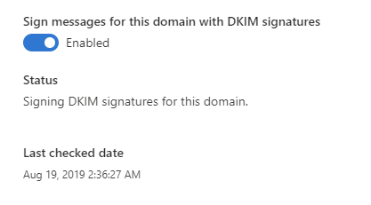
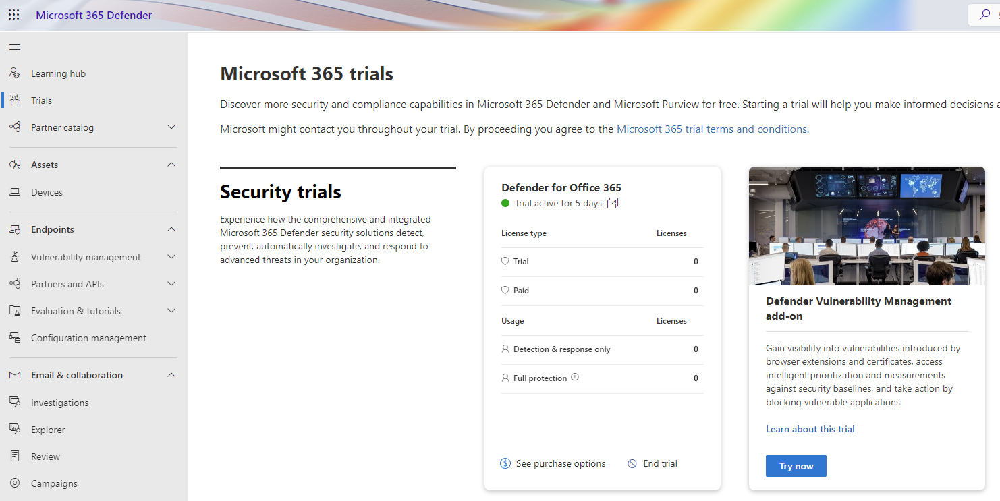
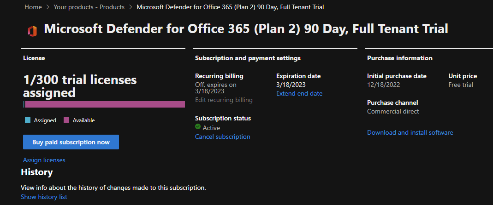

I have worked with email and more particular with Microsoft Exchange Server for a while now where I have installed Edge servers, Mailbox servers, optimizing databases, configuring mail flows and all of that but when Office 365 Advanced Threat Protection (ATP) came to life it really changed how we see email protection in the cloud. Many customers that I worked with were all focused on migrating mailboxes to Office 365 and just that step was the first step for many to the cloud. And many customers stopped there as well, because all we did was migrating mailboxes. Then Microsoft Teams came and even more customers wanted their mailboxes to be migrated because they wanted to utilize the full potential of Teams with calendar functions and so on.

The old ATP product became Microsoft Defender for Office 365 in late 2020 (and hopefully we don't need to rename that product or any Microsoft product in the future 😆) and we administered that product under the old Office 365 Security & Compliance portal - have you counted all of the portals? 😉


**Pro Tip - Microsoft Portals**

Visit http://msportals.io/ to get all URLs to the different portals


Enough with the old stuff. In this blog series about **Microsoft Defender for Office 365** (also called MDO) we will look into how to get started with a 90-day trial (if applicable), how to configure the different features and also look into different best practices, but we also need to be aware of email authentication and how to configure that as a first step.

# Microsoft Defender for Office 365 - Part 1 - Getting Started

## What is Microsoft Defender for Office 365 (MDO)?
Microsoft Defender for Office 365 is a powerful security solution that helps protect your organization's email, documents, and other Office 365 assets from threats like malware, spam, and phishing attacks.

## Which license should I choose? Plan 1 vs. Plan 2
Microsoft Official documentation: https://learn.microsoft.com/microsoft-365/security/office-365-security/microsoft-defender-for-office-365-product-overview?view=o365-worldwide&WT.mc_id=AZ-MVP-5004683#what-is-defender-for-office-365-security

We can put the security layers of the product into three different levels:
1. Exchange Online Protection (EOP)
2. Microsoft Defender for Office 365 Plan 1
3. Microsoft Defender for Office 365 Plan 2

You will get the core protection with EOP in all Microsoft 365/Office 365 subscription involving Exchange Online mailboxes. You can also buy MDO Plan 1/Plan 2 as an stand-alone subscription if you want. Many customers are choosing Microsoft 365 Business Premium or Microsoft 365 Enterprise E3. Business Premium do include MDO Plan 1 which is great, but E3 does not include any of the plans. 
EOP is also available to protect on-premise mailboxes.

* EOP will give you Protect
* MDO Plan 1 will give you Protect and Detect
* MDO Plan 2 will give you Protect, Detect, Investigate, and Respond

## Wait, we need to know more about the email flow and authentication!
Before we dive into the Defender product I think we need to know more about email authentication and how it works. This will not be a deep dive text, but highlight what we need to know so we can have a good reputation and help us stop spoofing (emails from forged senders). Microsoft (as well as others) uses these standards to validate emails and prevent spoofing:
* SPF
* DKIM
* DMARC (news coming up!)

And we need to configure those three standards.

### SPF (Sender Policy Framework)

To validate that the email is coming from who it says it is, SPF helps us. 
We need to add or modify some DNS-records at your public DNS provider. For example, if you host your mailboxes entirely in Microsoft 365, your SPF TXT DNS-record would be:

``` text
v=spf1 include:spf.protection.outlook.com -all
```

Syntax:
``` text
v=spf1 [<ip4>|<ip6>:<IP address>] [include:<domain name>] <enforcement rule>
```

There are some different values to our syntax. Recommended enforcement rule are the **-all**, translated to Hard Fail. Other values could be **~all** (soft fail, could be used if you are using DMARC) or **?all** (neutral, only for testing).

SPF will not be our single solution to protect us from spoofing. 

### DKIM (DomainKeys Identified Mail)
This second pillar of email authentication, DKIM, attaches like an ID to the email so receiving email system can verify that it is you who are sending the email.

In this case we will add another DNS-record to our public DNS, and this time we will add a new CNAME-record. 

In the DKIM page, https://security.microsoft.com/dkimv2, you will have the alternative to enable DKIM and get the DNS entry you need to publish in your DNS.

``` text
CNAME

Host name: selector1._domainkey
Points to address or value: selector1-<domain name>-<TLD>._domainkey.<M365 tenant name>.onmicrosoft.com
TTL: 3600

Host name: selector2._domainkey
Points to address or value: selector2-<domain name>-<TLD>._domainkey.<M365 tenant name>.onmicrosoft.com
TTL: 3600
```
Observe that TTL could also be as your DNS providers default value.

And of course, you need to wait until the new records have been populated and synchronized around the world before you can enable DKIM in the portal.



### DMARC (Domain-based Message Authentication, Reporting, and Conformance)
Email authentication protocol that helps protect email senders and recipients from spam, phishing, and other types of email fraud. It works by checking the authenticity of the sender's domain, and verifying that the email was actually sent by an authorized sender. 


**Don't be spoofed by other Microsoft 365 customers**

With the reject policy (p=reject) no other tenant within Microsoft can spoof your domain.


So we have three different policy options
1. None - will deliver the email as normal
2. Quarantine - will deliver the email to spam/quarantine folder
3. Reject - will reject the email to be delivered

``` text
TXT

_dmarc.domain 3600 IN  TXT  "v=DMARC1; p=none"

_dmarc.domain 3600 IN  TXT  "v=DMARC1; p=quarantine"

_dmarc.domain 3600 IN  TXT  "v=DMARC1; p=reject"

_dmarc.contoso.com.   3600    IN      TXT     "v=DMARC1; p=none; pct=100; rua=mailto:d@rua.contoso.com; ruf=mailto:d@ruf.contoso.com; fo=1"
```

In our DNS, once more, add a new TXT record and if we want to have the reporting capabilities to see the data on all sending sources using our domain. 

Aggregate reports - are sent to "rua"
Failing reports - are sent to "ruf"

I think it's important to have these reports to be able to know more and take action if necessary. 

Microsoft are working on a new feature for EOP customers regarding DMARC - https://www.microsoft.com/en-us/microsoft-365/roadmap?filters=&searchterms=109535 


*As part of the DMARC standard the owner of the domain can request reports about how receivers viewed their traffic which will help the domain owners adjust their sender authentication configurations so they can get to an actionable DMARC policy. This feature will be available for all EOP customers.*


## Summary of SPF, DKIM and DMARC

So SPF with DKIM and DMARC are working in conjunction to help verify that the sender is authorized to send emails on behalf of the domain, and that the email has not been tampered with during transit.

1. An email is sent from sender@example.com to recipient@example.com.
2. The recipient's email server checks the sender's domain for a DMARC policy.
3. The DMARC policy specifies how the recipient's email server should handle the email if it fails the authentication check.
4. The recipient's email server checks the SPF record of the sender's domain to see if the server that sent the email is on the list of authorized servers.
5. The recipient's email server checks the email headers for a DKIM signature, and uses the signature to verify that the email was actually sent by the domain it claims to be from.
6. If the email passes the authentication check, it is delivered to the recipient's inbox. If it fails the check, it may be marked as spam or rejected, depending on the DMARC policy.

## How to start with the trial for Microsoft Defender for Office 365

Trial or explore the interactive guide and evaluation environment?
There are some different ways to get started with Defender for Office 365, depending on what your goal is. Do you already have the licenses required (I highly recommend the Plan 2 license) you can go ahead and start configure the product. Otherwise, take use of the 90-day free trial.

Did you take a look at the above URL to see all portals? We will dive into the Microsoft 365 Defender portal, or https://security.microsoft.com/ where we will start our trial and start configuring the feature for our needs.

Once you are logged in with your Global Admin or Security Admin account go to the **Trials** menu on the left. 



Press the **Try Now** button and go through the process. You will get unlimited number of licenses and can end the trial at any time. The time period you get is 90-days. You can see all the details of the license in the Microsoft 365 Admin Center (https://admin.microsoft.com/).



When you have the trial, start assigning the license to the users with your preferred method (groups, manually or with code). 

## How to start with the Interactive Guide for Microsoft Defender for Office 365
https://mslearn.cloudguides.com/guides/Protect%20your%20organization%20with%20Microsoft%20365%20Defender


# Roadmap for Defender for Office 365
https://www.microsoft.com/en-us/microsoft-365/roadmap?filters=&searchterms=Microsoft%2CDefender%2Cfor%2COffice%2C365


In the next post we will go deeper in the configuration of MDO.

I see you at the next post!

**Happy hunting!**


