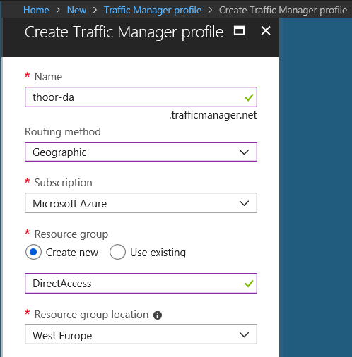
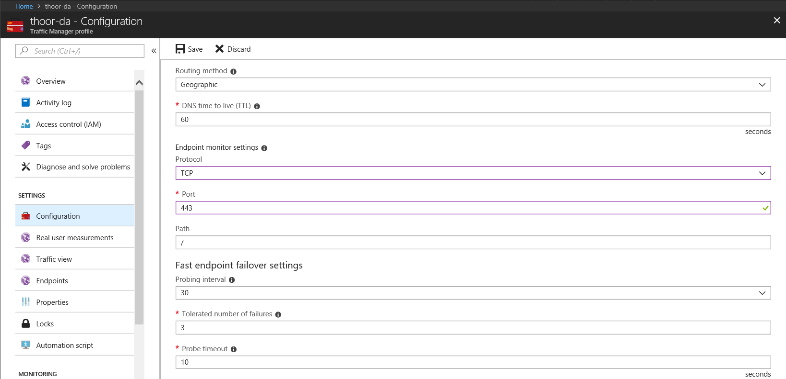
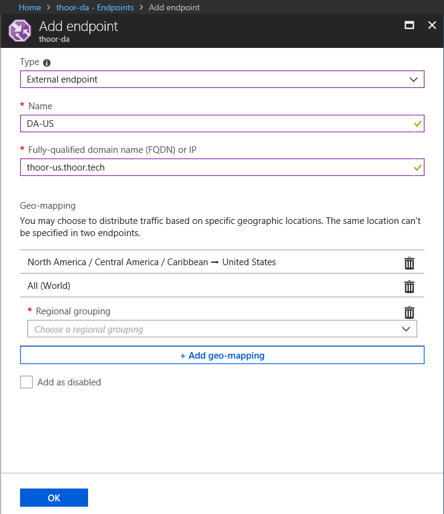
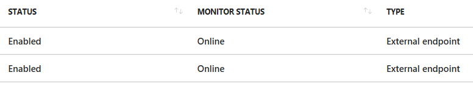
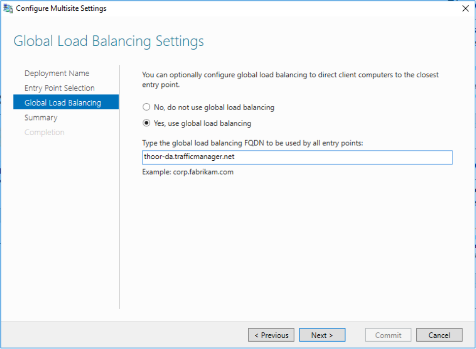
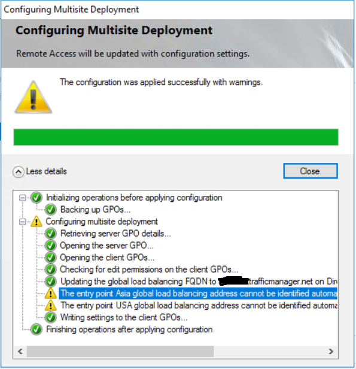
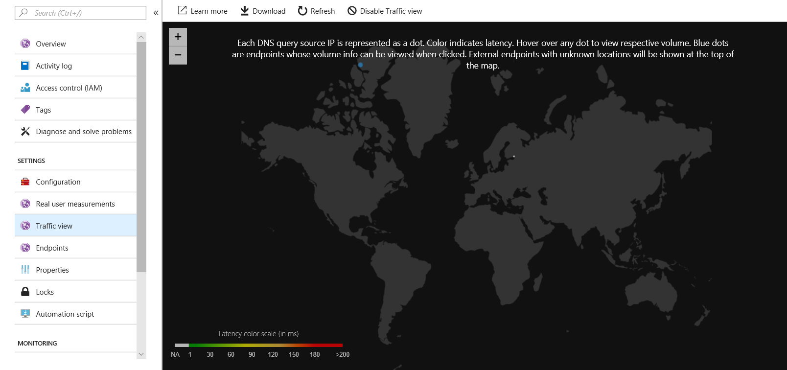

I want to reach out and give Richard Hicks a big thank you for helping me with this issue and opening my eyes, thank you Rich! Don’t forget to visit his blog <https://directaccess.richardhicks.com> and hey, buy his book!

I was setting up an Direct Access Multisite deployment and wanted to use Azure Traffic Manager as an GSLB solution. It should work and I was reading about it at Richard Hicks blog. But then the problems began.

If you are familiar with Direct Access and it’s terminologies I wanted to add the external hostnames (entry points) as an endpoint in Traffic Manager. That’s quite easy, right? Said and done, but one of my entry points wouldn’t change its status from Degraded to Online – what could be the problem?

I got one DA server in US (us.thoor.tech) and one DA server in Asia (asia.thoor.tech). I configured the multisite so that Windows 10 clients could select entry point manually.

Back to the Azure portal. Create a new Traffic Manager profile throughout the GUI or PowerShell, your choice. Here’s the problem. I did choose to monitor the HTTPS protocol and IPHTTPS path. With these settings one of my entry points got the status Online and the other Degraded. I started to troubleshoot with wget.exe, with PowerShell and … but I couldn’t find the problem.

With all tools listed above I got HTTP 200 OK for the entry point in Asia and no response from the entry point in the US… HOW could I resolve this?

Started to think if it would be an IIS issue, some NAT issues, the head started to spin… Reached out to Richard Hicks to see if he had some pointers. And he did! Before he suggested a potential solution he asked if I monitored HTTPS or TCP. TCP is the ANSWER. Before I answered Richard I logged in to the Azure portal and did change the monitor protocol to TCP. The seconds after, both endpoints was Online.

So how do we set up Azure Traffic Manager with Direct Access Multisite?
=======================================================================

Start with adding Traffic Manager profile in your Azure tenant – In Marketplace, search for Traffic Manager then click Add. Type in your name that will be your external hostname for this service, note that your name must be unique.

Routing method – for this purpose (Direct Access) chose Geographic.  
Resource Group – create new or use existing



When the profile is created, go in to Traffic Manager resource and then Configuration.

Edit TTL to your needs.  
Endpoint monitor settings:  
Protocol – for this purpose (Direct Access) chose TCP  
Port – 443  
Path – leave default  
Other settings – edit to fit your needs. Default will work just fine.



Then we need to add some endpoint (our entry points in Direct Access).

Type: External endpoint  
Name: Just an administrative name, keep it simple.  
FQDN or IP: To your DA entry point  
Geo-mapping: For US, select that region. Note that it’s recommended that one (1) endpoint have the All (World) location assigned to it. How does the client know which endpoint it should connect to? *…lookup starts at the lowest granularity level (State/Province where it is supported, else at the Country/Region level) and goes all the way up to the highest level, which is World. The first match found using this traversal is designated as the endpoint to return in the query response.  
For example, consider a Geographic Routing type profile with two endpoints – Endpoint1 and Endpoint2. Endpoint1 is configured to receive traffic from Ireland and Endpoint2 is configured to receive traffic from Europe. If a request originates from Ireland, it is always routed to Endpoint1.* Read more at Microsoft Docs: [https://docs.microsoft.com/en-us/azure/traffic-manager/traffic-manager-routing-methods#a-name–geographicageographic-traffic-routing-method](https://docs.microsoft.com/en-us/azure/traffic-manager/traffic-manager-routing-methods#a-name--geographicageographic-traffic-routing-method)



Your endpoint should then be Online.



When you have configured it all in Azure, its time to enable GSLB in Direct Access.  
Configure your Multisite deployment and type in your Traffic Manager DNS endpoint in GSLB settings. Then click Next to update the deployment and push out the new GPO.



It’s likley that you will need to run some PowerShell cmdlets after the GPO have been updated. If you get this warning, just follow its instructions.

```powershell
Set-DAEntryPoint -Name "Name of the entry point" -GslbIP "External IP address of the DNS name"
```



I also recommend to enable **Traffic View** to see more detailed view how the clients connect and some other cool stuff!

