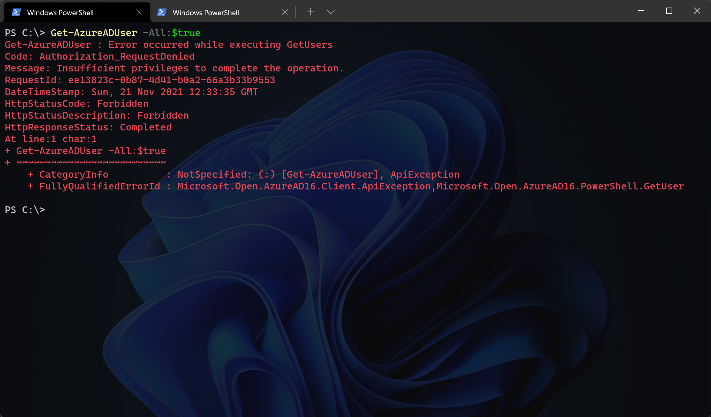
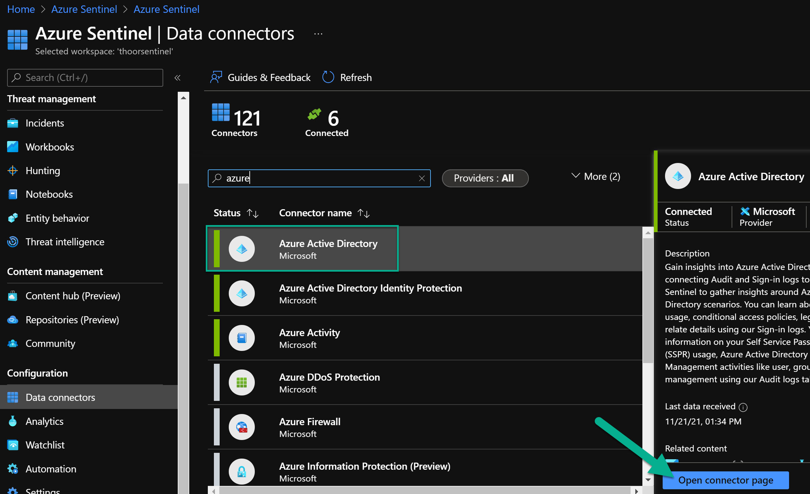
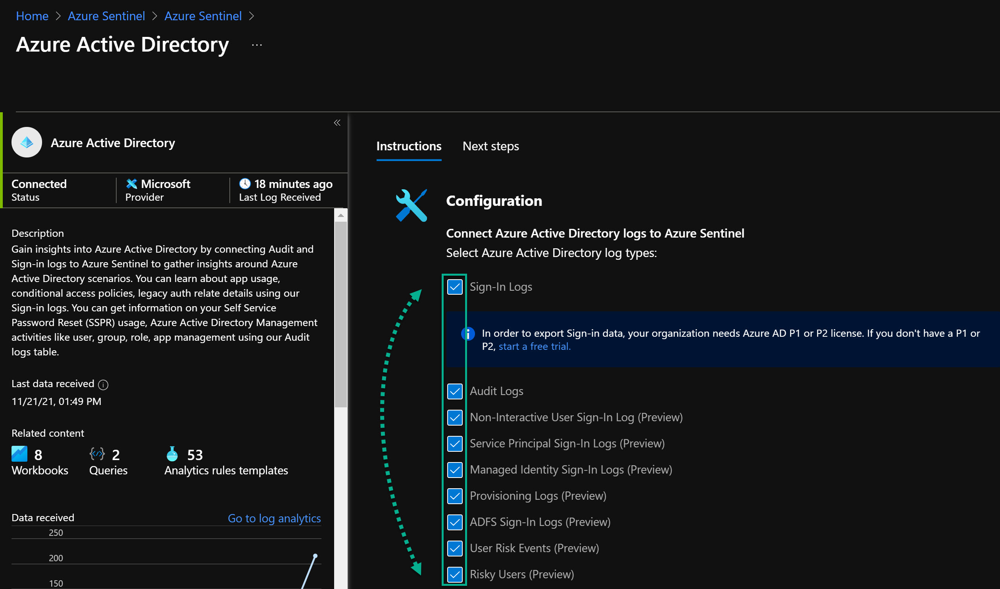
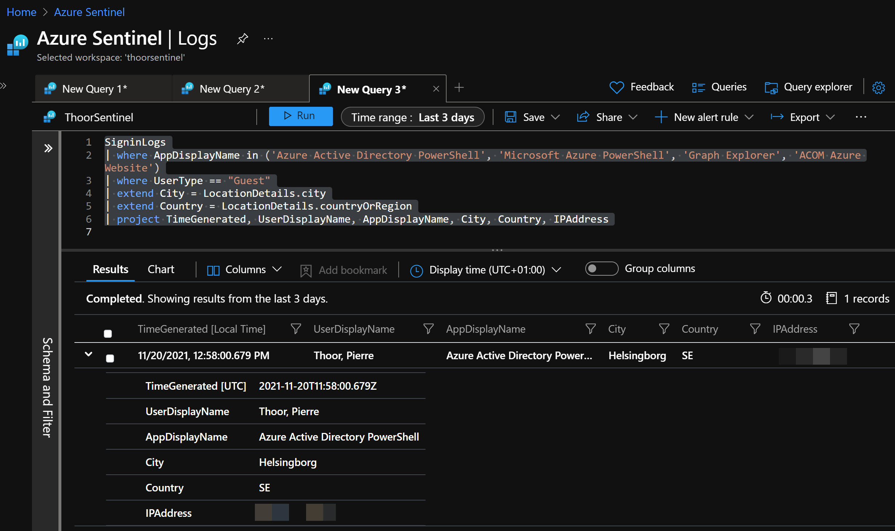
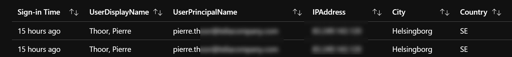
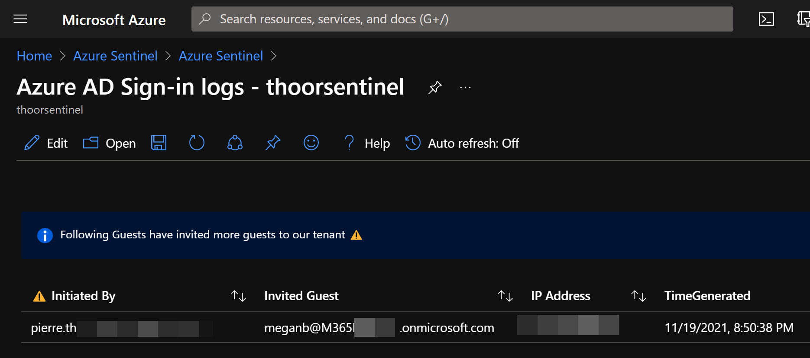
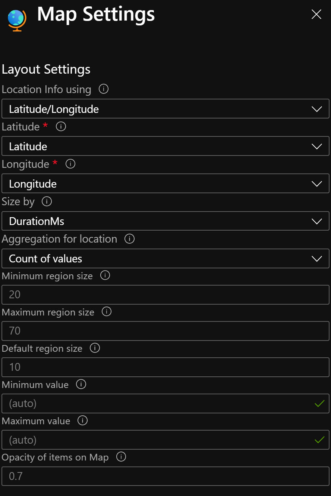
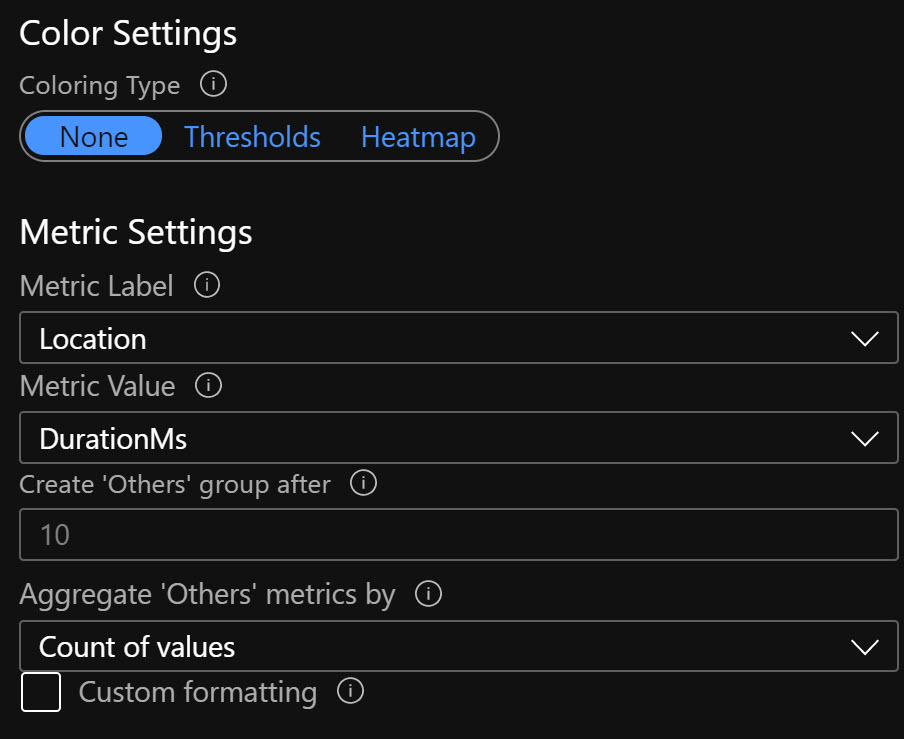
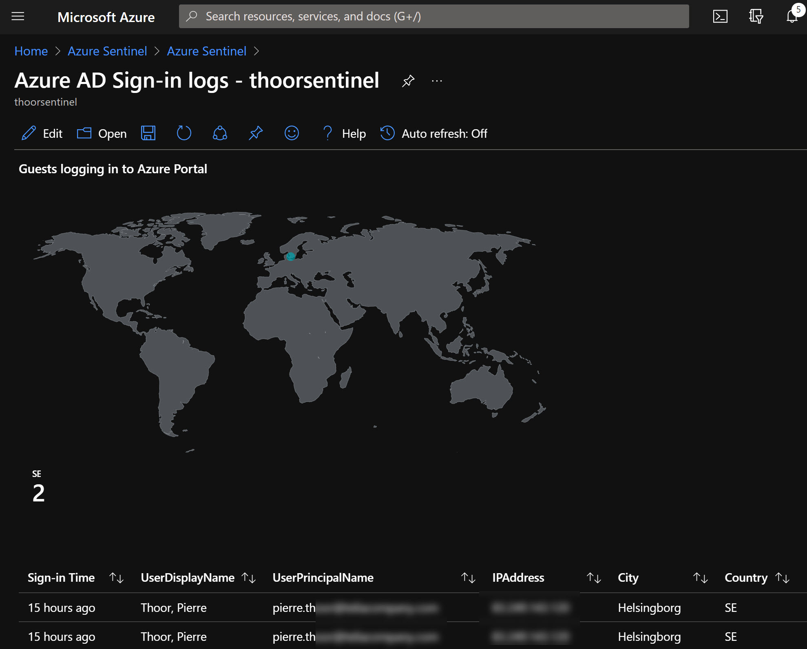


**We cannot see all...**


With default settings in Azure Active Directory we are, well, quite vulnerable... Many smaller companies just kicks off all the power of Office 365 and starts collaborating. Many settings are, open for the purpose of simplifing for our end users - but also an opener for bad actors.

One thing I didn't find is a way to collect evidence when someone does a GET operation or reads something, like sensitive accounts, groups, and other information. With PowerShell, when you have connect to another tenant other than your own, it is simple to start digging around and do some reconnaissance. In our on-premise Active Directory we can have for instance Defender for Identity what will be triggered if someone will do a reconnaissance, but not i Azure Active Directory (AAD).

This is why I think it's even more important to activate Microsoft Sentinel and start collecting logs, even though we don't get exactly what we want in the Audit logs.

Another reason why we should have the sign-ins and audit logs can be that someone with malicious intent who have access to your Azure subscription uses the **Run Command** feature for virtual machines to run something... bad. So activate the **Azure Activity** data connector as well.

I got inspired by Daniel Chronlund's post: *Scary Azure AD Tenant Enumeration… Using Regular B2B Guest Accounts* - check it out here:
https://danielchronlund.com/2021/11/18/scary-azure-ad-tenant-enumeration-using-regular-b2b-guest-accounts/ 

*Please do the mitigation part!*

## Connect to another tenant as a guest
To try this yourself in your own environment, use the AzureAD module.
After you have installed the module, find the Tenant ID with for example https://www.whatismytenantid.com/ or in the Azure Portal, see Daniel's post.

``` powershell
# Install module if you don't have it, use AllowClobber if you have install other Azure module that have some of the AzureAD cmdlets already installed.
Install-Module AzureAD -Force -AllowClobber

# Connect to a tenant where you are a guest in 
Connect-AzureAD -TenantId '<guid>' -ObjectId '<email@domain.com>'
```

When we are connected we can now start looking around.

``` powershell
# ObjectId will then be a persons UPN that you already know about
Get-AzureADUserMembership -ObjectId (Get-AzureADUser -ObjectId '<email@domain').UserPrincipalName
```

*Why not just looking at all users directly, well, **that's** not allowed...*

``` powershell
Get-AzureADUser -All:$true
```


## Enable Data Connector for Azure Active Directory

**If you haven't enabled the Data Connector for Azure AD - well follow these steps.**</br>
In Sentinel, go to Data Connectors, then find **Azure Active Directory** - open the connectors page.


Activate the log types you want to have.


**Sign-in logs**, which contain information about interactive user sign-ins where a user provides an authentication factor. The Azure AD connector now includes the following three additional categories of sign-in logs, all currently in PREVIEW:

**Non-interactive user sign-in logs**, which contain information about sign-ins performed by a client on behalf of a user without any interaction or authentication factor from the user.

**Service principal sign-in logs**, which contain information about sign-ins by apps and service principals that do not involve any user. In these sign-ins, the app or service provides a credential on its own behalf to authenticate or access resources.

**Managed Identity sign-in logs**, which contain information about sign-ins by Azure resources that have secrets managed by Azure. For more information, see What are managed identities for Azure resources?

**Audit logs**, which contain information about system activity relating to user and group management, managed applications, and directory activities.

**Provisioning logs** (also in PREVIEW), which contain system activity information about users, groups, and roles provisioned by the Azure AD provisioning service.


<div style="padding: 15px; border: 1px solid transparent; border-color: transparent; margin-bottom: 20px; border-radius: 4px; color: #ffffff; background-color: #674ea7; border-color: #674ea7;">
<b>Info</b></br></br>
<b>Sign-in logs</b>, which contain information about interactive user sign-ins where a user provides an authentication factor. The Azure AD connector now includes the following three additional categories of sign-in logs, all currently in PREVIEW:</br></br>

<b>Non-interactive user sign-in logs</b>, which contain information about sign-ins performed by a client on behalf of a user without any interaction or authentication factor from the user.

<b>Service principal sign-in logs</b>, which contain information about sign-ins by apps and service principals that do not involve any user. In these sign-ins, the app or service provides a credential on its own behalf to authenticate or access resources.

<b>Managed Identity sign-in logs</b>, which contain information about sign-ins by Azure resources that have secrets managed by Azure. For more information, see What are managed identities for Azure resources?

<b>Audit logs</b>, which contain information about system activity relating to user and group management, managed applications, and directory activities.

<b>Provisioning logs</b> (also in PREVIEW), which contain system activity information about users, groups, and roles provisioned by the Azure AD provisioning service.
</div>

https://docs.microsoft.com/en-us/azure/sentinel/connect-azure-active-directory 





**If you already have enabled the Data Connector, let's find out if someone have been signing in as a guest in the Azure Portal or via PowerShell.**

## Guest sign-ins to Azure via PowerShell/CLI
Sample KQL to find guests signing in with PowerShell.
``` sql
SigninLogs
| where AppDisplayName in ('Azure Active Directory PowerShell', 'Microsoft Azure PowerShell', 'Graph Explorer', 'ACOM Azure Website')
| where UserType == "Guest"
| extend City = LocationDetails.city
| extend Country = LocationDetails.countryOrRegion
| project TimeGenerated, UserDisplayName, AppDisplayName, City, Country, IPAddress
```


## Guest sign-ins to Azure Portal
Sample KQL to find guests signing in to the Azure Portal.
Changed some of the *project* for a nicer output.
``` sql
SigninLogs
| where AppDisplayName == "Azure Portal"
| where UserType == "Guest"
| extend City = LocationDetails.city
| extend Country = LocationDetails.countryOrRegion
| extend TimeFromNow = now() - TimeGenerated
| extend TimeAgo = strcat(case(TimeFromNow < 2m, strcat(toint(TimeFromNow / 1m), ' seconds'), TimeFromNow < 2h, strcat(toint(TimeFromNow / 1m), ' minutes'), TimeFromNow < 2d, strcat(toint(TimeFromNow / 1h), ' hours'), strcat(toint(TimeFromNow / 1d), ' days')), ' ago')
| project ['Sign-in Time'] = TimeAgo, UserDisplayName, UserPrincipalName, IPAddress, City, Country
```


## Guest inviting guests
Here's one sample KQL that shows us which guests have been inviting other guests

``` sql
AuditLogs
| where ActivityDisplayName == "Invite external user"
| extend initiatedBy = tostring(parse_json(tostring(InitiatedBy.user)).userPrincipalName)
| where isnotempty(initiatedBy)
| where initiatedBy !contains "<your domain>"
| extend InvitedUser = tostring(AdditionalDetails[5].value)
| extend IPAddress = tostring(AdditionalDetails[2].value)
| project ['⚠️ Initiated By'] = initiatedBy, ['Invited Guest'] = InvitedUser, ['IP Address'] = IPAddress, TimeGenerated
```


## Map over the sign in locations
To generate a simple map in Sentinel Workbooks over the location of the Azure Portal sign ins for guests use below KQL and Map Settings.
``` sql
SigninLogs
| where AppDisplayName == "Azure Portal"
| where UserType == "Guest"
| extend Longitude = LocationDetails.geoCoordinates.longitude
| extend Latitude = LocationDetails.geoCoordinates.latitude
```
### Map Settings





I see you at the next post!

**Happy hunting!**


