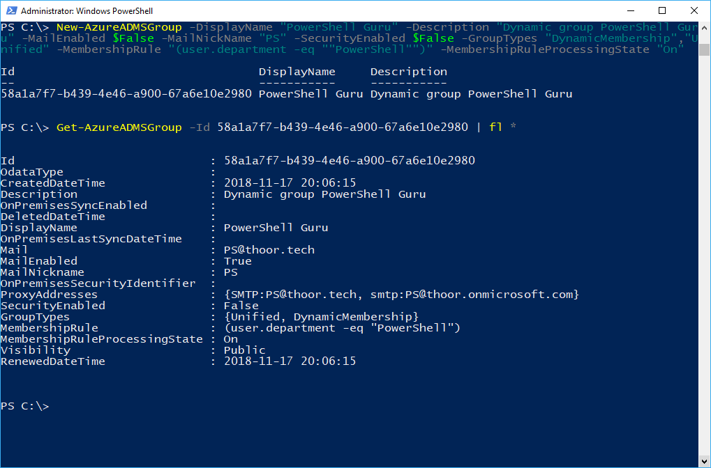
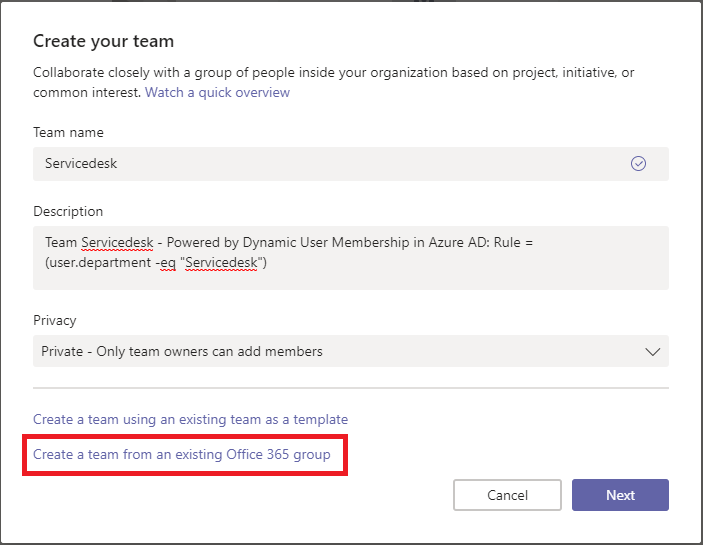
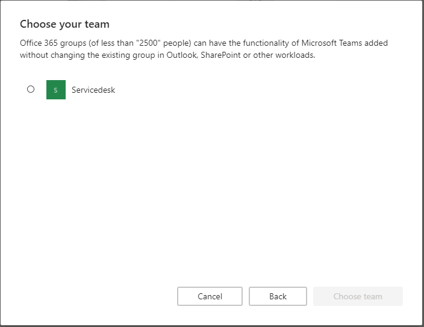
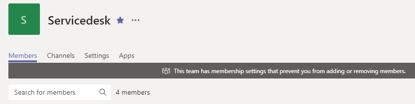

Really cool feature within Azure Active Directory. I have created a few Dynamic Groups, both for users but also for devices like “All Windows 10 Clients”, “All iPhones” and so on…

But now its time to do this for Microsoft Teams! I think this will take away the administrative part of adding and removing users from different teams within Microsoft Teams. I mean the world is dynamic today, and our teams are also that.

So how do we begin? I’m not going to show how you can create an Dynamic Group in the Azure Portal, that’s just to easy. Instead I’m going to show you the PowerShell-way, because we do love PowerShell, right?

First we do need to uninstall the AzureAD module. Sounds really crazy right? But I did found out that the AzureAD module doesn’t have all the parameters in the New-AzureADMSGroup cmdlet… Instead we need to install the AzureADPreview module. Just trust me on this one.

Then we can create our dynamic group! I have put in an example here for the Servicedesk group. I’m looking for the user attribute “Department” and I want the value to be “Servicedesk”. The parameter *MailEnabled*  should be $True because an Office 365 Group do have all of those features. Do we set $False the command will ignore that. See the pictures for real evidence.

When we have created the group we want to remove the user that created the group, right? Because that user will be a member of the team in Teams otherwise.

```powershell
Uninstall-Module AzureAD
Install-Module AzureADPreview -AllowClobber

New-AzureADMSGroup -DisplayName "Servicedesk" -Description "Dynamic group of Servicedesk" -MailEnabled $true -MailNickName "Servicedesk" -SecurityEnabled $True -GroupTypes "DynamicMembership","Unified" -MembershipRule "(user.department -eq ""Servicedesk"")" -MembershipRuleProcessingState "On"

$GroupId = (Get-AzureADMSGroup -SearchString "HR").Id

$UserId = (Get-AzureADUser -SearchString "pierre@thoor.tech").ObjectId

Add-AzureADGroupOwner -ObjectId $GroupId -RefObjectId $UserId

Get-AzureADGroupOwner -ObjectId $GroupId

Remove-AzureADGroupOwner -ObjectId $GroupId -OwnerId <paste in the ID of the owner that's going to be removed>

Get-AzureADGroupOwner -ObjectId $GroupId
```



Here you see that PowerShell ignores the $False value in MailEnabled parameters.



Type in Team name, Description, choose Privacy mode, then click on the “Create a team from existing Office 365 group” link.



Choose the dynamic group, in this case it’s the Servicedesk group. Then your done!


