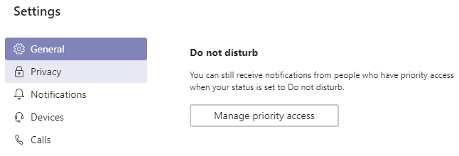

You may noticed the Search bar in Microsoft Teams, but have you used it yet? No? Here’s one quick tip!

If you type the slash-sign “/” you will see some commands that will help you during the day. Maybe you want to put your Status to “Do not disturb”, just type /dnd and you’re all set.

Now you will see that your Status is “Do not disturb”. And that does that mean exactly? It means that Teams will not notify you at all. No chat messages, no mentions, no activity from different teams. You will be able to focus on what you need to be focused at. When you’re done, switch your Status to Available, Busy or Away.

Quick status commands:  
**/available**  
**/busy**  
**/dnd** (Do Not Disturb)  
**/away**

When we use the Do Not Disturb status we can allow some colleagues to be in the priority access. This means that these people can bypass with their notifications (chat messages, mentions, calls) even if we use the Do Not Disturb status.

