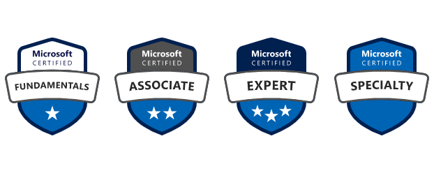

My first Microsoft exam was at March, 2016 and it was for the Windows Server 2012 (Exam 70-410). I was so nervous and I wrote it at a test center in the town where I live. I had studied for several weeks and had some knowledge from my time as Windows level 3 technician. 

So the first exam, I did pass and the feeling... Wow! This is so great AND fun. So schedule the next one in the Server 2012 series, 70-411. That one was harder and I failed, but pass a few days later. Same thing with the last exam in the Server 2012 series, 70-412. But I think it's good to fail exams because you will learn. You will learn how the questions are asked, how the environment in the test center works and as I wrote more and more exams - more knowledge and experience will follow and also how you can improve your own study technique. From September, 2016 (from 70-412) until February, 2021 I didn't fail one exam. And I did approx. 4-6 exams each year. 

It's so important when you are doing the exams online with a proctor monitoring you - don't talk to yourself, don't look at the wall or ceiling, don't repeat the question with your mouth, just sit still and look at your screen. I have been warned many times... 

Now almost 30 exams later, I still get the kick in passing the exam and specially after doing beta exams. 

The renewal process for the exams are great. You will be notified when it's time and you will have many days to prepare and to look at the new things you will be tested. There's no proctor, no need to clean your desk, just answer a few questions and if you reach to the Pass level, well you have extended your certificate for one more year.

## So why bother taking the exams in first place?

This is my view on it, but I see more and more job descriptions require certifications. I see that you will get greater job offers (and hopefully more salary), you will be top of mind at other people - getting more fun projects, and for some Microsoft partners - it's crucial to have these certifications because of incentives, invitation to programs, advanced specialization programs and so on. Skilling and training is a very big topic that needs to be decided higher up in the management - and if you want to be competitive, well the answer is simple.

And the best part - you will get a badge!

Plan your certification journey here: https://query.prod.cms.rt.microsoft.com/cms/api/am/binary/RE2PjDI 

Browse and find more information about Microsoft certifications: https://docs.microsoft.com/en-us/learn/certifications/ 

**Good luck!**

View my verified achievements from Microsoft: [https://www.credly.com/users/pierre-thoor/](https://www.credly.com/users/pierre-thoor/badges?sort=-state_updated_at&page=1)

