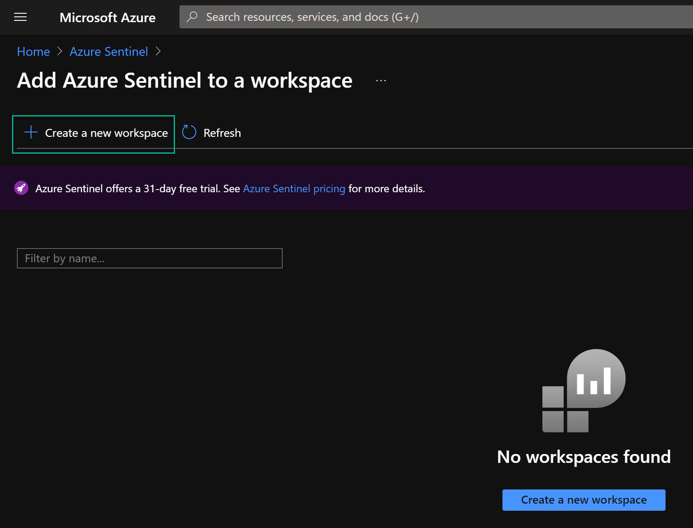
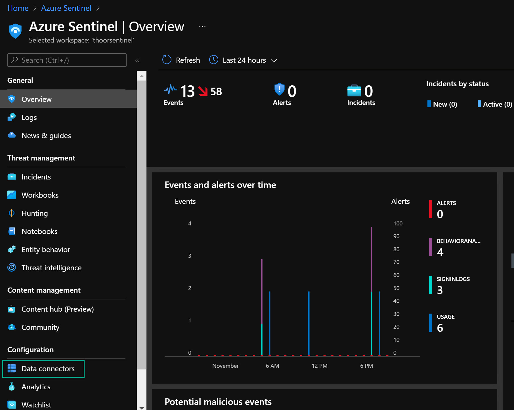
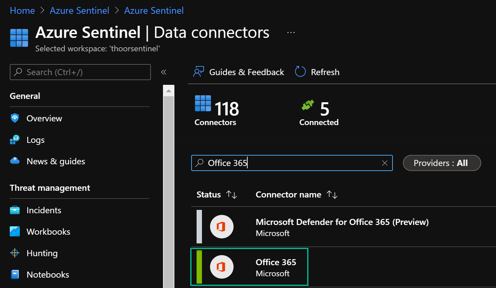
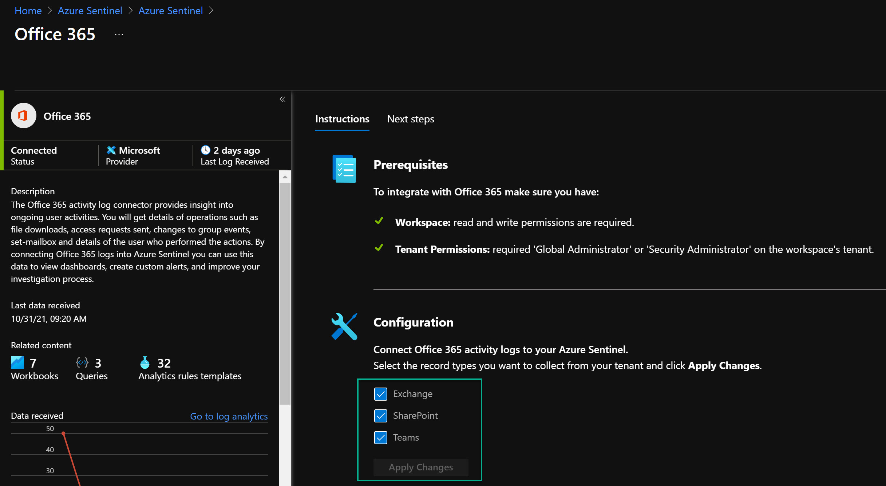

It's really no news that Microsoft Teams have been growing so much during the pandemic and many companies have been forced to take the digitalization and the cloud journey faster than intended. Key in the cloud journey is the security work - and this is my view - to make the entire journey successful. 

I still see many companies rely on firewalls and other "old school security tools" and not secure the company during the cloud journey. When documents flyes from on-premise to the cloud to external recipient then to some external drive - you cannot rely on firewall. Same with your identities when most of the companies utilize the hybrid model where you have on-premise Active Directory and are extending this to Azure Active Directory so you can enable services like Microsoft Teams. 

So how can we protect our content in Microsoft Teams with Azure Sentinel?
We will not discuss Information Protection - but I really think this is critical to every organization - but very few (at least in the Nordics) are utilizing that capability.

These are the steps covered in this post:

1. Enable MFA (have nothing to do with Sentinel, but please enable it if you haven't already)
2. Enable Audit Logs in Microsoft 365
3. Start Azure Sentinel and enable Office 365 data connector
*Did you know that Microsoft Teams logs are free of charge inside of Azure Sentinel?*

### Free data sources with Azure Sentinel
- Azure Activity Logs
- Office 365 Audit Logs, including all SharePoint activity, Exchange admin activity, and Teams
- Microsoft Defender alerts, including alerts from Azure Defender, Microsoft 365 Defender, Microsoft Defender for Office 365, Microsoft Defender for Identity, and Microsoft Defender for Endpoint
- Azure Security Center and Microsoft Cloud App Security (MCAS) alerts. 
*Raw logs for some Microsoft 365 Defender, MCAS, Azure Active Directory (Azure AD), and Azure Information Protection (AIP) data types are paid.*


You need required permissions to be able to configure audit logs, and to enable the Office 365 data connector in Azure Sentinel. 


## Enable Audit Logs
If you have a old tenant, it may be so that the audit log is not enabled. New tenants (don't know by date) should have the audit logs enabled by default. Either you use PowerShell to verify or use the Compliance Center portal.

### PowerShell - Audit Logs

```powershell
Get-AdminAuditLogConfig | Format-List UnifiedAuditLogIngestionEnabled
```
If you got the value **FALSE**, you need to activate it.

To be able to activate audit logs you need to install Exchange Online PowerShell (now supporting PowerShell 7!).
Install EXO V2 as it's also called, then activate audit logs:
```powershell
# Set Execution Policy to allow signed PowerShell scripts from a trusted publisher.
# Using the Scope of the current PowerShell process, will be reverted then PowerShell closes.
Set-ExecutionPolicy RemoteSigned -Scope Process
# Install EXO V2 module.
Install-Module -Name ExchangeOnlineManagement
# Import EXO V2 module.
Import-Module ExchangeOnlineManagement
# Connect to Exchange Online, enter your password in the sign-in window and response to the MFA challenge.
Connect-ExchangeOnline -UserPrincipalName username@domain.com
# Enable Audit Logs
Set-AdminAuditLogConfig -UnifiedAuditLogIngestionEnabled $true
# Disconnect from Exchange Online
Disconnect-ExchangeOnline
```

### Compliance Center - Audit Logs
Go to https://compliance.microsoft.com/ then click on **Audit**. 
If audit logs are not enabled, you will see a banner saying "Start recording user and admin activity" - click on the banner to activate.

Either solution will take approx. 60 minutes for the change to take effect. A short Microsoft moment. 

## Azure Sentinel
Because this is a Azure service, you will need a Azure subscription and hopefully you are using the new Azure Plan (make sure to migrate to Azure Plan if you haven't already). 

*Have your naming convention figured out before you start.*
https://docs.microsoft.com/en-us/azure/cloud-adoption-framework/ready/azure-best-practices/resource-abbreviations 

1. Search after Azure Sentinel inside of Azure portal
2. Click on **Create**, then click on **Create a new workspace**


3. Choose your Azure subscription and your resource group. One rule is that use **ONE** Log Analytics Workspace with **ONE** Azure Sentinel. Otherwise your future KQL queries will be more advanced to be able to analyze logs. Also choose Name of your Sentinel instance and Azure Region.
4. When the Sentinel resource are deployed, go to that resouce then **Data Connectors**

5. Search for **Office 365**, then click on the Office 365 in the list.

6. Click on **Open Connector page**.
7. Select those data sources within Office 365 data connector you want to enable, then click on **Apply Changes**.

8. Done!

Now you have enabled the Teams data source with Azure Sentinel. 
*No, I didn't show you how to enable MFA - that will be covered in another post in the future*

In the next post, we will go deeper inside of Azure Sentinel and do some queries to find malicious activities and to be alerted when it's happening.

**Happy hunting!**
🐱‍👤