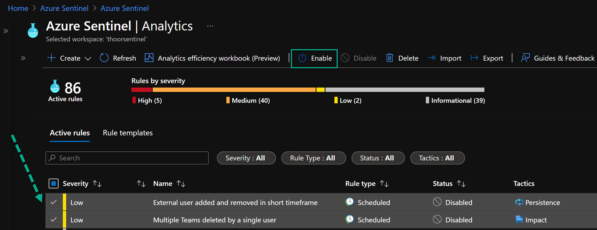

In the first part of this series we enabled the logging capability of Microsoft Teams into Microsoft (previously Azure) Sentinel. In this post we will focus on enabling a solution from the new Content Hub within Sentinel.

So in to our Sentinel workspace and locate Content Hub. After that you do a quick search for Teams and the solution will be displayed as above. After that, press **Install**.

*Teams serves a central role in both communication and data sharing in the Microsoft 365 Cloud. Because the Teams service touches on so many underlying technologies in the Cloud, it can benefit from human and automated analysis not only when it comes to hunting in logs, but also in real-time monitoring of meetings. Azure Sentinel offers admins these solutions.*


*This Microsoft Sentinel Solution is currently in public preview. This feature is provided without a service level agreement, and it's not recommended for production workloads. Certain features might not be supported or might have constrained capabilities.*


This solution will give us (more on those later in the post):
- 2 Analytics Rules
- 7 Hunting Queries
- 2 Playbooks

Click on **Create** and then like every other Azure resource; Select subscription, resource group, and log analytics workspace.

## Analytics Rules


After installation of this solution, the analytics rules will be in disabled state. Don't forget to enable those.


- External user added and removed in short timeframe (Persistence)
This detection flags the occurances of external user accounts that are added to a Team and then removed within one hour.
- Multiple Teams deleted by a single user (Impact)
This detection flags the occurrences of deleting multiple teams within an hour. This data is a part of Office 365 Connector in Azure Sentinel.

## Hunting Queries
- External user from a new organisation added to Teams
This query identifies external users added to Teams where the user's domain is not one previously seen in Teams data. It depends on the Office365 data connector and OfficeActivity (Teams) data type and Office365 parser.
- Multiple Teams deleted by a single user
This hunting query identifies where multiple Teams have been deleted by a single user in a short timeframe. It depends on the Office365 data connector and OfficeActivity (Teams) data type and Office365 parser.
- Bots added to multiple teams
This hunting query helps identify bots added to multiple Teams in a short space of time. It depends on the Office365 data connector and OfficeActivity (Teams) data type and Office365 parser.
- User made Owner of multiple teams
This hunting query identifies users who have been made Owner of multiple Teams. It depends on the Office365 data connector and OfficeActivity (Teams) data type and Office365 parser.
- Previously unseen bot or application added to Teams
This hunting query helps identify new, and potentially unapproved applications or bots being added to Teams. It depends on the Office365 data connector and OfficeActivity (Teams) data type and Office365 parser.
- Files uploaded to teams and access summary
This hunting query identifies files uploaded to SharePoint via a Teams chat and summarizes users and IP addresses that have accessed these files. This allows for identification of anomolous file sharing patterns. It depends on the Office365 data connector and OfficeActivity (SharePoint) data type and Office365 parser.
- User added to Team and immediately uploads file
This hunting query identifies users who are added to a Team or Teams chat and within 1 minute of being added upload a file via the chat. This might be an indicator of suspicious activity. It depends on the Office365 data connector and OfficeActivity (Teams) data type and Office365 parser.

## Playbooks

Create an account for the playbook (Azure LogicApp) - either an service principal or an managed identity (currently in preview). Make sure after the deployment are done that the LogicApps works and that the account have the right permissions.


- IdentityProtection-TeamsBotResponse
- Post-Message-Teams

Now that we have enabled the solution, next step is to see if we will be alerted when things started to happend. And we also see if there are any other analytic rules/hunting queries/playbooks/workbooks we can use for Teams and Sentinel - more on that in the next post!

**Happy hunting!**
🐱‍👤