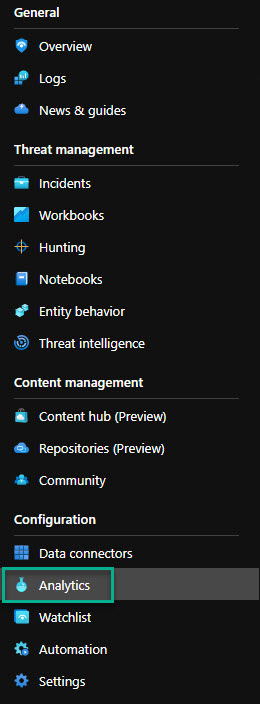
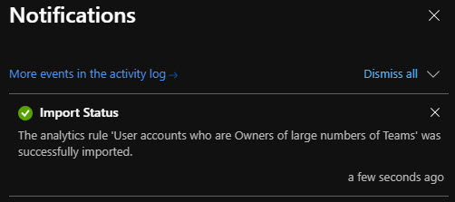
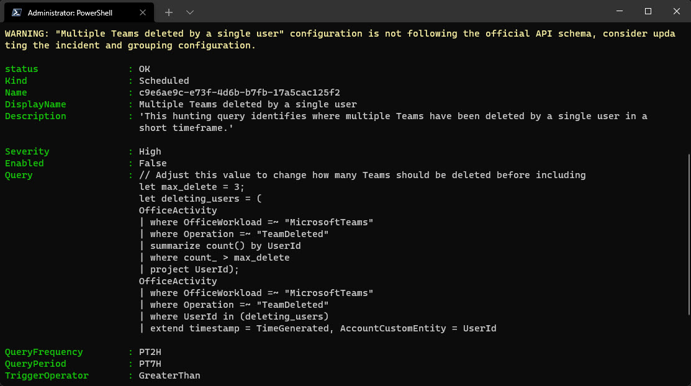

In the two first posts in this series we went over how to enabled Office 365 Audit Logs, how we enabled the Office 365 data connector and Microsoft Sentinel, to the second post that showed us how to enable the new Teams solution within Content Hub (currently in preview).

**Read the posts in the series:**</br>
[Part 1 - Enable logging for Teams](https://thoor.tech/blog/protect-teams-with-az-sentinel/)</br>
[Part 2 - Install Teams Solution](https://thoor.tech/blog/protect-teams-with-ms-sentinel-part2/)

In this post, part 3, we will look at some of the Analytic Rules, but first -</br> *What is analytic rules within Microsoft Sentinel?*


Analytics rules search for specific events or sets of events across your environment, alert you when certain event thresholds or conditions are reached, generate incidents for your SOC to triage and investigate, and respond to threats with automated tracking and remediation processes.



But then we have **Hunting Rules**, written in the same format, and doing the same thing? Well, to do hunting we need to do that manually and typical is the analysts within the SOC team doing that. But when we do find a good hunting query, we can add that query to Analytic Rules for more scheduled analysis, and the most important feature - automated response with playbooks. That's why (if I can guess) the *Analytics* menu are under Configuration in the Azure portal.



So in this post we will look at some of the Analytic Rules you can start with and how you can add them to your Sentinel environment.
And if you followed part 2 in this series, we already have two analytic rules in place - and hopefully you have been enabling those.

✔️ Multiple teams deleted by a single user - *part of Teams solution*

✔️ External user added and removed in short timeframe - *part of Teams solution*

✔️ User accounts who are Owners of large numbers of Teams

✔️ Bots added to multiple teams

✔️ External user from a new organisation added to Teams

✔️ Files uploaded to teams and access summary

✔️ Anomalous login followed by Teams action


### Multiple teams deleted by a single user



```sql
// Adjust this value to change how many Teams should be deleted before including
let max_delete_count = 3;
// Adjust this value to change the timewindow the query runs over
OfficeActivity
| where OfficeWorkload =~ "MicrosoftTeams" 
| where Operation =~ "TeamDeleted"
| summarize StartTime = min(TimeGenerated), EndTime = max(TimeGenerated), DeletedTeams = make_set(TeamName) by UserId
| where array_length(DeletedTeams) > max_delete_count
| extend timestamp = StartTime, AccountCustomEntity = UserId
```



### External user added and removed in short timeframe


```sql
OfficeActivity
| where OfficeWorkload =~ "MicrosoftTeams"
| where Operation =~ "MemberAdded"
| extend UPN = tostring(parse_json(Members)[0].UPN)
| where UPN contains ("#EXT#")
| project TimeAdded=TimeGenerated, Operation, UPN, UserWhoAdded = UserId, TeamName
| join (
 OfficeActivity
| where OfficeWorkload =~ "MicrosoftTeams"
| where Operation =~ "MemberRemoved"
| extend UPN = tostring(parse_json(Members)[0].UPN)
| where UPN contains ("#EXT#")
| project TimeDeleted=TimeGenerated, Operation, UPN, UserWhoDeleted = UserId, TeamName
) on UPN
| where TimeDeleted > TimeAdded
| project TimeAdded, TimeDeleted, UPN, UserWhoAdded, UserWhoDeleted, TeamName
| extend timestamp = TimeAdded, AccountCustomEntity = UPN
```



### User accounts who are Owners of large numbers of Teams


``` sql
// Adjust this value to change how many teams a user is made owner of before detecting
  let max_owner_count = 3;
  // Change this value to adjust how larger timeframe the query is run over.
  let high_owner_count = (OfficeActivity
  | where OfficeWorkload =~ "MicrosoftTeams"
  | where Operation =~ "MemberRoleChanged"
  | extend Member = tostring(parse_json(Members)[0].UPN) 
  | extend NewRole = toint(parse_json(Members)[0].Role) 
  | where NewRole == 2
  | summarize dcount(TeamName) by Member
  | where dcount_TeamName > max_owner_count
  | project Member);
  OfficeActivity
  | where OfficeWorkload =~ "MicrosoftTeams"
  | where Operation =~ "MemberRoleChanged"
  | extend Member = tostring(parse_json(Members)[0].UPN) 
  | extend NewRole = toint(parse_json(Members)[0].Role) 
  | where NewRole == 2
  | where Member in (high_owner_count)
  | extend timestamp = TimeGenerated, AccountCustomEntity = Member
```



### Bots added to multiple teams


``` sql
// Adjust these thresholds to suit your environment.
let threshold = 2;
let time_threshold = timespan(5m);
let timeframe = 30d;
OfficeActivity
  | where TimeGenerated > ago(timeframe)
  | where OfficeWorkload =~ "MicrosoftTeams"
  | where Operation =~ "BotAddedToTeam"
  | summarize Start=max(TimeGenerated), End=min(TimeGenerated), Teams = makeset(TeamName)
  | extend CountOfTeams = array_length(Teams)
  | extend TimeDelta = End - Start 
  | where CountOfTeams > threshold
  | where TimeDelta >= time_threshold
  | project Start, End, Teams, CountOfTeams
```


### External user from a new organisation added to Teams


``` sql
// If you have more than 14 days worth of Teams data change this value
let data_date = 14d;
// If you want to look at users further back than the last day change this value
let lookback_date = 1d;
let known_orgs = (
OfficeActivity 
| where TimeGenerated > ago(data_date)
| where OfficeWorkload =~ "MicrosoftTeams"
| where Operation =~ "MemberAdded" or Operation =~ "TeamsSessionStarted"
// Extract the correct UPN and parse our external organization domain
| extend UPN = iif(Operation == "MemberAdded", tostring(Members[0].UPN), UserId)
| extend Organization = tostring(split(split(UPN, "_")[1], "#")[0])
| where isnotempty(Organization)
| summarize by Organization);
OfficeActivity 
| where TimeGenerated > ago(lookback_date)
| where OfficeWorkload =~ "MicrosoftTeams"
| where Operation =~ "MemberAdded"
| extend UPN = tostring(parse_json(Members)[0].UPN)
| extend Organization = tostring(split(split(UPN, "_")[1], "#")[0])
| where isnotempty(Organization)
| where Organization !in (known_orgs)
| extend timestamp = TimeGenerated, AccountCustomEntity = UPN
```


### Files uploaded to teams and access summary


``` sql
OfficeActivity 
| where RecordType =~ "SharePointFileOperation"
| where Operation =~ "FileUploaded" 
| where UserId != "app@sharepoint"
| where SourceRelativeUrl has "Microsoft Teams Chat Files" 
| join kind= leftouter ( 
   OfficeActivity 
    | where RecordType =~ "SharePointFileOperation"
    | where Operation =~ "FileDownloaded" or Operation =~ "FileAccessed" 
    | where UserId != "app@sharepoint"
    | where SourceRelativeUrl has "Microsoft Teams Chat Files" 
) on OfficeObjectId 
| extend userBag = pack(UserId1, ClientIP1) 
| summarize makeset(UserId1), make_bag(userBag) by TimeGenerated, UserId, OfficeObjectId, SourceFileName 
| extend NumberUsers = array_length(bag_keys(bag_userBag))
| project timestamp=TimeGenerated, AccountCustomEntity=UserId, FileLocation=OfficeObjectId, FileName=SourceFileName, AccessedBy=bag_userBag, NumberOfUsersAccessed=NumberUsers
```


### Anomalous login followed by Teams action


``` sql
//The bigger the window the better the data sample size, as we use IP prevalence, more sample data is better.
//The minimum number of countries that the account has been accessed from [default: 2]
let minimumCountries = 2;
//The delta (%) between the largest in-use IP and the smallest [default: 90]
let deltaThreshold = 95;
//The maximum (%) threshold that the country appears in login data [default: 10]
let countryPrevalenceThreshold = 10;
//The time to project forward after the last login activity [default: 60min]
let projectedEndTime = 60min; 
//Get Teams successful signins globally
let aadFunc = (tableName:string){
let signinData =
  table(tableName)
  | where AppDisplayName has "Teams"
  | where ConditionalAccessStatus =~ "success"
  | extend country = tostring(todynamic(LocationDetails)['countryOrRegion'])
  | where isnotempty(country) and isnotempty(IPAddress);
// Collect successful signins to teams
let loginEvents = 
  signinData
  | summarize count(), country=any(country), make_list(TimeGenerated) by IPAddress, UserPrincipalName;
//Calcualte delta between logins
let loginDelta =
  loginEvents
  | summarize max(count_), min(count_) by UserPrincipalName
  | extend delta = toreal(max_count_ - min_count_) / max_count_ * 100
  | where delta >= deltaThreshold;
//Count number of countries used to sign in
let countryCount =
  loginEvents
  | summarize Countries = dcount(country) by UserPrincipalName;
//Join delta and sign in counts to successful logins
loginDelta
| join kind=rightouter  (
  loginEvents
) on UserPrincipalName
| join kind=rightouter (
  countryCount
) on UserPrincipalName
//Check where the record meets the minimum required countries
| where Countries >= minimumCountries
| join kind=leftouter (
      signinData
      | summarize count() by country
      | join (
          //Now get the total number of logins from any country and join it to the previous count in a single table
          signinData
          | summarize count() by country
          | summarize sum(count_), make_list(country)
          | mv-expand list_country
          | extend country = tostring(list_country)
      ) on country
      | summarize by country, count_, sum_count_
      //Now calculate each countries prevalence within login events
      | extend prevalence = toreal(count_) / toreal(sum_count_) * 100
      | project-away sum_count_
      | order by prevalence
) on country
//The % that suspicious country is prevalent in data, this can be configured, less than 10% is uncommon
| where prevalence < countryPrevalenceThreshold
| where min_count_ == count_
//Login start and end times from the JSON object, this is the activity window the suspicious IP was active within
| extend EventTimes = list_TimeGenerated
| extend SuspiciousIP = IPAddress
| project UserPrincipalName, SuspiciousIP, UserIPDelta = delta, SuspiciousLoginCountry = country, SuspiciousCountryPrevalence = prevalence, EventTimes
//Teams join to collect operations the user account has performed within the given time range
| join kind=inner( 
  OfficeActivity
  | where Operation in~ ("TeamsAdminAction", "MemberAdded", "MemberRemoved", "MemberRoleChanged", "AppInstalled", "BotAddedToTeam")
  | project Operation, UserId=tolower(UserId), OperationTime=TimeGenerated
) on $left.UserPrincipalName == $right.UserId
| mv-expand StartTime = EventTimes
| extend StartTime = make_datetime(StartTime)
//The end time is projected 60 minutes forward, in case actions took place within the last hour of the final login for the suspicious IP
| extend ProjectedEndTime = make_datetime(StartTime + projectedEndTime)
//Limit to operations carried out by the user account in the timeframe the IP was active
| where OperationTime between (StartTime .. ProjectedEndTime)
| project UserPrincipalName, SuspiciousIP, StartTime, ProjectedEndTime, OperationTime, Operation, SuspiciousLoginCountry, SuspiciousCountryPrevalence
//Filter on suspicious actions
| extend activitySummary = pack(tostring(StartTime), pack("Operation",tostring(Operation), "OperationTime", OperationTime))
| summarize make_bag(activitySummary) by UserPrincipalName, SuspiciousIP, SuspiciousLoginCountry, SuspiciousCountryPrevalence
| extend IPCustomEntity = SuspiciousIP, AccountCustomEntity = UserPrincipalName
};
let aadSignin = aadFunc("SigninLogs");
let aadNonInt = aadFunc("AADNonInteractiveUserSignInLogs");
union isfuzzy=true aadSignin, aadNonInt
```


*Take a look at the source for most of the queries: https://github.com/Azure/Azure-Sentinel/tree/master/Hunting%20Queries/OfficeActivity*

A lot of code? Yes, but we will in the future look into the magic of KQL.
Now that we have some Analytic Rules to add, let's see how we can add them.

So the two first queries are already in our environment, and now we have two choices to import the queries above.
1. Import via .json (ARM Template) directly to Sentinel (hard)
2. Import JSON/YAML via AzSentinel PowerShell Module - https://github.com/wortell/AZSentinel (medium)
3. Manually copy/paste (easy, not covered in this post)

## So the first alternative - import the JSON file.
So within the Sentinel portal under Analytics you should see the **Import** button. When you click on that you will be promted to upload the .json file. For test purpose, here's one file you can test with and develop your own if you want to.

[Analytic Rule - User accounts who are Owners of large numbers of Teams](https://github.com/pthoor/MS_Sentinel/blob/main/Hunting/OfficeActivity/JSON/OwnerOfManyTeams.json)



## Second alternative via Powershell
You must have PowerShell 7 installed together with **powershell-yaml** module and with the **AzSentinel** module from Wortell.

Pre-Reqs:
- [PowerShell 7.2](https://docs.microsoft.com/en-us/powershell/scripting/install/installing-powershell-on-windows?view=powershell-7.2)
- [Microsoft Az Module](https://www.powershellgallery.com/packages/Az/6.6.0)
- [powershell-yaml](https://www.powershellgallery.com/packages/powershell-yaml/0.4.2)
- [AzSentinel](https://github.com/wortell/AZSentinel)

``` powershell
msiexec.exe /package PowerShell-7.2.0-win-x64.msi /quiet ADD_EXPLORER_CONTEXT_MENU_OPENPOWERSHELL=1 ENABLE_PSREMOTING=1 REGISTER_MANIFEST=1
# Then start the new PowerShell 7 from the start menu and proceed
Install-Module -Name Az
Install-Module -Name powershell-yaml
Install-Module -Name AzSentinel
# Connect to your Azure environment
Connect-AzAccount
# Change subscription if necessary with Set-AzContext -Subscription "xxxx-xxxx-xxxx-xxxx"
```
Save the example YAML file that I have here: https://github.com/pthoor/MS_Sentinel/blob/main/Hunting/OfficeActivity/YAML/MultipleTeamsDeletes.yaml 

I really think YAML is much easier to read, but I will add all of the examples above as both JSON and YAML so you can decide. Have a close look at my GitHub repo (under construction): https://github.com/pthoor/MS_Sentinel 

And with the AzModule that can import both of the file types - you are covered!

Then run this command:
``` powershell
Import-AzSentinelAlertRule -SubscriptionId "your_subscription_id" -WorkspaceName "your_loganalytics_workspacename_connected_to_sentinel" -SettingsFile .\MultipleTeamsDeletes.yaml
```


Don't forget to enable the rules (or edit the file so it will be enabled directly).
I see you at the next post!

**Happy hunting!**
🐱‍👤 🥷 🐱‍💻