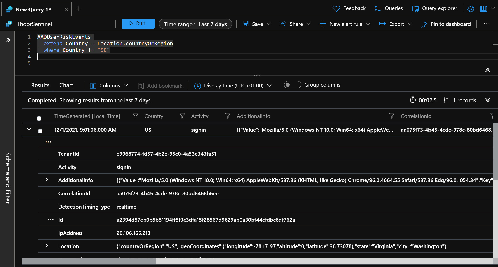
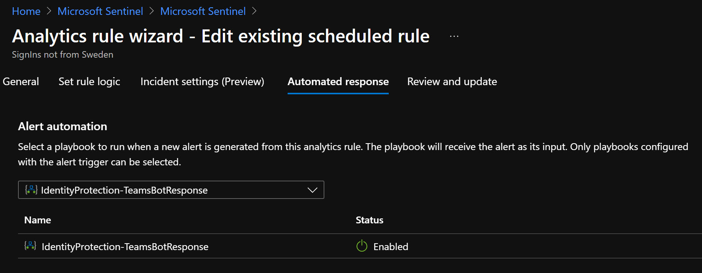
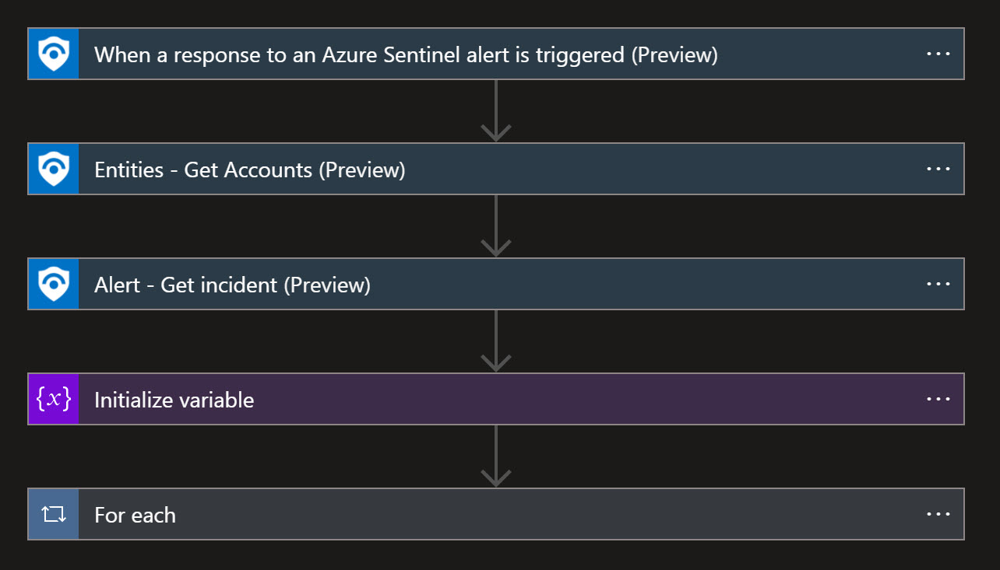
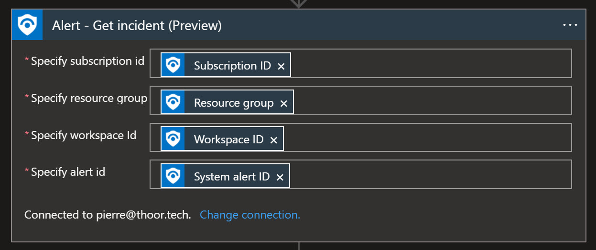
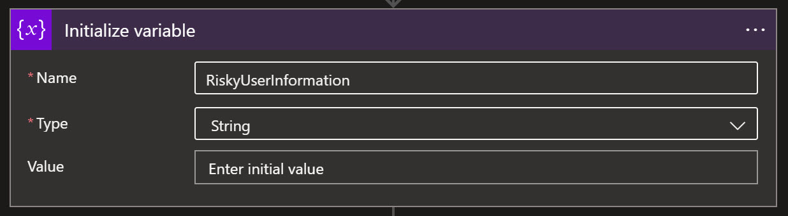
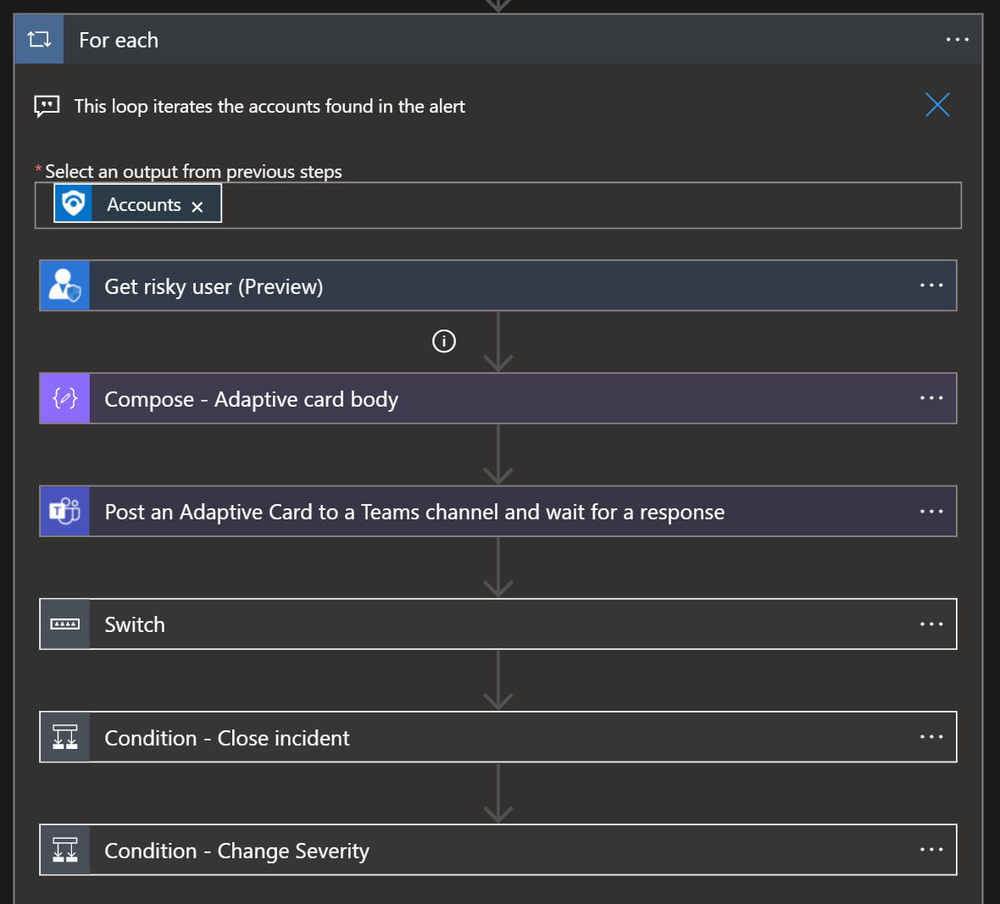
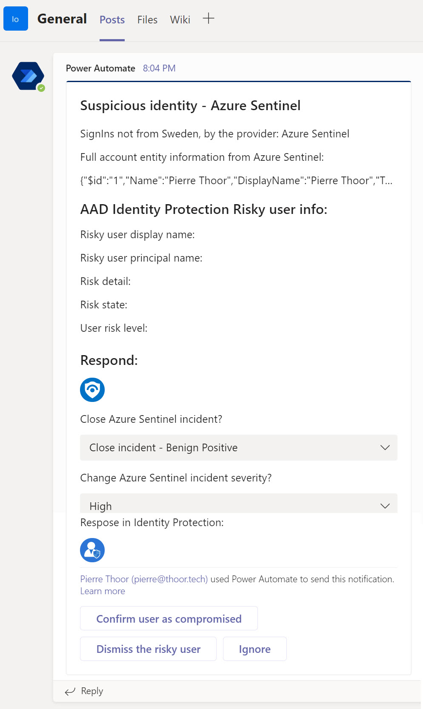

Now it's time to look into some of the automated response part of Microsoft Sentinel, also known as SOAR, Security Orchestration, Automation and Response. 

**Read the posts in the series:**

[Part 1 - Enable logging for Teams](https://thoor.tech/blog/protect-teams-with-az-sentinel/)

[Part 2 - Install Teams Solution](https://thoor.tech/blog/protect-teams-with-ms-sentinel-part2/)

[Part 3 - Analytic Rules](https://thoor.tech/blog/protect-teams-with-ms-sentinel-part3/)

In this post we will look at one of the LogicApp that was included in the Teams solution that we installed in Part 2 of this series - **IdentityProtection-TeamsBotResponse**.

This LogicApp do require *Azure Active Directory P2* because in this LogicApp we will talk to Identity Protection. In the Analytic Rule I did, I'm looking into the table AADUserRiskEvents. So I'm simulating a risky user with an Azure VM in East US and my ordinary laptop in Sweden, and signing in to the Office 365 portal at the same time. 

After some time, my user account will be at risk and I'm seeing that in the AADUserRiskEvents table. Here's the quick and dirty KQL I used. 

``` sql
AADUserRiskEvents 
| extend Country = Location.countryOrRegion
| where Country != "SE"
```


When we have an alert for this, I have enabled the LogicApp and the automated response inside of the Analytic Rule. 


Looking into the LogicApp by itself. Ps. You need to first check so that the LogicApp doesn't have any errors, and you must specify which channel and team the Adaptive Card will be posted in.






So when the Analytic Rule fires off, our automated response will be triggered and send a Adaptive Card to the team and channel you have specified. 



Now you can close the incident, confirm that the user as compromised, change the incident severity and so on. 

And so simple as that. 

I see you at the next post!

**Happy hunting!**


