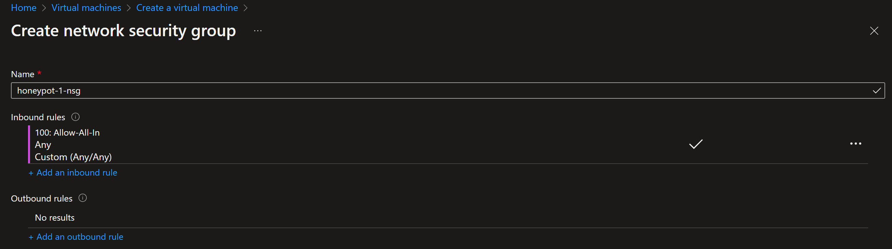
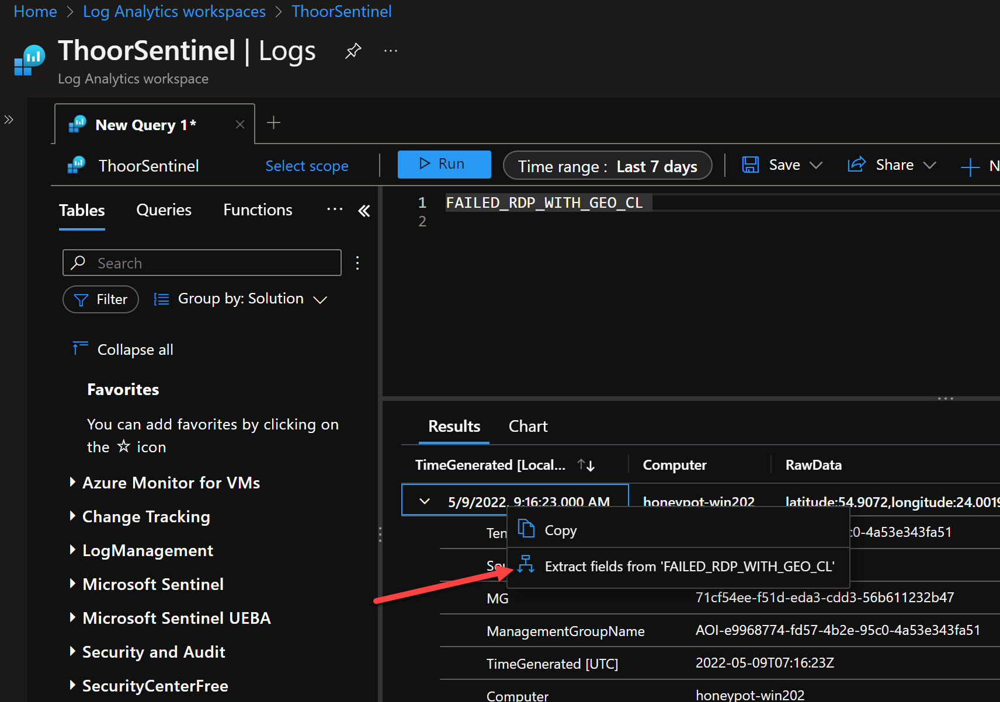

I had some fun with some testing of RDP Honeypot in Azure and visualizing the attacks with Microsoft Sentinel Workbooks. The test included two virtual machines in different Azure Regions (Sweden Central and West Europe).


If you want to do the same, follow along.

**Pre-Reqs:**
- Create virtual machine
- Create VNet and Network Security Group as part of the virtual machine wizard (separate from your production please)
- In NSG rule, allow everything and set the priority to for example 100
- Log Analytics Workspace connected to Microsoft Sentinel

# VM Creation
I suppose you are familiar in creating an standard VM in Azure, choose your VM SKU, region, Windows version, disk type and so on.

Under **Networking** and **NIC network security group**, choose to create a new Network Security Group.
Delete the inbound rule that exist and then create a new inbound rule



Review and create!

# Alternatives

You will then have two alternatives (maybe more, let me know) to gather the information and send it to Log Analytics for further analysis with Sentinel.
I haven't taken the cost in to account for these two alternatives but feel that alternative 1 is more for testing and alternative 2 for production.

* Alternative 1: Use PowerShell script and Log Analytics Custom Log with Custom Tables
* Alternative 2: Defender for Servers to send data directly to Log Analytics

## Alternative 1

When the machine is booted, connect to it via public IP address and then:
- Disable Windows Firewall (all profiles)
- Start PowerShell ISE and paste the PowerShell script below



```powershell
$LOGFILE_NAME = "failed_rdp.log"
$LOGFILE_PATH = "C:\ProgramData\$($LOGFILE_NAME)"

# This filter will be used to filter failed RDP events from Windows Event Viewer
$XMLFilter = @'
<QueryList> 
   <Query Id="0" Path="Security">
         <Select Path="Security">
              *[System[(EventID='4625')]]
          </Select>
    </Query>
</QueryList> 
'@

<#
    This function creates a bunch of sample log files that will be used to train the
    Extract feature in Log Analytics workspace. If you don't have enough log files to
    "train" it, it will fail to extract certain fields for some reason -_-.
    We can avoid including these fake records on our map by filtering out all logs with
    a destination host of "samplehost"
#>
Function write-Sample-Log() {
    "latitude:47.91542,longitude:-120.60306,destinationhost:samplehost,username:fakeuser,sourcehost:24.16.97.222,state:Washington,country:United States,label:United States - 24.16.97.222,timestamp:2021-10-26 03:28:29" | Out-File $LOGFILE_PATH -Append -Encoding utf8
    "latitude:-22.90906,longitude:-47.06455,destinationhost:samplehost,username:lnwbaq,sourcehost:20.195.228.49,state:Sao Paulo,country:Brazil,label:Brazil - 20.195.228.49,timestamp:2021-10-26 05:46:20" | Out-File $LOGFILE_PATH -Append -Encoding utf8
    "latitude:52.37022,longitude:4.89517,destinationhost:samplehost,username:CSNYDER,sourcehost:89.248.165.74,state:North Holland,country:Netherlands,label:Netherlands - 89.248.165.74,timestamp:2021-10-26 06:12:56" | Out-File $LOGFILE_PATH -Append -Encoding utf8
    "latitude:40.71455,longitude:-74.00714,destinationhost:samplehost,username:ADMINISTRATOR,sourcehost:72.45.247.218,state:New York,country:United States,label:United States - 72.45.247.218,timestamp:2021-10-26 10:44:07" | Out-File $LOGFILE_PATH -Append -Encoding utf8
    "latitude:33.99762,longitude:-6.84737,destinationhost:samplehost,username:AZUREUSER,sourcehost:102.50.242.216,state:Rabat-Salé-Kénitra,country:Morocco,label:Morocco - 102.50.242.216,timestamp:2021-10-26 11:03:13" | Out-File $LOGFILE_PATH -Append -Encoding utf8
    "latitude:-5.32558,longitude:100.28595,destinationhost:samplehost,username:Test,sourcehost:42.1.62.34,state:Penang,country:Malaysia,label:Malaysia - 42.1.62.34,timestamp:2021-10-26 11:04:45" | Out-File $LOGFILE_PATH -Append -Encoding utf8
    "latitude:41.05722,longitude:28.84926,destinationhost:samplehost,username:AZUREUSER,sourcehost:176.235.196.111,state:Istanbul,country:Turkey,label:Turkey - 176.235.196.111,timestamp:2021-10-26 11:50:47" | Out-File $LOGFILE_PATH -Append -Encoding utf8
    "latitude:55.87925,longitude:37.54691,destinationhost:samplehost,username:Test,sourcehost:87.251.67.98,state:null,country:Russia,label:Russia - 87.251.67.98,timestamp:2021-10-26 12:13:45" | Out-File $LOGFILE_PATH -Append -Encoding utf8
    "latitude:52.37018,longitude:4.87324,destinationhost:samplehost,username:AZUREUSER,sourcehost:20.86.161.127,state:North Holland,country:Netherlands,label:Netherlands - 20.86.161.127,timestamp:2021-10-26 12:33:46" | Out-File $LOGFILE_PATH -Append -Encoding utf8
    "latitude:17.49163,longitude:-88.18704,destinationhost:samplehost,username:Test,sourcehost:45.227.254.8,state:null,country:Belize,label:Belize - 45.227.254.8,timestamp:2021-10-26 13:13:25" | Out-File $LOGFILE_PATH -Append -Encoding utf8
    "latitude:-55.88802,longitude:37.65136,destinationhost:samplehost,username:Test,sourcehost:94.232.47.130,state:Central Federal District,country:Russia,label:Russia - 94.232.47.130,timestamp:2021-10-26 14:25:33" | Out-File $LOGFILE_PATH -Append -Encoding utf8
}

# This block of code will create the log file if it doesn't already exist
if ((Test-Path $LOGFILE_PATH) -eq $false) {
    New-Item -ItemType File -Path $LOGFILE_PATH
    write-Sample-Log
}

# Infinite Loop that keeps checking the Event Viewer logs.
while ($true)
{
    
    Start-Sleep -Seconds 1
    # This retrieves events from Windows EVent Viewer based on the filter
    $events = Get-WinEvent -FilterXml $XMLFilter -ErrorAction SilentlyContinue
    if ($Error) {
        #Write-Host "No Failed Logons found. Re-run script when a login has failed."
    }

    # Step through each event collected, get geolocation
    #    for the IP Address, and add new events to the custom log
    foreach ($event in $events) {


        # $event.properties[19] is the source IP address of the failed logon
        # This if-statement will proceed if the IP address exists (>= 5 is arbitrary, just saying if it's not empty)
        if ($event.properties[19].Value.Length -ge 5) {

            # Pick out fields from the event. These will be inserted into our new custom log
            $timestamp = $event.TimeCreated
            $year = $event.TimeCreated.Year

            $month = $event.TimeCreated.Month
            if ("$($event.TimeCreated.Month)".Length -eq 1) {
                $month = "0$($event.TimeCreated.Month)"
            }

            $day = $event.TimeCreated.Day
            if ("$($event.TimeCreated.Day)".Length -eq 1) {
                $day = "0$($event.TimeCreated.Day)"
            }
            
            $hour = $event.TimeCreated.Hour
            if ("$($event.TimeCreated.Hour)".Length -eq 1) {
                $hour = "0$($event.TimeCreated.Hour)"
            }

            $minute = $event.TimeCreated.Minute
            if ("$($event.TimeCreated.Minute)".Length -eq 1) {
                $minute = "0$($event.TimeCreated.Minute)"
            }


            $second = $event.TimeCreated.Second
            if ("$($event.TimeCreated.Second)".Length -eq 1) {
                $second = "0$($event.TimeCreated.Second)"
            }

            $timestamp = "$($year)-$($month)-$($day) $($hour):$($minute):$($second)"
            $eventId = $event.Id
            $destinationHost = $event.MachineName# Workstation Name (Destination)
            $username = $event.properties[5].Value # Account Name (Attempted Logon)
            $sourceHost = $event.properties[11].Value # Workstation Name (Source)
            $sourceIp = $event.properties[19].Value # IP Address
        

            # Get the current contents of the Log file!
            $log_contents = Get-Content -Path $LOGFILE_PATH

            # Do not write to the log file if the log already exists.
            if (-Not ($log_contents -match "$($timestamp)") -or ($log_contents.Length -eq 0)) {
            
                Start-Sleep -Seconds 1

                # Make web request to the IP-API
                $API_ENDPOINT = "http://ip-api.com/json/$($sourceIp)"
                $response = Invoke-WebRequest -UseBasicParsing -Uri $API_ENDPOINT

                # Pull Data from the API response, and store them in variables
                $responseData = $response.Content | ConvertFrom-Json
                $latitude = $responseData.lat
                $longitude = $responseData.lon
                $state_prov = $responseData.state_prov
                $country = $responseData.country
                if ($country -eq "") {$country -eq "null"}

                # Write all gathered data to the custom log file. It will look something like this:
                #
                "latitude:$($latitude),longitude:$($longitude),destinationhost:$($destinationHost),username:$($username),sourcehost:$($sourceIp),country:$($country),label:$($country) - $($sourceIp),timestamp:$($timestamp)" | Out-File $LOGFILE_PATH -Append -Encoding utf8

                Write-Host -BackgroundColor Black -ForegroundColor Magenta "latitude:$($latitude),longitude:$($longitude),destinationhost:$($destinationHost),username:$($username),sourcehost:$($sourceIp),label:$($country) - $($sourceIp),timestamp:$($timestamp)"
            }
            else {
                # Entry already exists in custom log file. Do nothing, optionally, remove the # from the line below for output
                # Write-Host "Event already exists in the custom log. Skipping." -ForegroundColor Gray -BackgroundColor Black
            }
        }
    }
}
```



Then just run the script and let it be.
In **C:\ProgramData** you will find the logfile, this logfile will be used to train Log Analytics. If you haven't used Custom Logs before, lets go.

1. Grab the logfile and download it to your computer where you are signed in to the Azure Portal
2. Go to your Log Anaytics Workspace, then Custom Logs, then Create a custom log
3. Upload the sample log file 
4. Select "New line" as delimeter
5. Under Collection Paths, choose Windows and type in C:\ProgramData\failed_rdp.log
6. Under Details, type in your name of the Custom Log such as FAILED_RDP_WITH_GEO
7. Review and create!


Now we need to train the custom log so we can grab the raw data.
In Log Analytics, go to Logs, then type in the custom log name **<"name_you_choosed">_CL** then Run.
Now you will see the data inside of that custom log.

Right-click on one row and then choose *Extract fields from 'custom log name'*



Now we are in the Custom Fields menu, and it could be a bit tricky to get this right.
We want to get the data from each label so we will get:
* latitude
* longitude
* destinationhost
* username
* sourcehost
* country
* label
* timestamp

So start to grab the information, by highlighting the value after **latitide** and then take a close look so you got the right information. See picture below.


Make sure you look to the right of the screen and see that all the examples are just the same, otherwise edit the wrong one so Log Analytics can grab correct info.


Now you need to do that for each of the value we want to extract as Custom Field

* latitude_CF - Numeric
* longitude - Numeric
* destinationhost - Text
* username - Text
* sourcehost - Text
* country - Text
* label - Text
* timestamp - DateTime


Now let's see all the events coming in...

## Alternative 2

This is the alternativ if you don't want to create your own custom log with custom fields but instead using the built-in solution with **Defender for Cloud** and **Defender for Servers**.

Enable **Defender for Servers Plan 2** inside Defender for Cloud menu.


Then select **Auto Provisoning** menu, make sure to enable Log Analytics agent for VMs.
Choose the workspace setting that fits you. Make also sure to select the level of **Windows Security Events**, for this I have choosen **All events**. Don't forget to save.


From the Azure Monitor for VMs and the **VMConnection** table we can do the same.
https://docs.microsoft.com/en-us/azure/azure-monitor/reference/tables/VMConnection 

We can after some time look at the SecurityEvent table and the EventID 4625:
https://docs.microsoft.com/en-us/windows/security/threat-protection/auditing/event-4625 

```sql
SecurityEvent 
| where EventID == "4625"
```

To find botnets you can use this KQL:
```sql
(VMConnection
    | where Type == "VMConnection"
    | extend
        TrafficDirection = iff(Direction != "outbound", "InboundOrUnknown", "Outbound"),
        Country=RemoteCountry,
        Latitude=RemoteLatitude,
        Longitude=RemoteLongitude,
        MaliciousIP=MaliciousIp)
| where isnotempty(MaliciousIP)
    and isnotempty(Country)
    and isnotempty(Latitude)
    and isnotempty(Longitude) 
| where TrafficDirection == "InboundOrUnknown"
```

# Building the Workbook
Take the code below to build the workbook I have created and adjust it to your needs. I have for this used alternative 1 to build the workbook.
* Make sure to change resourceGroupName
* Change Custom Table name and/or Custom Field Name (_CF) if you have named it other than this example

1. Go to Sentinel, then Workbooks 
2. Click on **Add workbook**
3. Click on **Edit**
4. Click on **Advanced editor** </>
5. Copy the json code below and paste in, make sure to be in the Gallery Template and make changes to resourcegroup name
6. Apply, then Done editing and Save




```json
{
  "version": "Notebook/1.0",
  "items": [
    {
      "type": 1,
      "content": {
        "json": "## Honeypot RDP failed login\r\nHaving one server in West Europe (Amsterdam) and one server in Sweden Central (Gävle/Sandviken) and allowing entire Internet to connect to those servers, including ping.\r\n\r\n- Windows Firewall off\r\n- Network Security Group allowing ALL IN\r\n\r\nThis is not best practice...",
        "style": "warning"
      },
      "name": "text - 1"
    },
    {
      "type": 3,
      "content": {
        "version": "KqlItem/1.0",
        "query": "Resources\r\n    | where type =~ 'microsoft.compute/virtualmachines'\r\n    | where resourceGroup == \"rg-honeypot\"\r\n    | project vmId = tolower(tostring(id)), location, properties.extended.instanceView.powerState.displayStatus\r\n    | join (Resources\r\n        | where type =~ 'microsoft.network/networkinterfaces'\r\n        | mv-expand ipconfig=properties.ipConfigurations\r\n        | project vmId = tolower(tostring(properties.virtualMachine.id)), privateIp = ipconfig.properties.privateIPAddress, publicIpId = tostring(ipconfig.properties.publicIPAddress.id)\r\n        | join kind=leftouter (Resources\r\n            | where type =~ 'microsoft.network/publicipaddresses'\r\n            | project publicIpId = id, publicIp = properties.ipAddress\r\n        ) on publicIpId\r\n        | project-away publicIpId, publicIpId1\r\n        | summarize privateIps = make_list(privateIp), publicIps = make_list(publicIp) by vmId\r\n    ) on vmId\r\n    | project-away vmId1",
        "size": 4,
        "queryType": 1,
        "resourceType": "microsoft.resourcegraph/resources",
        "gridSettings": {
          "labelSettings": [
            {
              "columnId": "vmId",
              "label": "VM Name"
            },
            {
              "columnId": "location",
              "label": "Azure Region"
            },
            {
              "columnId": "properties_extended_instanceView_powerState_displayStatus",
              "label": "VM State"
            },
            {
              "columnId": "privateIps",
              "label": "Private IP"
            },
            {
              "columnId": "publicIps",
              "label": "Public IP"
            }
          ]
        }
      },
      "name": "query - 4"
    },
    {
      "type": 3,
      "content": {
        "version": "KqlItem/1.0",
        "query": "resources\r\n| where resourceGroup == \"rg-honeypot\"\r\n| where type == \"microsoft.compute/virtualmachines\"\r\n| summarize count() by location | project  location, total=count_| order by total desc \r\n",
        "size": 3,
        "queryType": 1,
        "resourceType": "microsoft.resourcegraph/resources",
        "visualization": "map",
        "mapSettings": {
          "locInfo": "AzureLoc",
          "locInfoColumn": "location",
          "sizeSettings": "total",
          "sizeAggregation": "Sum",
          "legendMetric": "total",
          "legendAggregation": "Sum",
          "itemColorSettings": {
            "nodeColorField": "total",
            "colorAggregation": "Sum",
            "type": "heatmap",
            "heatmapPalette": "greenRed"
          }
        }
      },
      "name": "query - 6"
    },
    {
      "type": 3,
      "content": {
        "version": "KqlItem/1.0",
        "query": "SecurityDetection\r\n| project AssociatedResource, AlertTitle, AlertSeverity, Description, RemediationSteps",
        "size": 4,
        "title": "Alerts",
        "timeContext": {
          "durationMs": 2592000000
        },
        "queryType": 0,
        "resourceType": "microsoft.operationalinsights/workspaces",
        "visualization": "table",
        "gridSettings": {
          "labelSettings": [
            {
              "columnId": "AssociatedResource",
              "label": "Resource"
            },
            {
              "columnId": "AlertTitle",
              "label": "Alert Title"
            },
            {
              "columnId": "AlertSeverity",
              "label": "Severity"
            },
            {
              "columnId": "Description",
              "label": "Description"
            },
            {
              "columnId": "RemediationSteps",
              "label": "Remediation Steps"
            }
          ]
        }
      },
      "name": "query - 9"
    },
    {
      "type": 3,
      "content": {
        "version": "KqlItem/1.0",
        "query": "Resources\r\n| where type =~ \"microsoft.network/networksecuritygroups\"\r\n| join kind=leftouter (ResourceContainers | where type=='microsoft.resources/subscriptions' | project SubcriptionName=name, subscriptionId) on subscriptionId\r\n| where resourceGroup == 'rg-honeypot'\r\n| mv-expand rules=properties.securityRules\r\n| extend direction = tostring(rules.properties.direction)\r\n| extend access = tostring(rules.properties.access)\r\n| extend priority = toint(rules.properties.priority)\r\n| extend destprefix = rules.properties.destinationAddressPrefix\r\n| extend destport = rules.properties.destinationPortRange\r\n| extend sourceprefix = rules.properties.sourceAddressPrefix\r\n| extend sourceport = rules.properties.sourcePortRange\r\n| project name, direction, access, priority, destprefix, destport, sourceprefix, sourceport",
        "size": 4,
        "title": "Network Security Group (NSG) Settings",
        "queryType": 1,
        "resourceType": "microsoft.resourcegraph/resources",
        "gridSettings": {
          "labelSettings": [
            {
              "columnId": "name",
              "label": "NSG Name"
            },
            {
              "columnId": "direction",
              "label": "Direction"
            },
            {
              "columnId": "access",
              "label": "Access"
            },
            {
              "columnId": "priority",
              "label": "Priority"
            },
            {
              "columnId": "destprefix",
              "label": "Destination Prefix"
            },
            {
              "columnId": "destport",
              "label": "Destination Port"
            },
            {
              "columnId": "sourceprefix",
              "label": "Source Prefix"
            },
            {
              "columnId": "sourceport",
              "label": "Source Port"
            }
          ]
        }
      },
      "name": "query - 5"
    },
    {
      "type": 12,
      "content": {
        "version": "NotebookGroup/1.0",
        "groupType": "editable",
        "items": [
          {
            "type": 3,
            "content": {
              "version": "KqlItem/1.0",
              "query": "FAILED_RDP_WITH_GEO_CL\r\n| where destinationhost_CF != \"samplehost\"\r\n| where username_CF != \"\"\r\n| where destinationhost_CF contains \"honeypot\"\r\n| summarize hit_count=count() by destinationhost_CF\r\n| render piechart",
              "size": 4,
              "timeContext": {
                "durationMs": 604800000
              },
              "queryType": 0,
              "resourceType": "microsoft.operationalinsights/workspaces",
              "mapSettings": {
                "locInfo": "LatLong",
                "sizeSettings": "hit_count",
                "sizeAggregation": "Sum",
                "legendMetric": "hit_count",
                "legendAggregation": "Sum",
                "itemColorSettings": {
                  "type": "heatmap",
                  "colorAggregation": "Sum",
                  "nodeColorField": "hit_count",
                  "heatmapPalette": "greenRed"
                }
              }
            },
            "name": "query - 4"
          },
          {
            "type": 3,
            "content": {
              "version": "KqlItem/1.0",
              "query": "FAILED_RDP_WITH_GEO_CL\r\n| project latitude_CF, longitude_CF, country_CF, destinationhost_CF\r\n| where destinationhost_CF != \"samplehost\"\r\n| where country_CF != \"\"\r\n| summarize event_count=count() by country_CF",
              "size": 3,
              "timeContext": {
                "durationMs": 604800000
              },
              "queryType": 0,
              "resourceType": "microsoft.operationalinsights/workspaces",
              "visualization": "map",
              "mapSettings": {
                "locInfo": "CountryRegion",
                "locInfoColumn": "country_CF",
                "latitude": "latitude_CF",
                "longitude": "longitude_CF",
                "sizeSettings": "event_count",
                "sizeAggregation": "Sum",
                "labelSettings": "country_CF",
                "legendMetric": "event_count",
                "legendAggregation": "Sum",
                "itemColorSettings": {
                  "nodeColorField": "event_count",
                  "colorAggregation": "Sum",
                  "type": "heatmap",
                  "heatmapPalette": "yellowOrangeRed"
                }
              }
            },
            "name": "query - 0"
          }
        ]
      },
      "name": "group - 5"
    },
    {
      "type": 1,
      "content": {
        "json": "### Most tried username to access the environment",
        "style": "info"
      },
      "name": "text - 3"
    },
    {
      "type": 3,
      "content": {
        "version": "KqlItem/1.0",
        "query": "FAILED_RDP_WITH_GEO_CL\r\n| where destinationhost_CF != \"samplehost\"\r\n| where username_CF != \"\"\r\n| summarize username_count=count() by username_CF",
        "size": 3,
        "timeContext": {
          "durationMs": 604800000
        },
        "queryType": 0,
        "resourceType": "microsoft.operationalinsights/workspaces",
        "visualization": "tiles",
        "tileSettings": {
          "titleContent": {
            "columnMatch": "username_CF",
            "formatter": 1
          },
          "leftContent": {
            "columnMatch": "username_count",
            "formatter": 12,
            "formatOptions": {
              "palette": "auto"
            },
            "numberFormat": {
              "unit": 17,
              "options": {
                "maximumSignificantDigits": 3,
                "maximumFractionDigits": 2
              }
            }
          },
          "showBorder": false,
          "sortCriteriaField": "username_count",
          "sortOrderField": 2
        }
      },
      "name": "query - 2"
    },
    {
      "type": 1,
      "content": {
        "json": "### Most tried ports to hack the environment",
        "style": "info"
      },
      "name": "text - 8"
    },
    {
      "type": 3,
      "content": {
        "version": "KqlItem/1.0",
        "query": "AzureNetworkAnalytics_CL\r\n//| project DestPort_d, L7Protocol_s, L4Protocol_s\r\n| where DestPort_d != \"\"\r\n| where L7Protocol_s != \"\"\r\n| summarize port_count=count() by DestPort_d, L7Protocol_s, L4Protocol_s",
        "size": 0,
        "timeContext": {
          "durationMs": 2592000000
        },
        "queryType": 0,
        "resourceType": "microsoft.operationalinsights/workspaces",
        "visualization": "tiles",
        "gridSettings": {
          "labelSettings": [
            {
              "columnId": "DestPort_d",
              "label": "Destination Port"
            },
            {
              "columnId": "L7Protocol_s",
              "label": "L7 Protocol"
            },
            {
              "columnId": "port_count",
              "label": "Count"
            }
          ]
        },
        "tileSettings": {
          "titleContent": {
            "columnMatch": "L7Protocol_s",
            "formatter": 1
          },
          "subtitleContent": {
            "columnMatch": "DestPort_d"
          },
          "leftContent": {
            "columnMatch": "port_count",
            "formatter": 12,
            "formatOptions": {
              "palette": "auto"
            },
            "numberFormat": {
              "unit": 17,
              "options": {
                "style": "decimal",
                "maximumFractionDigits": 2,
                "maximumSignificantDigits": 3
              }
            }
          },
          "showBorder": false,
          "sortCriteriaField": "port_count",
          "sortOrderField": 2
        },
        "graphSettings": {
          "type": 0
        }
      },
      "name": "query - 7"
    }
  ],
  "fallbackResourceIds": [
    "/subscriptions/555e8304-e581-4bb3-b2ad-9d55d69b5907/resourcegroups/rg-sentinel/providers/microsoft.operationalinsights/workspaces/thoorsentinel"
  ],
  "fromTemplateId": "sentinel-UserWorkbook",
  "$schema": "https://github.com/Microsoft/Application-Insights-Workbooks/blob/master/schema/workbook.json"
}
```



I see you at the next post!

**Happy hunting!**


