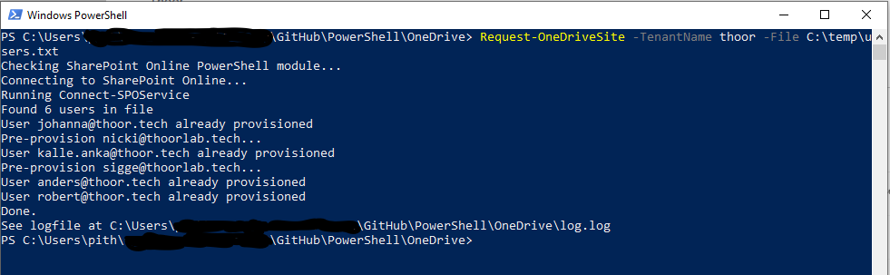

To automate things, that’s why Snover did create PowerShell for, we sometimes need to pre-provision users OneDrive storage. New users will not have the storage ready when we licensed the user – instead the storage are provisioned when the user starts OneDrive – or, when we, admins, run this script.

Pre-Reqs:

- SharePoint Online PowerShell Module –   
  <https://www.microsoft.com/en-us/download/details.aspx?id=35588>
- Azure AD Module – **Install-Module AzureAD** in PowerShell
- Global or SharePoint Admin permissions for the specific tenant (the script works with MFA)
- List of users in a .txt file with the users UPN attribute
 
The script checks if the user have a provisioned OneDrive or not. If not, the script will provision the OneDrive site so that we admins can migrate the users files, for example…

The script log everything and will output the path to the logfile at the end.

You can download the script from my GitHub repo:   
<https://github.com/pthoor/PowerShell/blob/master/OneDrive/Request-OneDriveSite.ps1>

 ```powershell
"https://raw.githubusercontent.com/pthoor/PowerShell/master/OneDrive/Request-OneDriveSite.ps1"
```

