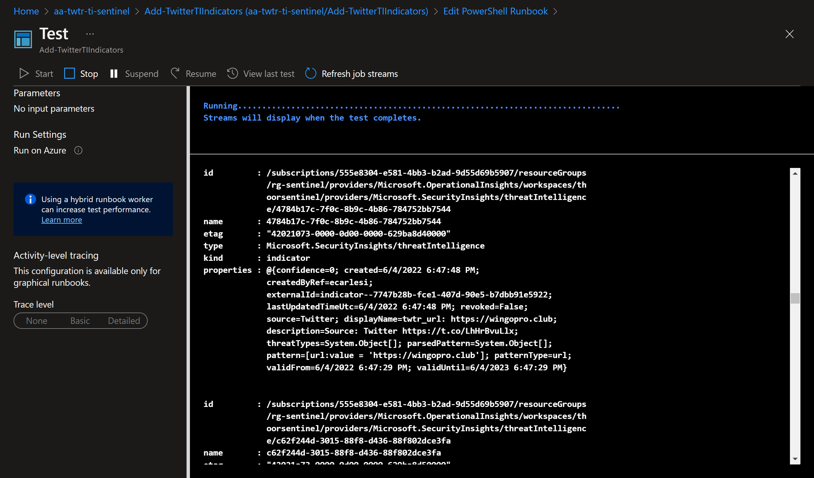


**Updated blog post 2022-07-23**


Have had some fun with Microsoft Sentinel Threat Intelligence lately and when I saw a tweet from [Stefan Grimminck](https://twitter.com/StefanGrimminck) about the tool he made to retrieve tweets, parses them and extract the malicious URLs and IPs, I had to start doing some PowerShell magic. Yes, of course you can use Python but I'm not there, yet.

The URL to Stefans tool is https://twitter.threatintel.rocks/ and he has an example in this blog post - https://grimminck.medium.com/building-a-threat-intelligence-feed-using-the-twitter-api-and-a-bit-of-code-5787808e32ef - to get the feed.

```python title="python"
curl https://twitter.threatintel.rocks/ --silent | jq 
```

We all know that curl is an alias in PowerShell for Invoke-WebRequest 😉 but JQ was new to me. JQ is a JSON command-line processor. We have ConvertTo/ConvertFrom-Json in PowerShell but since the feed is not in JSON but JSON Lines (JSONL) format instead, I needed to dig down what PowerShell can or cannot do.

JSON Lines also called newline-delimited JSON and '\n' is our line separator - read more here https://jsonlines.org/

So looking into the the feed with PowerShell we got


And the $TI.RawContent shows...


If you look closely you see that each line is indeed a JSON, a.k.a. JSON Lines. It took we a while (maybe because I'm not using PowerShell on a daily basis any more...) to figure out how to make it more "PowerShell friendly".

I simply tried to use the method ToString() and then used RegEx to match the content and then use ConvertFrom-Json. In that way I now know how to use the data and the rest is history.


*I needed to update the script because the RegEx didn't work as expected. There was some tweets (text) that broke my RegEx because I was looking for curly brackets and when the tweet contained {}, well the PowerShell script terminated.*

**Updated:**
I found a sweet function on GitHub that hopefully will be more stable when it comes to parse the content more correctly. I renamed it to Split-Json from Delimit-Json. See the function on original GitHub repo: https://github.com/jpmikkers/Delimit-Json/blob/master/Delimit-Json.ps1

Now we can do into a foreach loop, and get the stuff I wanted to add as an IoC in Sentinel Threat Intelligence API. Used AzSec's scripts to get some inspiration - https://azsec.azurewebsites.net/2021/11/25/azure-sentinel-threat-intelligence-api - on how to add custom Threat Intelligence indicator to Sentinel.

But since the feed now includes over 24.000+ entries, it will take forever to check for each entry in Sentinel TI and then add the missing ones. So I did make use of the new **Foreach -Parallel** in PowerShell 7. We will reach the limit of the API, so we need to fix that as well. 

**Function: Split-Json**

 
  

```powershell
function Split-Json {
    <#
    .SYNOPSIS
        Splits text consisting of concatenated JSON objects into separate JSON chunks.
    .DESCRIPTION
        Splits text consisting of concatenated JSON objects into separate JSON chunks.
        This is useful for processing JSON structured logging.
    .EXAMPLE  
        Get-Content -Wait "jsonstructuredlog.txt" | Split-Json | %{ "New structured log object: $($_ | ConvertFrom-Json)" }
        This will act as tail-like monitoring for a json structured log file, showing new objects as soon 
        as they are appended and complete.
    #>

        [CmdletBinding()]
        Param
        (
            [Parameter(ValueFromPipeline)]
            [string]$concatenated
        )
        Begin
        {
            $reconstructed = ''
            $betweenQuotes = $false
            $nestLevel = 0
        }
        Process
        {
            # split by square brackets, braces and quotes.
            foreach($t in ($concatenated -split '([\{\}\[\]\"])'))
            {
                if($t.Length -gt 0)
                {
                    # reassemble the json object in progress
                    $reconstructed += $t

                    # update the $betweenQuotes state
                    if($betweenQuotes)
                    {
                        # only end if the last character was a non-escaped double quote
                        if($reconstructed[-1] -eq '"' -and $reconstructed[-2] -ne '\'){ $betweenQuotes = $false }
                    }
                    else
                    {
                        if($reconstructed[-1] -eq '"'){ $betweenQuotes = $true }
                    }

                    # only look at nesting levels if we did not end somewhere within double quoted string
                    if(!$betweenQuotes)
                    {
                        $lastChar = $reconstructed[-1]

                        if($lastChar -eq '{' -or $lastChar -eq '[')
                        { 
                            $nestLevel++ 
                        }
                        elseif($lastChar -eq '}' -or $lastChar -eq ']')
                        { 
                            $nestLevel--

                            if($nestLevel -eq 0)
                            {
                                # nesting level reached zero, output the reconstructed string and restart
                                $reconstructed
                                $reconstructed = ''
                            }
                        }
                    }
                }
            }
        }
        End
        {
        }
    }
```


</br>


```powershell
$TI = Invoke-WebRequest -Uri https://twitter.threatintel.rocks
$TI = $TI.ToString()

# Formatting JSON and sorting by the latest
$TWTR = $TI | Split-Json | ConvertFrom-Json
$TWTR = $TWTR | Sort-Object created_at -Descending

Write-Host -ForegroundColor Green "[-] Found $($TWTR.count) indicators to add"
```
As of 2022-07-23, the count will show over 24.000+ (!) entries. Cool! 😎


The script I've built will also look for existing indicators (based on displayname) so we don't publish duplicates. 
You can try this script locally (works fine with PS 7) or via Azure Automation Account. 




To use Azure Automation Account, use Managed Identity and then use below script to add the MSI account to use the ThreatIndicators.ReadWrite.OwnedBy API permissions.

```powershell
# Your tenant id (in Azure Portal, under Azure Active Directory -> Overview )
$TenantID="xxxxxxxxxxx"
# Microsoft Graph App ID (DON'T CHANGE)
$GraphAppId = "00000003-0000-0000-c000-000000000000"
# Name of the manage identity, same as the Automation Account name
$DisplayNameOfMSI="aa-twtr-ti-sentinel" 
# Check the Microsoft Graph documentation for the permission you need for the operation
$PermissionName = "ThreatIndicators.ReadWrite.OwnedBy" 

# Install the module (You need admin on the machine)
# Install-Module AzureAD 

Connect-AzureAD -TenantId $TenantID 
$MSI = (Get-AzureADServicePrincipal -Filter "displayName eq '$DisplayNameOfMSI'")
Start-Sleep -Seconds 10
$GraphServicePrincipal = Get-AzureADServicePrincipal -Filter "appId eq '$GraphAppId'"
$AppRole = $GraphServicePrincipal.AppRoles | `
Where-Object {$_.Value -eq $PermissionName -and $_.AllowedMemberTypes -contains "Application"}
New-AzureAdServiceAppRoleAssignment -ObjectId $MSI.ObjectId -PrincipalId $MSI.ObjectId `
-ResourceId $GraphServicePrincipal.ObjectId -Id $AppRole.Id
```

**Script on Github: https://github.com/pthoor/MS_Sentinel/blob/main/Add-TwitterTIIndicators.ps1**

## Add-TwitterTIIndicators.ps1


```powershell
<#
.SYNOPSIS
    This script is used to add indicators from https://twitter.threatintel.rocks to Microsoft Sentinel.
.DESCRIPTION
    SecOps analyst may want to use Twitter as an TI feed.
.NOTES
    This script is written with Azure PowerShell (Az) module.
    
    File Name   : Add-TwitterTIIndicators.ps1
    Version     : 1.1 (2022-07-22)
    Author      : pthoor (https://thoor.tech/)

    Version History
    1.0 Initial version
    1.1 Changed foreach loop to foreach parallel loop due to extensive TIs to check or add into Sentinel
        Removed older RegEx to a function called Split-Json, original found at https://github.com/jpmikkers/Delimit-Json/blob/master/Delimit-Json.ps1
#>


function Split-Json {
    <#
    .SYNOPSIS
        Splits text consisting of concatenated JSON objects into separate JSON chunks.

    .DESCRIPTION
        Splits text consisting of concatenated JSON objects into separate JSON chunks.
        This is useful for processing JSON structured logging.

    .EXAMPLE  
        Get-Content -Wait "jsonstructuredlog.txt" | Split-Json | %{ "New structured log object: $($_ | ConvertFrom-Json)" }

        This will act as tail-like monitoring for a json structured log file, showing new objects as soon 
        as they are appended and complete.
    #>

        [CmdletBinding()]
        Param
        (
            [Parameter(ValueFromPipeline)]
            [string]$concatenated
        )
        Begin
        {
            $reconstructed = ''
            $betweenQuotes = $false
            $nestLevel = 0
        }
        Process
        {
            # split by square brackets, braces and quotes.
            foreach($t in ($concatenated -split '([\{\}\[\]\"])'))
            {
                if($t.Length -gt 0)
                {
                    # reassemble the json object in progress
                    $reconstructed += $t

                    # update the $betweenQuotes state
                    if($betweenQuotes)
                    {
                        # only end if the last character was a non-escaped double quote
                        if($reconstructed[-1] -eq '"' -and $reconstructed[-2] -ne '\'){ $betweenQuotes = $false }
                    }
                    else
                    {
                        if($reconstructed[-1] -eq '"'){ $betweenQuotes = $true }
                    }

                    # only look at nesting levels if we did not end somewhere within double quoted string
                    if(!$betweenQuotes)
                    {
                        $lastChar = $reconstructed[-1]

                        if($lastChar -eq '{' -or $lastChar -eq '[')
                        { 
                            $nestLevel++ 
                        }
                        elseif($lastChar -eq '}' -or $lastChar -eq ']')
                        { 
                            $nestLevel--

                            if($nestLevel -eq 0)
                            {
                                # nesting level reached zero, output the reconstructed string and restart
                                $reconstructed
                                $reconstructed = ''
                            }
                        }
                    }
                }
            }
        }
        End
        {
        }
    }
function Get-AzThreatIntelligenceIndicator {
    <#
    .SYNOPSIS
        This script is used to query custom Threat Intelligence (TI) Indicators in your Microsoft Sentinel.
    .DESCRIPTION
        Search for custom TI indicator, specified by TISource parameter (see your Sentinel TI for sources).
    .NOTES
        This script is written with Azure PowerShell (Az) module.

        File Name       : Get-AzThreatIntelligenceIndicators.ps1
        Version         : 1.0.0.0
        Original Author : AzSec (https://azsec.azurewebsites.net/)
        Author          : pthoor (https://thoor.tech/)
        Reference       : https://thoor.tech/blog/sentinel-twitter-threatintelligence
        Prerequisite    : Az
    #>

    Param(
        [Parameter(Mandatory = $true,
                HelpMessage = "Resource group name of the Log Analytics workspace Microsoft Sentinel connects to",
                Position = 0)]
        [ValidateNotNullOrEmpty()]
        [string]
        $WorkspaceRg,

        [Parameter(Mandatory = $true,
                HelpMessage = "Name of the Log Analytics workspace Microsoft Sentinel connects to",
                Position = 1)]
        [ValidateNotNullOrEmpty()]
        [string]
        $WorkspaceName,

        [Parameter(Mandatory = $true,
                HelpMessage = "The display name of the indicator",
                Position = 2)]
        [ValidateNotNullOrEmpty()]
        [String]
        $IndicatorDisplayName,

        [Parameter(Mandatory = $true,
                HelpMessage = "Name of the Threat Intelligence source inside of Microsoft Sentinel",
                Position = 3)]
        [ValidateNotNullOrEmpty()]
        [string]
        $TISource
    )

    $indicator = [ordered]@{
        keywords = $IndicatorDisplayName
        sources = @(
            $TISource
        )
    }

    $requestBody = $indicator | ConvertTo-Json

    $uri = "https://management.azure.com" + $workspaceId `
                                        + "/providers/Microsoft.SecurityInsights/ThreatIntelligence/main/queryIndicators" `
                                        + "?api-version=2021-10-01-preview"

    $response = Invoke-RestMethod -Uri $uri -Method Post -Headers $authHeader -Body $requestBody
    $indicators = $response.value
    $indicators
}

function New-AzTwitterThreatIntelligenceIndicator {
    <#
    .SYNOPSIS
        This function is used to create a custom Threat Intelligence (TI) indicator in Microsoft Sentinel.
    .DESCRIPTION
        Use this script/function as a reference for Microsoft Sentinel REST API for TI indicator operation. 
    .NOTES
        This script is written with Azure PowerShell (Az) module.
        Original Author     : AzSec (https://azsec.azurewebsites.net/)
        Author:             : pthoor (https://thoor.tech/)
        Prerequisite        : Az
        Original Reference  : https://azsec.azurewebsites.net/2021/11/25/azure-sentinel-threat-intelligence-api/
        Reference           : https://thoor.tech/blog/sentinel-twitter-threatintelligence
    .PARAMETER WorkspaceRg
        The resource group name of the Log Analytics workspace Microsoft Sentinel connects to.
    .PARAMETER WorkspaceName
        The name of the Log Analytics workspace Microsoft Sentinel connects to.
    .PARAMETER IndicatorType
        The type of the indicator. 
        Supported values:
         - url
         - ipv4-addr
         - ipv6-addr
         - file
         - domain
    .PARAMETER Pattern
        The pattern of the indicator
        # | type      | pattern           | sample value                                                  |
        # | --------- | ----------------- | ------------------------------------------------------------- |
        # | url       | url:value         | url:value = 'http://contoso.com'                              |
        # | ipv4-addr | ipv4-addr:value   | ipv4-addr:value = '195.133.20.78'                             |
        # | ipv6-addr | ipv6-addr:value   | ipv6-addr:value = 'FE80:0202:B3FF:FE1E:8329'                  |
        # | file      | file:hashes.      | file:hashes.'SHA-256' = '279D7A3C1CCA7D3C786154ACB40XXXXXXX7' |
        # | domain    | domain-name:value | domain-name:value = 'sampledomain.com'                        |        
    .PARAMETER IndicatorDisplayName
        The display name of the indicator
    .PARAMETER IndicatorDescription
        The description of the indicator
    .PARAMETER ThreatType
        The threat type of the indicator.
        Supported values:
         - malicious-activity
         - attribution
         - compromised
         - anonymization
         - benign
         - anomalous-activity
         - unknown
    .PARAMETER IsRevoked
        Indicate whether the indicator is revoked
    .PARAMETER Confidence
        The confidence of the indicator
    .PARAMETER ValidFrom
        Date and time the indicator is valid From. 
        Valid format is +%Y-%m-%dT%H:%M:%S.000Z
    .PARAMETER ValidUntil
        Date and time the indicator is valid Until.
        Valid format is +%Y-%m-%dT%H:%M:%S.000Z
    #>

    Param(
        [Parameter(Mandatory = $true,
                HelpMessage = "The resource group name of the Log Analytics workspace Azure Sentinel connects to",
                Position = 0)]
        [ValidateNotNullOrEmpty()]
        [string]
        $WorkspaceRg,

        [Parameter(Mandatory = $true,
                HelpMessage = "The name of the Log Analytics workspace Azure Sentinel connects to",
                Position = 1)]
        [ValidateNotNullOrEmpty()]
        [string]
        $WorkspaceName,

        [Parameter(Mandatory = $true,
                HelpMessage = "The type of the indicator",
                Position = 2)]
        [ValidateSet("url",
                    "ipv4-addr",
                    "ipv6-addr",
                    "file",
                    "domain")]
        [string]
        $IndicatorType,

        [Parameter(Mandatory = $true,
                HelpMessage = "The pattern of the indicator",
                Position = 3)]
            [ValidateNotNullOrEmpty()]
        [string]
        $Pattern,

        [Parameter(Mandatory = $true,
                HelpMessage = "The display name of the indicator",
                Position = 4)]
        [ValidateNotNullOrEmpty()]
        [String]
        $IndicatorDisplayName,
        
        [Parameter(Mandatory = $true,
                HelpMessage = "The description of the indicator",
                Position = 5)]
        [ValidateNotNullOrEmpty()]
        [String]
        $IndicatorDescription,

        [Parameter(Mandatory = $true,
                HelpMessage = "The threat type of the indicator",
                Position = 6)]
        [ValidateSet("malicious-activity",
                    "attribution",
                    "compromised",
                    "anonymization",
                    "benign",
                    "anomalous-activity",
                    "unknown")]
        [String[]]
        $ThreatType,

        [Parameter(Mandatory = $true,
                HelpMessage = "Indicate whether the indicator is revoked",
                Position = 7)]
        [ValidateSet("true", "false")]
        [String]
        $IsRevoked,

        [Parameter(Mandatory = $true,
                HelpMessage = "The confidence of the indicator",
                Position = 8)]
        [ValidateRange(0,100)]
        [Int]
        $Confidence,

        [Parameter(Mandatory = $true,
                HelpMessage = "Date and time the indicator is valid From",
                Position = 9)]
        [ValidateNotNullOrEmpty()]
        [String]
        $ValidFrom,

        [Parameter(Mandatory = $true,
                HelpMessage = "Date and time the indicator is valid Until",
                Position = 10)]
        [ValidateNotNullOrEmpty()]
        [String]
        $ValidUntil,

        [Parameter(Mandatory = $true,
                HelpMessage = "The creator of the indicator",
                Position = 11)]
        [ValidateNotNullOrEmpty()]
        [String]
        $CreatedBy
    )

    # Create an indicator object
    $indicatorName = (New-Guid).Guid
    $indicator = [ordered]@{
        name = $indicatorName
        kind = "indicator"
        properties = @{
            patternType = $IndicatorType
            source = "Twitter"
            pattern = "[$Pattern]"
            displayName = $IndicatorDisplayName
            description = $IndicatorDescription
            threatTypes = @(
                $ThreatType
            )
            revoked = $IsRevoked
            confidence = $Confidence
            validFrom = $ValidFrom
            validUntil = $ValidUntil
            createdByRef = $CreatedBy
        }
    }

    $requestBody = $indicator | ConvertTo-Json -Depth 3

    $uri = "https://management.azure.com" + $workspaceId `
                                        + "/providers/Microsoft.SecurityInsights/ThreatIntelligence/main/createIndicator" `
                                        + "?api-version=2021-10-01-preview"

    $response = Invoke-RestMethod -Uri $uri -Method POST -Headers $authHeader -Body $requestBody
    $response
}

# Uncomment to testrun on your computer and not in as an Azure Runbook

#Connect-AzAccount
#$AzSub = Get-AzSubscription | Out-GridView -Passthru
#Set-AzContext -Subscription $AzSub.Id

# Uncomment to be able to run as an Azure Runbook
#Connect-AzAccount -Identity
#Set-AzContext -Subscription xxxxxxxxx

$FindModule = Get-Module -ListAvailable | Where-object {$_.Name -eq 'Az.OperationalInsights'}
    if($FindModule){
        Import-Module Az.OperationalInsights
        Write-Host -ForegroundColor Green "[-] Module Az.OperationalInsights imported"
    }else {
        "[!] Az.OperationalInsights module not found, install via Install-Module -Name Az.OperationalInsights"
        exit
    }

# Change for your environment
$resourceGroup = "NameOfRG"
$WorkspaceName = "NameOfWorkspace"
$TISource = "Twitter"

# Verify Azure Sentinel Workspace
$workspaceId = (Get-AzOperationalInsightsWorkspace -Name $WorkspaceName `
                                                   -ResourceGroupName $resourceGroup).ResourceId

    if (!$workspaceId) {
    throw  "[!] Workspace cannot be found. Please try again"
    exit
    }else {
    Write-Host -ForegroundColor Green "[-] Your Microsoft Sentinel is connected to workspace: $WorkspaceName"
    }

# Get Azure Access Token for https://management.azure.com endpoint
$accessToken = Get-AzAccessToken -ResourceTypeName "ResourceManager"
$authHeader = @{
'Content-Type'  = 'application/json'
'Authorization' = 'Bearer ' + $accessToken.Token
}

$ValidFrom = Get-Date -Format s
$ValidUntil = Get-Date -Date (Get-Date).AddYears(1) -Format s

$TI = Invoke-WebRequest -Uri https://twitter.threatintel.rocks
$TI = $TI.ToString()

# Formatting JSON and sorting by the latest
$TWTR = $TI | Split-Json | ConvertFrom-Json
$TWTR = $TWTR | Sort-Object created_at -Descending

Write-Host -ForegroundColor Green "[-] Found $($TWTR.count) indicators to add"

# Add to Sentinel TI

# Get the function's definition *as a string*
$GetAzTI = ${function:Get-AzThreatIntelligenceIndicator}.ToString()
$NewTWTRTI = ${function:New-AzTwitterThreatIntelligenceIndicator}.ToString()

$TWTR | Foreach-Object -ThrottleLimit 50 -Parallel {
    #Action that will run in Parallel. Reference the current object via $PSItem and bring in outside variables with $USING:varname
    ${function:Get-AzThreatIntelligenceIndicator} = $USING:GetAzTI
    ${function:New-AzTwitterThreatIntelligenceIndicator} = $USING:NewTWTRTI

    $resourceGroup = $USING:resourceGroup
    $WorkspaceName = $USING:WorkspaceName
    $workspaceId = $USING:workspaceId
    $TISource = $USING:TISource
    $ValidFrom = $USING:ValidFrom
    $ValidUntil = $USING:ValidUntil
    $accessToken = $USING:accessToken
    $authHeader = $USING:authHeader

    $URLs = $_ | Select-Object malicious_urls -Unique
    $manyURLs = ($URLs.malicious_urls | Measure-Object -Line).Lines
        if($manyURLs -ge "2"){
            $URLs = $URLs.malicious_urls.Split(",")
        }else{
            $URLs = $URLs.malicious_urls
        }

    $IPs = $_ | Select-Object malicious_ips -Unique
    $manyIPs = ($IPs.malicious_ips | Measure-Object -Line).Lines
        if($manyIPs -ge "2"){
            $IPs = $IPs.malicious_ips.Split(",")
        }else{
            $IPs = $IPs.malicious_ips
        }
    
    $TwitterUsername = $_.username
    
    $Tweet = $_.text
    $Tweet = ((Select-String 'https:\/\/t.co\/[a-zA-Z0-9\-\.]{10}' -Input $Tweet).Matches.Value)

    if($URLs -ne $null){
            foreach($URL in $URLs){
                $GetURLIndicator = Get-AzThreatIntelligenceIndicator -WorkspaceRg $resourceGroup `
                                                                -WorkspaceName $WorkspaceName `
                                                                -IndicatorDisplayName "twtr_url: $($URL)" `
                                                                -TISource "Twitter" `
                                                                -ErrorAction SilentlyContinue
                    if($GetURLIndicator -eq $null){
                        New-AzTwitterThreatIntelligenceIndicator -WorkspaceRg $resourceGroup `
                                                                -WorkspaceName $WorkspaceName `
                                                                -IndicatorType "url" `
                                                                -Pattern "url:value = '$($URL)'" `
                                                                -IndicatorDisplayName "twtr_url: $($URL)" `
                                                                -IndicatorDescription "Source: Twitter $($Tweet)" `
                                                                -ThreatType "malicious-activity" `
                                                                -IsRevoked "false" `
                                                                -Confidence 0 `
                                                                -ValidFrom $USING:ValidFrom `
                                                                -ValidUntil $USING:ValidUntil `
                                                                -CreatedBy $TwitterUsername
                    }else {
                        Write-Host -ForegroundColor Yellow "[!] Indicator twtr_url: $($URL) already exists"
                    }
            }
    }

    if ($IPs -ne $null) {
        foreach($IP in $IPs){
            $GetIPIndicator = Get-AzThreatIntelligenceIndicator -WorkspaceRg $USING:resourceGroup `
                                                                -WorkspaceName $USING:WorkspaceName `
                                                                -IndicatorDisplayName "twtr_ip: $($IP)" `
                                                                -TISource "Twitter" `
                                                                -ErrorAction SilentlyContinue
                if($GetIPIndicator -eq $null){
                    New-AzTwitterThreatIntelligenceIndicator -WorkspaceRg $USING:resourceGroup `
                                                                -WorkspaceName $USING:WorkspaceName `
                                                                -IndicatorType "ipv4-addr" `
                                                                -Pattern "ipv4-addr:value = '$($IP)'" `
                                                                -IndicatorDisplayName "twtr_ip: $($IP)" `
                                                                -IndicatorDescription "Source: Twitter $($Tweet)" `
                                                                -ThreatType "malicious-activity" `
                                                                -IsRevoked "false" `
                                                                -Confidence 0 `
                                                                -ValidFrom $USING:ValidFrom `
                                                                -ValidUntil $USING:ValidUntil `
                                                                -CreatedBy $TwitterUsername
                }else {
                    Write-Host -ForegroundColor Yellow "[!] Indicator twtr_ip: $($IP) already exists"
                }
        }
    }
}
```


I see you at the next post!

**Happy hunting!**


