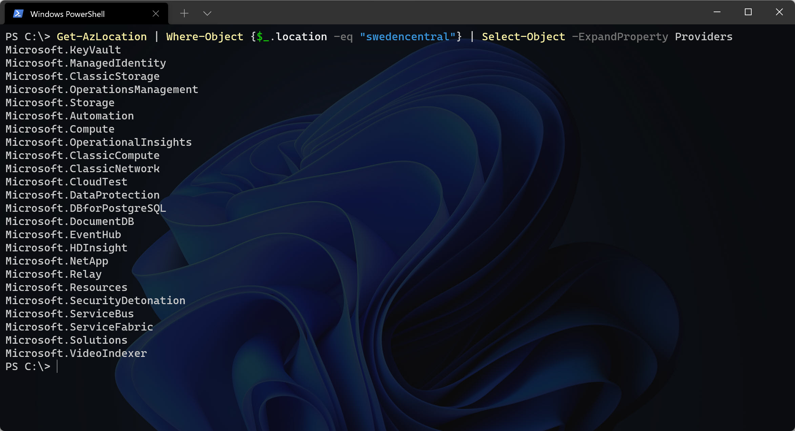
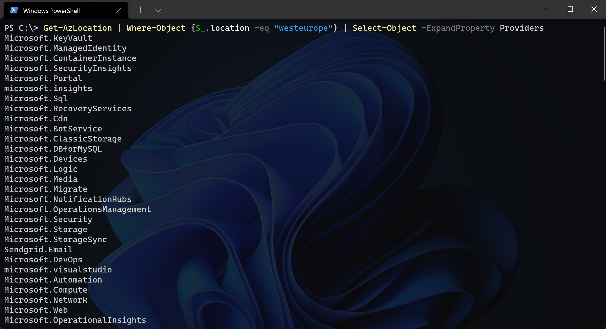
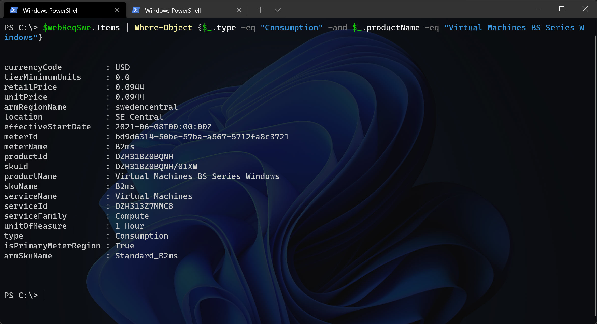

**Today is the day - Sweden Central is offically open!**

*But wait, which Azure resources are available to us and where's the prices?*

When Microsoft opens up a new Azure Region all of the services we are used to may not be available right away.


Azure services are grouped into three categories: foundational, mainstream, and strategic. Azure's general policy on deploying services into any given region is primarily driven by region type, service categories, and customer demand.

**Foundational**: Available in all recommended and alternate regions when the region is generally available, or within 90 days of a new foundational service becoming generally available.

**Mainstream**: Available in all recommended regions within 90 days of the region general availability. Demand-driven in alternate regions, and many are already deployed into a large subset of alternate regions.

**Strategic** (previously Specialized): Targeted service offerings, often industry-focused or backed by customized hardware. Demand-driven availability across regions, and many are already deployed into a large subset of recommended regions.


When I tried to look into a general view of all the services available to Sweden Central, I couldn't find it (maybe my Bing/Google skills are bad today). Otherwise it's fairly simple to look up with PowerShell.
``` powershell
Get-AzLocation | Where-Object {$_.location -eq "swedencentral"} | Select-Object -ExpandProperty Providers
Get-AzLocation | Where-Object {$_.location -eq "westeurope"} | Select-Object -ExpandProperty Providers
```

As of today - Sweden Central has 24 services up and running.


Compare to **my** favorite region, West Europe, it has 164 services up and running.


## Sweden Central


``` powershell
Microsoft.Automation
Microsoft.ClassicCompute
Microsoft.ClassicNetwork
Microsoft.ClassicStorage
Microsoft.CloudTest
Microsoft.Compute
Microsoft.DataProtection
Microsoft.DBforPostgreSQL
Microsoft.DocumentDB
Microsoft.EventHub
Microsoft.HDInsight
Microsoft.KeyVault
Microsoft.ManagedIdentity
Microsoft.NetApp
Microsoft.OperationalInsights
Microsoft.OperationsManagement
Microsoft.Relay
Microsoft.Resources
Microsoft.SecurityDetonation
Microsoft.ServiceBus
Microsoft.ServiceFabric
Microsoft.Solutions
Microsoft.Storage
Microsoft.VideoIndexer
```




``` powershell
84codes.CloudAMQP
Dynatrace.Observability
Microsoft.AAD
microsoft.aadiam
Microsoft.Addons
Microsoft.AnalysisServices
Microsoft.ApiManagement
Microsoft.AppConfiguration
Microsoft.AppPlatform
Microsoft.Attestation
Microsoft.Automanage
Microsoft.Automation
Microsoft.AutonomousDevelopmentPlatform
Microsoft.AVS
Microsoft.AzureArcData
Microsoft.AzureCIS
Microsoft.AzureData
Microsoft.AzureStack
Microsoft.AzureStackHCI
Microsoft.BackupSolutions
Microsoft.BareMetalInfrastructure
Microsoft.Batch
Microsoft.Bing
Microsoft.Blockchain
Microsoft.BotService
Microsoft.Cache
Microsoft.Cdn
Microsoft.Chaos
Microsoft.ClassicCompute
Microsoft.ClassicInfrastructureMigrate
Microsoft.ClassicNetwork
Microsoft.ClassicStorage
Microsoft.CloudTest
Microsoft.CodeSigning
Microsoft.Codespaces
Microsoft.CognitiveServices
Microsoft.Compute
Microsoft.ConfidentialLedger
Microsoft.Confluent
Microsoft.ConnectedVehicle
Microsoft.ConnectedVMwarevSphere
Microsoft.ContainerInstance
Microsoft.ContainerRegistry
Microsoft.ContainerService
Microsoft.CustomProviders
Microsoft.DataBox
Microsoft.DataBoxEdge
Microsoft.Databricks
Microsoft.DataCatalog
Microsoft.DataCollaboration
Microsoft.DataFactory
Microsoft.DataLakeAnalytics
Microsoft.DataLakeStore
Microsoft.DataMigration
Microsoft.DataProtection
Microsoft.DataShare
Microsoft.DBforMariaDB
Microsoft.DBforMySQL
Microsoft.DBforPostgreSQL
Microsoft.DelegatedNetwork
Microsoft.DeploymentManager
Microsoft.DesktopVirtualization
Microsoft.DevAI
Microsoft.Devices
Microsoft.DevOps
Microsoft.DevTestLab
Microsoft.DigitalTwins
Microsoft.DocumentDB
Microsoft.EdgeOrder
Microsoft.Elastic
Microsoft.EnterpriseKnowledgeGraph
Microsoft.EventGrid
Microsoft.EventHub
Microsoft.ExtendedLocation
Microsoft.Fidalgo
Microsoft.FluidRelay
Microsoft.HanaOnAzure
Microsoft.HardwareSecurityModules
Microsoft.HDInsight
Microsoft.HealthBot
Microsoft.HealthcareApis
Microsoft.HybridCompute
Microsoft.HybridConnectivity
Microsoft.HybridContainerService
Microsoft.HybridData
Microsoft.HybridNetwork
Microsoft.ImportExport
microsoft.insights
Microsoft.IoTCentral
Microsoft.IoTSecurity
Microsoft.KeyVault
Microsoft.Kubernetes
Microsoft.KubernetesConfiguration
Microsoft.Kusto
Microsoft.LabServices
Microsoft.Logic
Microsoft.Logz
Microsoft.MachineLearning
Microsoft.MachineLearningServices
Microsoft.Maintenance
Microsoft.ManagedIdentity
Microsoft.Maps
Microsoft.MarketplaceApps
Microsoft.Media
Microsoft.Migrate
Microsoft.MixedReality
Microsoft.MobileNetwork
Microsoft.NetApp
Microsoft.Network
Microsoft.NotificationHubs
Microsoft.OffAzure
Microsoft.OperationalInsights
Microsoft.OperationsManagement
Microsoft.Peering
Microsoft.Portal
Microsoft.PowerBI
Microsoft.PowerBIDedicated
Microsoft.Purview
Microsoft.Quantum
Microsoft.RecommendationsService
Microsoft.RecoveryServices
Microsoft.RedHatOpenShift
Microsoft.Relay
Microsoft.Resources
Microsoft.Scheduler
Microsoft.Scom
Microsoft.ScVmm
Microsoft.Search
Microsoft.Security
Microsoft.SecurityDetonation
Microsoft.SecurityInsights
Microsoft.SerialConsole
Microsoft.ServiceBus
Microsoft.ServiceFabric
Microsoft.ServiceFabricMesh
Microsoft.ServiceLinker
Microsoft.ServicesHub
Microsoft.SignalRService
Microsoft.Singularity
Microsoft.Solutions
Microsoft.Sql
Microsoft.SqlVirtualMachine
Microsoft.Storage
Microsoft.StorageCache
Microsoft.StoragePool
Microsoft.StorageSync
Microsoft.StorSimple
Microsoft.StreamAnalytics
microsoft.support
Microsoft.Synapse
Microsoft.TimeSeriesInsights
Microsoft.VideoIndexer
Microsoft.VirtualMachineImages
microsoft.visualstudio
Microsoft.VMware
Microsoft.VMwareCloudSimple
Microsoft.VSOnline
Microsoft.Web
Microsoft.WindowsESU
RavenHq.Db
Sendgrid.Email
Wandisco.Fusion
```



## VM SKUs in Sweden Central
So, looking at Virtual Machines, which VM SKUs are currently available?
Again, PowerShell can help us.

``` powershell
Get-AzVMSize -Location SwedenCentral
```




| Name                   | NumberOfCores | MemoryInMB |
|------------------------|---------------|------------|
| Standard_B1ls          | 1             | 512        |
| Standard_B1ms          | 1             | 2048       |
| Standard_B1s           | 1             | 1024       |
| Standard_B2ms          | 2             | 8192       |
| Standard_B2s           | 2             | 4096       |
| Standard_B4ms          | 4             | 16384      |
| Standard_B8ms          | 8             | 32768      |
| Standard_B12ms         | 12            | 49152      |
| Standard_B16ms         | 16            | 65536      |
| Standard_B20ms         | 20            | 81920      |
| Standard_E2_v4         | 2             | 16384      |
| Standard_E4_v4         | 4             | 32768      |
| Standard_E8_v4         | 8             | 65536      |
| Standard_E16_v4        | 16            | 131072     |
| Standard_E20_v4        | 20            | 163840     |
| Standard_E32_v4        | 32            | 262144     |
| Standard_E48_v4        | 48            | 393216     |
| Standard_E64_v4        | 64            | 516096     |
| Standard_E2d_v4        | 2             | 16384      |
| Standard_E4d_v4        | 4             | 32768      |
| Standard_E8d_v4        | 8             | 65536      |
| Standard_E16d_v4       | 16            | 131072     |
| Standard_E20d_v4       | 20            | 163840     |
| Standard_E32d_v4       | 32            | 262144     |
| Standard_E48d_v4       | 48            | 393216     |
| Standard_E64d_v4       | 64            | 516096     |
| Standard_E2s_v4        | 2             | 16384      |
| Standard_E4-2s_v4      | 4             | 32768      |
| Standard_E4s_v4        | 4             | 32768      |
| Standard_E8-2s_v4      | 8             | 65536      |
| Standard_E8-4s_v4      | 8             | 65536      |
| Standard_E8s_v4        | 8             | 65536      |
| Standard_E16-4s_v4     | 16            | 131072     |
| Standard_E16-8s_v4     | 16            | 131072     |
| Standard_E16s_v4       | 16            | 131072     |
| Standard_E20s_v4       | 20            | 163840     |
| Standard_E32-8s_v4     | 32            | 262144     |
| Standard_E32-16s_v4    | 32            | 262144     |
| Standard_E32s_v4       | 32            | 262144     |
| Standard_E48s_v4       | 48            | 393216     |
| Standard_E64-16s_v4    | 64            | 516096     |
| Standard_E64-32s_v4    | 64            | 516096     |
| Standard_E64s_v4       | 64            | 516096     |
| Standard_E80is_v4      | 80            | 516096     |
| Standard_E2ds_v4       | 2             | 16384      |
| Standard_E4-2ds_v4     | 4             | 32768      |
| Standard_E4ds_v4       | 4             | 32768      |
| Standard_E8-2ds_v4     | 8             | 65536      |
| Standard_E8-4ds_v4     | 8             | 65536      |
| Standard_E8ds_v4       | 8             | 65536      |
| Standard_E16-4ds_v4    | 16            | 131072     |
| Standard_E16-8ds_v4    | 16            | 131072     |
| Standard_E16ds_v4      | 16            | 131072     |
| Standard_E20ds_v4      | 20            | 163840     |
| Standard_E32-8ds_v4    | 32            | 262144     |
| Standard_E32-16ds_v4   | 32            | 262144     |
| Standard_E32ds_v4      | 32            | 262144     |
| Standard_E48ds_v4      | 48            | 393216     |
| Standard_E64-16ds_v4   | 64            | 516096     |
| Standard_E64-32ds_v4   | 64            | 516096     |
| Standard_E64ds_v4      | 64            | 516096     |
| Standard_E80ids_v4     | 80            | 516096     |
| Standard_D2d_v4        | 2             | 8192       |
| Standard_D4d_v4        | 4             | 16384      |
| Standard_D8d_v4        | 8             | 32768      |
| Standard_D16d_v4       | 16            | 65536      |
| Standard_D32d_v4       | 32            | 131072     |
| Standard_D48d_v4       | 48            | 196608     |
| Standard_D64d_v4       | 64            | 262144     |
| Standard_D2_v4         | 2             | 8192       |
| Standard_D4_v4         | 4             | 16384      |
| Standard_D8_v4         | 8             | 32768      |
| Standard_D16_v4        | 16            | 65536      |
| Standard_D32_v4        | 32            | 131072     |
| Standard_D48_v4        | 48            | 196608     |
| Standard_D64_v4        | 64            | 262144     |
| Standard_D2ds_v4       | 2             | 8192       |
| Standard_D4ds_v4       | 4             | 16384      |
| Standard_D8ds_v4       | 8             | 32768      |
| Standard_D16ds_v4      | 16            | 65536      |
| Standard_D32ds_v4      | 32            | 131072     |
| Standard_D48ds_v4      | 48            | 196608     |
| Standard_D64ds_v4      | 64            | 262144     |
| Standard_D2s_v4        | 2             | 8192       |
| Standard_D4s_v4        | 4             | 16384      |
| Standard_D8s_v4        | 8             | 32768      |
| Standard_D16s_v4       | 16            | 65536      |
| Standard_D32s_v4       | 32            | 131072     |
| Standard_D48s_v4       | 48            | 196608     |
| Standard_D64s_v4       | 64            | 262144     |
| Standard_D1_v2         | 1             | 3584       |
| Standard_D2_v2         | 2             | 7168       |
| Standard_D3_v2         | 4             | 14336      |
| Standard_D4_v2         | 8             | 28672      |
| Standard_D5_v2         | 16            | 57344      |
| Standard_D11_v2        | 2             | 14336      |
| Standard_D12_v2        | 4             | 28672      |
| Standard_D13_v2        | 8             | 57344      |
| Standard_D14_v2        | 16            | 114688     |
| Standard_D15_v2        | 20            | 143360     |
| Standard_D2_v2_Promo   | 2             | 7168       |
| Standard_D3_v2_Promo   | 4             | 14336      |
| Standard_D4_v2_Promo   | 8             | 28672      |
| Standard_D5_v2_Promo   | 16            | 57344      |
| Standard_D11_v2_Promo  | 2             | 14336      |
| Standard_D12_v2_Promo  | 4             | 28672      |
| Standard_D13_v2_Promo  | 8             | 57344      |
| Standard_D14_v2_Promo  | 16            | 114688     |
| Standard_F1            | 1             | 2048       |
| Standard_F2            | 2             | 4096       |
| Standard_F4            | 4             | 8192       |
| Standard_F8            | 8             | 16384      |
| Standard_F16           | 16            | 32768      |
| Standard_DS1_v2        | 1             | 3584       |
| Standard_DS2_v2        | 2             | 7168       |
| Standard_DS3_v2        | 4             | 14336      |
| Standard_DS4_v2        | 8             | 28672      |
| Standard_DS5_v2        | 16            | 57344      |
| Standard_DS11-1_v2     | 2             | 14336      |
| Standard_DS11_v2       | 2             | 14336      |
| Standard_DS12-1_v2     | 4             | 28672      |
| Standard_DS12-2_v2     | 4             | 28672      |
| Standard_DS12_v2       | 4             | 28672      |
| Standard_DS13-2_v2     | 8             | 57344      |
| Standard_DS13-4_v2     | 8             | 57344      |
| Standard_DS13_v2       | 8             | 57344      |
| Standard_DS14-4_v2     | 16            | 114688     |
| Standard_DS14-8_v2     | 16            | 114688     |
| Standard_DS14_v2       | 16            | 114688     |
| Standard_DS15_v2       | 20            | 143360     |
| Standard_DS2_v2_Promo  | 2             | 7168       |
| Standard_DS3_v2_Promo  | 4             | 14336      |
| Standard_DS4_v2_Promo  | 8             | 28672      |
| Standard_DS5_v2_Promo  | 16            | 57344      |
| Standard_DS11_v2_Promo | 2             | 14336      |
| Standard_DS12_v2_Promo | 4             | 28672      |
| Standard_DS13_v2_Promo | 8             | 57344      |
| Standard_DS14_v2_Promo | 16            | 114688     |
| Standard_F1s           | 1             | 2048       |
| Standard_F2s           | 2             | 4096       |
| Standard_F4s           | 4             | 8192       |
| Standard_F8s           | 8             | 16384      |
| Standard_F16s          | 16            | 32768      |
| Standard_A1_v2         | 1             | 2048       |
| Standard_A2m_v2        | 2             | 16384      |
| Standard_A2_v2         | 2             | 4096       |
| Standard_A4m_v2        | 4             | 32768      |
| Standard_A4_v2         | 4             | 8192       |
| Standard_A8m_v2        | 8             | 65536      |
| Standard_A8_v2         | 8             | 16384      |
| Standard_D2_v3         | 2             | 8192       |
| Standard_D4_v3         | 4             | 16384      |
| Standard_D8_v3         | 8             | 32768      |
| Standard_D16_v3        | 16            | 65536      |
| Standard_D32_v3        | 32            | 131072     |
| Standard_D48_v3        | 48            | 196608     |
| Standard_D64_v3        | 64            | 262144     |
| Standard_D2s_v3        | 2             | 8192       |
| Standard_D4s_v3        | 4             | 16384      |
| Standard_D8s_v3        | 8             | 32768      |
| Standard_D16s_v3       | 16            | 65536      |
| Standard_D32s_v3       | 32            | 131072     |
| Standard_D48s_v3       | 48            | 196608     |
| Standard_D64s_v3       | 64            | 262144     |
| Standard_E2_v3         | 2             | 16384      |
| Standard_E4_v3         | 4             | 32768      |
| Standard_E8_v3         | 8             | 65536      |
| Standard_E16_v3        | 16            | 131072     |
| Standard_E20_v3        | 20            | 163840     |
| Standard_E32_v3        | 32            | 262144     |
| Standard_E48_v3        | 48            | 393216     |
| Standard_E64_v3        | 64            | 442368     |
| Standard_E2s_v3        | 2             | 16384      |
| Standard_E4-2s_v3      | 4             | 32768      |
| Standard_E4s_v3        | 4             | 32768      |
| Standard_E8-2s_v3      | 8             | 65536      |
| Standard_E8-4s_v3      | 8             | 65536      |
| Standard_E8s_v3        | 8             | 65536      |
| Standard_E16-4s_v3     | 16            | 131072     |
| Standard_E16-8s_v3     | 16            | 131072     |
| Standard_E16s_v3       | 16            | 131072     |
| Standard_E20s_v3       | 20            | 163840     |
| Standard_E32-8s_v3     | 32            | 262144     |
| Standard_E32-16s_v3    | 32            | 262144     |
| Standard_E32s_v3       | 32            | 262144     |
| Standard_E48s_v3       | 48            | 393216     |
| Standard_E64-16s_v3    | 64            | 442368     |
| Standard_E64-32s_v3    | 64            | 442368     |
| Standard_E64s_v3       | 64            | 442368     |
| Standard_F2s_v2        | 2             | 4096       |
| Standard_F4s_v2        | 4             | 8192       |
| Standard_F8s_v2        | 8             | 16384      |
| Standard_F16s_v2       | 16            | 32768      |
| Standard_F32s_v2       | 32            | 65536      |
| Standard_F48s_v2       | 48            | 98304      |
| Standard_F64s_v2       | 64            | 131072     |
| Standard_F72s_v2       | 72            | 147456     |
| Standard_M208ms_v2     | 208           | 5836800    |
| Standard_M208s_v2      | 208           | 2918400    |
| Standard_M416-208s_v2  | 416           | 5836800    |
| Standard_M416s_v2      | 416           | 5836800    |
| Standard_M416-208ms_v2 | 416           | 11673600   |
| Standard_M416ms_v2     | 416           | 11673600   |



## But the prices?
Well, the API works - so play around with that, for example, to get the prices for Virtual Machines in Sweden Central, use this URI: 
``` powershell
"https://prices.azure.com/api/retail/prices?$filter=serviceName eq 'Virtual Machines' and armRegionName eq 'swedencentral'"
```

Here's a quick PS script to check for prices for all VM SKUs - but limited to 100, so make the filter as you want it (keep in mind that for one SKU, there is multiple choices like Linux or Windows series, consumption or reservation).

*Keep in mind that you need to change some characters:*

*$ sign is %24, spaces are %20, and ' are %27.*

``` powershell
$VMSweAPI = "https://prices.azure.com/api/retail/prices?%24filter=serviceName%20eq%20%27Virtual Machines%27%20and%20armRegionName%20eq%20%27swedencentral%27"

$webReqSwe = Invoke-WebRequest -Uri $VMSweAPI | ConvertFrom-Json
$webReqSwe.Items
```


``` powershell
$B2ms = "https://prices.azure.com/api/retail/prices?%24filter=serviceName%20eq%20%27Virtual Machines%27%20and%20armRegionName%20eq%20%27swedencentral%27%20and%20armSkuName%20eq%20%27Standard_B2ms%27"

$webReqSwe = Invoke-WebRequest -Uri $B2ms | ConvertFrom-Json
$webReqSwe.Items
```

``` powershell
$B2ms = "https://prices.azure.com/api/retail/prices?%24filter=serviceName%20eq%20%27Virtual Machines%27%20and%20armRegionName%20eq%20%27swedencentral%27%20and%20armSkuName%20eq%20%27Standard_B2ms%27"

$webReqSwe = Invoke-WebRequest -Uri $B2ms | ConvertFrom-Json
$webReqSwe.Items | Where-Object {$_.type -eq "Consumption" -and $_.productName -eq "Virtual Machines BS Series Windows"}
```


Play around with PowerShell and the Az module and see if you can find the service you want to use in Sweden Central, otherwise be patient it will come in a near future (I hope!).

Also, take a look at Microsoft Docs - https://docs.microsoft.com/en-us/azure/availability-zones/region-types-service-categories-azure 