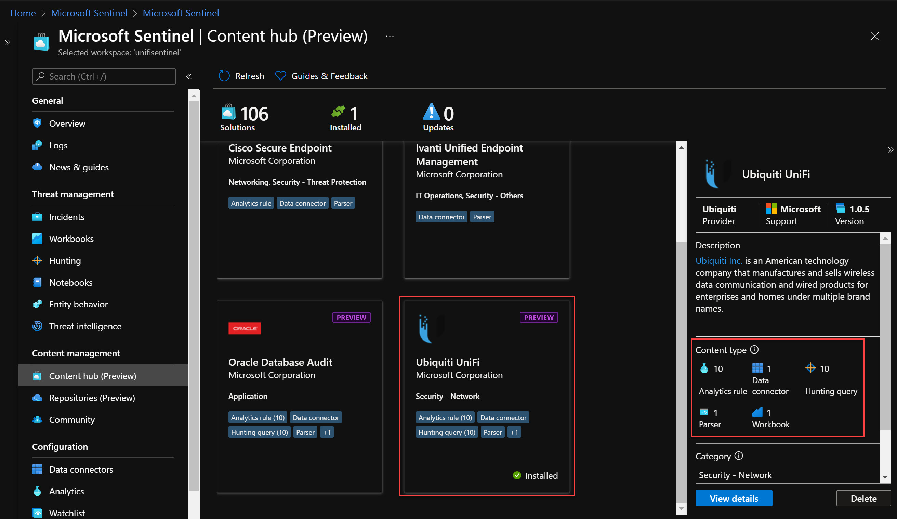
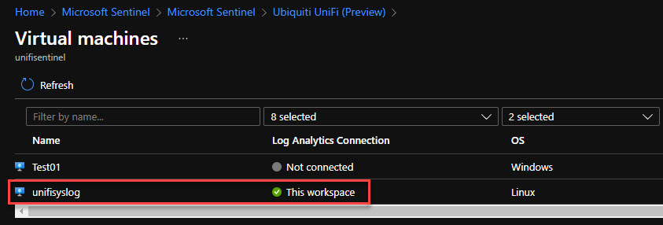
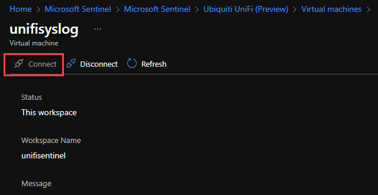
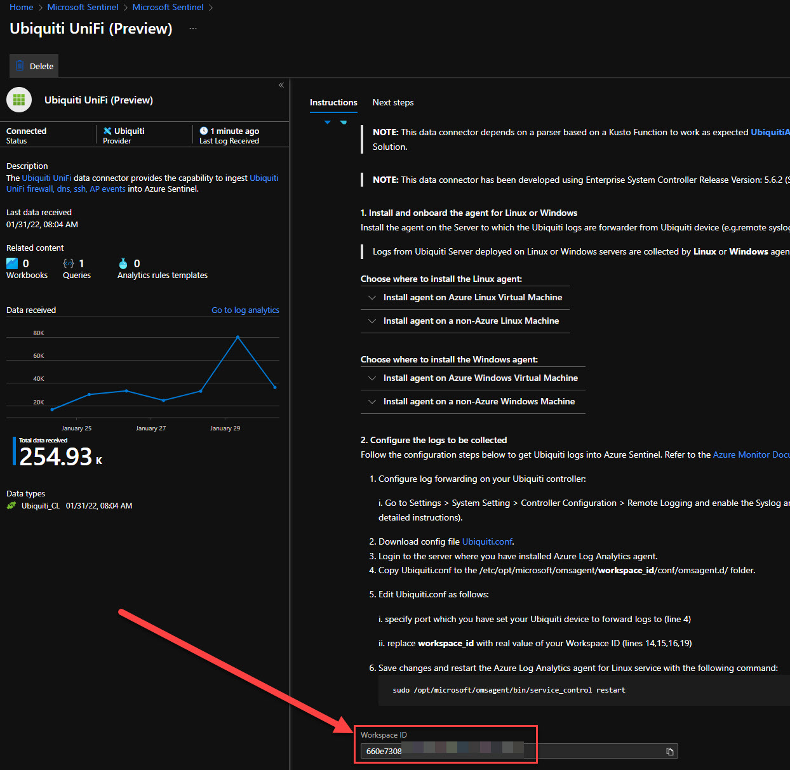
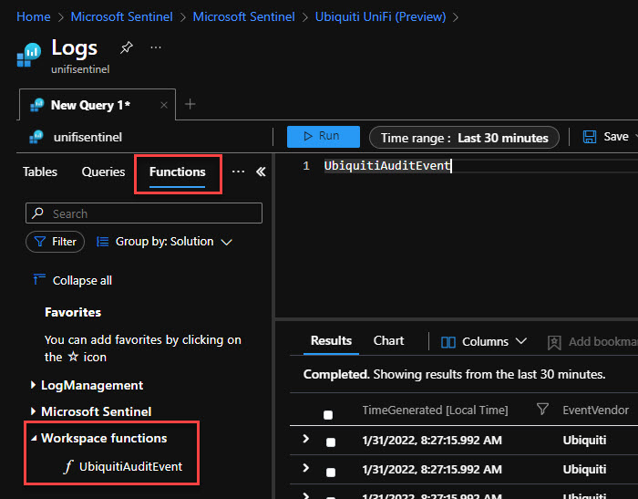

So I just needed to try out this solution available in Microsoft Sentinel, or as it called now - Content Hub. The **Ubiquiti UniFi** solution will give us:

- 10 Analytic Rules
- 10 Hunting Queries
- 1 Workbook
- 1 Parser
- 1 Data Connector

The parser are very interesting thing and we will take another deep dive in that topic later. But this ready-to-go solution have a parser to help us normalize our data into a function. You can then use function alias from any other queries (e.g. **UbiquitiAuditEvent | take 10**)



But first of all we need to have a Syslog server. I did choose to install a Ubuntu 20.04 VM inside of Azure with a B2s SKU and with a public IP address. Make sure to really use a secure way to send up your logs. An Azure Site-to-Site VPN should maybe be a more secure way. 

So, install the solution and then go to Data Connectors blade, and search for **Ubiquiti UniFi (Preview)**


Select the VM you just installed and connect the Log Analytics agent.



During the installtion for the Log Analytics agent on the VM we can log in to our Unifi Controller and make the change for Syslog. </br>
With the new GUI for the controller: Go to **Settings -> System -> Application Configuration -> Remote Logging** </br>
The URL will be like: network/default/settings/system/controller

Enable Syslog, then set the Syslog Host (name or IP) and Syslog Port.

In the instructions we are then asked to access this link:
https://aka.ms/sentinel-UbiquitiUnifi-conf

Save the file or copy the text, but we need to make some changes.

Change **Line 4** to the Syslog port you have specified in the UniFi Controller.
Change **Line 14, 15, 16, 19** to the workspace ID you have for your Log Analytics Workspace. (You will find your Workspace ID at the buttom of the connectors page)



```txt
<source>
  type udp
  format none
  port 22022
  bind 0.0.0.0
  delimiter "\n"
  tag oms.api.Ubiquiti
</source>

<match oms.api.Ubiquiti>
  type out_oms_api
  log_level info
  num_threads 5
  omsadmin_conf_path /etc/opt/microsoft/omsagent/workspace_id/conf/omsadmin.conf
  cert_path /etc/opt/microsoft/omsagent/workspace_id/certs/oms.crt
  key_path /etc/opt/microsoft/omsagent/workspace_id/certs/oms.key
  buffer_chunk_limit 10m
  buffer_type file
  buffer_path /var/opt/microsoft/omsagent/workspace_id/state/out_oms_api_ubiquiti*.buffer
  buffer_queue_limit 10
  buffer_queue_full_action drop_oldest_chunk
  flush_interval 30s
  retry_limit 10
  retry_wait 30s
  max_retry_wait 9m
</match>
```

Copy the file or text and connect (SSH) with Putty, or your choice of tooling, to the machine. In my case I did copy the final text above and created a new file at the path location specified below.

*Change the path to the workpace ID you have.*

**Path:** /etc/opt/microsoft/omsagent/<workspace_id>/conf/omsagent.d/ </br>
**File Name:** Ubiquiti.conf

After you have done above, you need to restart the service:
```cmd
sudo /opt/microsoft/omsagent/bin/service_control restart
```

After a short while you will find your new table **Ubiquiti_CL** and the great function called **UbiquitiAuditEvent**.



In the next post about Microsoft Sentinel and Ubiquiti UniFi we will look at the parser and the hunting mechanisms we got from the Content Hub.

I see you at the next post!

**Happy hunting!**


