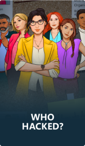
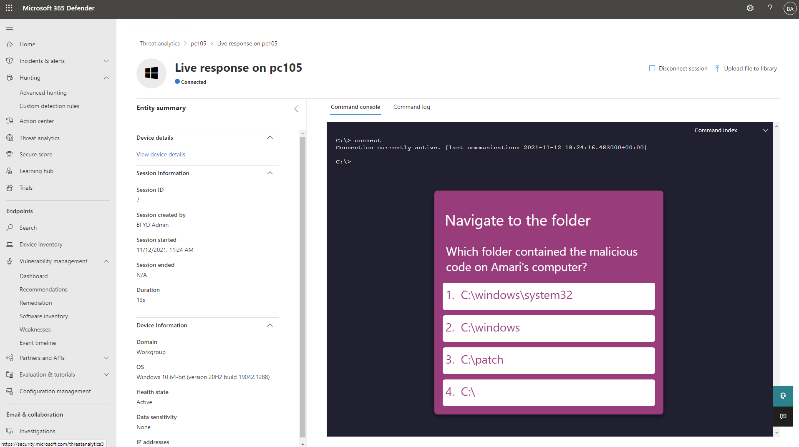

New Microsoft on-demand games that learns you to solve real-world challenges.
> *Who Hacked is a game in which players are detectives, gathering clues and evidence to investigate, remediate, and protect against cybersecurity incidents at Best for You Organics (BFYO), one of the largest organic produce e-retailers in the nation.*

There are two different games with the same purpose, to be an analyst who will gather evidence for investigating ransomware attack and data compromise. In the game that's interactive, you will log in to different portals within Azure and Microsoft 365, looking at everything from eDiscovery, Advanced Hunting, Sentinel Analytic Rule creation, searching in Purview for internal communication, live response on a computers, enable protection to GitHub via Defender for Cloud, and much more. I really enjoyed the game and can highly recommend it! In the end when you have collected all of the evidence you need to present that and say who did what. 

## Game 1 - Keeping up Appearances

Gather and follow the forensic clues and evidence to investigate and tackle a ransomware attack at Best For You Organics (BFYO). Use Microsoft tools, like Microsoft Sentinel,  Microsoft 365 Defender and Microsoft Purview compliance portal to find the culprit, remediate, configure compliance policies and protect against future cybersecurity incidents.

## Game 2 - In the Crosshairs

Best For You Organics (BFYO) is under another cyber security attack. Uncover whose data in the company has been compromised, and to what extent. Determine how it happened using Microsoft 365 Defender, Microsoft Sentinel, and Azure AD. Remediate and protect against future attacks.

### From the game

Play today!
https://www.microsoft.com/en-us/cloudgames/registration 

I see you at the next post!

**Happy hunting!**

